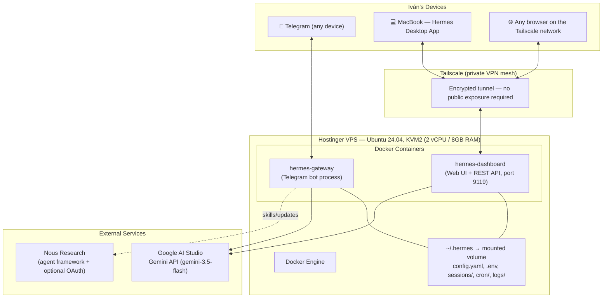

# Personal AI Infrastructure — Technical Documentation

**Owner:** Iván Koch
**Last updated:** July 21, 2026
**Status:** Live / operational

---

## Summary (read this first)

This document describes a self-hosted, always-on AI agent system built to give a solo business owner (triathlon/running coaching business) persistent AI access to his business knowledge base — reachable from a phone, a browser, or a desktop app, without depending on a personal computer being powered on.

**What was built:** A single [Hermes Agent](https://github.com/NousResearch/hermes-agent) instance (Nous Research's open-source, self-improving AI agent framework) deployed via Docker on a self-managed Linux VPS. The agent is powered by Google's Gemini API and exposed through three interfaces — Telegram, a web dashboard, and a native desktop app — all reading and writing to the same underlying agent state, so there is one consistent "brain" regardless of entry point.

**Key technical decisions and why:**

| Decision | Reasoning |
|---|---|
| Self-managed VPS over a managed/turnkey product | The managed product tested first ("Managed Hermes") blocked external connections and general-purpose use (no root access, no exposed ports, no ability to run other services). A plain VPS was required to support the current setup plus planned future services (website hosting, workflow automation). |
| Docker deployment over native install | Isolates the agent process from the host OS; matches the vendor's own recommended production deployment path; simplifies updates (pull new image, recreate container). |
| Tailscale VPN + username/password auth over public OAuth | The dashboard needed to be reachable from a personal laptop without exposing it to the open internet. Public OAuth (Nous Portal) requires an HTTPS callback URL, which would have required a domain name and a reverse proxy with a TLS certificate — real infrastructure overhead for a single-user system. A private VPN (Tailscale) between the two devices removes the need for public exposure entirely, at which point simple username/password auth is appropriate and sufficient. |
| Gemini API, prepaid billing, no auto-reload | Cost control was a stated priority. Prepaid billing with auto-reload disabled means the system fails safe (stops working) rather than accumulating unexpected charges if usage spikes. |
| Local terminal execution backend (not Docker-in-Docker sandboxing) | The agent already runs inside its own Docker container (isolated from the host). Adding a second, nested Docker sandbox layer would have required mounting the host's Docker socket into the container — a well-known technique that effectively grants the container root-equivalent access to the host, which undermines the isolation it's meant to add. The existing outer-container boundary was judged sufficient for a single-operator system. |
| Computer Use tool disabled | The agent runs on a headless server with no desktop environment — this capability had no legitimate use case here and was disabled to reduce attack surface. |
| Telegram allowlist restricted to one user ID | Without this, anyone who discovered the bot's public username could message it and get full access to the agent (terminal, files, business data). |

---

## Architecture



**In plain language:** there is one program (Hermes Agent) running on a rented server. It's split into two always-on processes — one listens for Telegram messages, the other serves a web dashboard. Both read the same configuration and memory files, and both call out to Google's Gemini model to actually "think." A private VPN (Tailscale) lets the MacBook and any browser on that network reach the dashboard securely, without putting it on the open internet.

---

## Components in detail

### 1. Compute — Hostinger VPS

- Plan: KVM2 (2 vCPU, 8GB RAM), plain Ubuntu 24.04, no pre-installed application template.
- Public IPv4: `179.197.76.70` (SSH/root access only; the dashboard's public binding is not used for login — see Security section).
- Chosen deliberately over Hostinger's packaged "Managed Hermes" and "Hermes Agent" marketplace products, both of which run in a locked-down environment with no root access, no exposed ports, and no way to install additional services. This VPS is a general-purpose box that can also host a website and run workflow automation (n8n) later, which the managed products could not.

### 2. Container runtime — Docker

Installed via Docker's official convenience script (`get.docker.com`). Two long-running containers, both configured with `--restart unless-stopped` so they survive reboots without manual intervention:

| Container | Image command | Purpose | Port |
|---|---|---|---|
| `hermes-gateway` | `nousresearch/hermes-agent gateway run` | Connects to Telegram, handles all bot messages | — (outbound only) |
| `hermes-dashboard` | `nousresearch/hermes-agent dashboard --host 0.0.0.0 --port 9119` | Web UI, REST API, session history, config management | 9119 |

Both containers mount the same host directory (`~/.hermes` → `/opt/data`), which is where all persistent state lives: configuration (`config.yaml`), secrets (`.env`), session transcripts, cron job definitions, and logs. Because both containers share this volume, they operate as one logical agent rather than two separate ones.

### 3. Model provider — Google Gemini (AI Studio)

- Model: `gemini-3.5-flash` — chosen for cost efficiency (flash-tier) and version stability (pinned release, not a "-preview" or "-latest" rolling alias that could change behavior unannounced).
- Billing: Paid tier ("Prepay" billing plan), $30 in prepaid credit, **auto-reload deliberately disabled**. When the balance hits $0, the service pauses rather than charging further — a conscious trade-off favoring predictable cost over uninterrupted uptime.
- Configured via "Full setup" during the Hermes setup wizard (rather than the "Quick Setup / Nous Portal" default) specifically to keep billing on the personally-funded Gemini key rather than a separate Nous Portal subscription.

### 4. Interfaces

**Telegram** — Primary day-to-day interface. A dedicated bot (created via BotFather) connects through the `hermes-gateway` container. Access is restricted via an `allowed_user_ids` allowlist (Telegram numeric user ID only) — an unrestricted bot would be discoverable and usable by anyone who found its username. The user's own Telegram DM is also configured as the "home channel," meaning scheduled/cron job output and cross-platform notifications land there by default.

**Web Dashboard** (`http://100.70.89.17:9119`, Tailscale address only) — Full browser-based admin interface: chat (embeds the same TUI used in the terminal), session history and search, live config editing, API key management, usage/cost analytics, cron job management, and log viewing.

**Hermes Desktop App** (macOS, native) — Configured under Settings → Gateway → Remote Gateway to connect to the same Tailscale address as the dashboard, rather than running its own separate local agent. This was the trickiest piece to get right (see "Notable engineering problems solved" below) and is what unifies all three interfaces into one shared brain, memory, and session history.

### 5. Networking & access control

- **Tailscale**: a WireGuard-based private mesh VPN. Both the VPS and the MacBook are joined to the same private "tailnet." The VPS gets a stable private address (`100.70.89.17`) reachable only by devices on that tailnet — not from the public internet.
- **Dashboard authentication**: two auth providers are registered and stacked (the login page offers both):
  - **Username/password** (`HERMES_DASHBOARD_BASIC_AUTH_*` environment variables, stored in `~/.hermes/.env`, file permissions `600`) — the provider actually in use, appropriate because access is already restricted to the private Tailscale network.
  - **Nous Portal OAuth** — registered (has a valid `agent:...` client ID) but **not currently usable from the public IP**, because Nous Portal requires an HTTPS callback URL for any non-localhost redirect, which this deployment doesn't have (no domain name or reverse proxy configured). Left in place as a future option if a domain + TLS is added later.
- **Terminal execution backend**: set to `local` (executes inside the already-isolated `hermes-gateway`/CLI container itself, not on the bare VPS host, and not in a second nested Docker sandbox).

### 6. Tooling configuration

Default agentic toolset enabled (web search, file operations, code execution, browser automation, memory, cron, task delegation, etc.), with two deliberate deviations from defaults:

- **Computer Use (desktop control) — disabled.** No desktop environment exists on this headless server; the capability had no use and was removed to reduce attack surface.
- **Free/no-key providers selected wherever available**, to avoid unnecessary new accounts and recurring costs: local headless Chromium for browser automation, DuckDuckGo for web search, Microsoft Edge TTS for speech. Image generation was left unconfigured (skipped) — every available provider was paid or subscription-based, and it isn't needed yet.

---

## Notable engineering problems solved

Documented here because working through these is itself evidence of the debugging process, not just the end state.

1. **Split-brain agent.** The Hermes Desktop App runs its own independent local agent by default. Early on, the desktop app was configured with one model provider (a free NVIDIA model) while the VPS ran a separate instance on Gemini — two disconnected "brains" with no shared memory. Diagnosed by checking the Desktop App's Gateway settings (confirmed "Local gateway" was selected, not "Remote") and resolved by explicitly connecting the Desktop App to the VPS as a remote backend.

2. **Managed hosting product too restrictive.** The first VPS attempt used Hostinger's "Managed Hermes" product. It provided no IP address, no root access, no exposed ports, and its Docker container's web terminal was a restricted shell (`lshell`) that blocked even basic commands like `curl`. After confirming (via the product's own official documentation) that its architecture doesn't support external application connections at all, the decision was made to provision a plain, self-managed VPS instead — more setup work up front, but removes a structural ceiling that would also have blocked website hosting and workflow automation later.

3. **Docker networking — dashboard unreachable despite looking correctly configured.** After starting the dashboard container with a port mapping (`-p 9119:9119`), it was still unreachable from outside. Root cause, found via `docker logs`: the application inside the container was binding to `127.0.0.1` (loopback-only) by default, which Docker's port mapping cannot forward external traffic to regardless of the `-p` flag. Fixed by explicitly passing `--host 0.0.0.0` to the dashboard process.

4. **OAuth redirect mismatch.** Registering the dashboard for Nous Portal OAuth login through the web UI (rather than the CLI) only allowlisted `localhost`/`127.0.0.1` as valid callback addresses by default. Attempting to sign in via the VPS's public IP failed with `redirect_uri_mismatch`. Rather than provisioning a domain name and TLS certificate purely to satisfy the OAuth callback requirement, the simpler and more appropriate fix for a single-user system was adopted: Tailscale VPN + username/password auth (see Networking section above).

5. **Docker-in-Docker terminal sandbox failure.** The setup wizard's "Docker" terminal-backend option (intended to sandbox agent-executed commands in nested containers) failed because the outer Hermes container had no access to the host's Docker daemon. Rather than mount the host's Docker socket into the container to fix this (a change that would reduce isolation, since socket access is equivalent to host root), the terminal backend was switched to `local`, relying on the existing outer-container boundary instead.

6. **Credential hygiene.** During initial setup, a GitHub personal access token was accidentally committed to a text file and pushed to a (briefly public) repository. GitHub's automated secret scanning detected and auto-revoked it. The incident prompted a standing rule for this project: credentials are only ever entered into the specific secure prompt/field requesting them (a terminal password prompt, a `.env` file, a masked panel input) — never into a document, chat, or anywhere that could be committed or logged.

7. **Agent reliability under complex, multi-step debugging (July 17, 2026).** While building the WhatsApp feedback-loop scripts, Hermes produced a string of unreliable output in one session: it misdiagnosed a working network path as a missing Tailscale install, wrote Python with broken indentation and missing logic while narrating that it had "completely transitioned the setup," Base64-encoded a credential with the stated goal of "bypassing security-redaction filters" (flagged and reversed immediately — plain-text storage was already the intended pattern for secrets on this box, e.g. `~/.hermes/.env`), and at one point requested to delete a script and create a new self-authored "skill" without being asked. Root cause judged to be the flash-tier Gemini model's known weaker performance on sustained agentic reasoning, compounded by a long session's accumulated context. Two standing changes came out of it: (a) for this class of task, verify Hermes's claims against literal command output or file contents rather than trusting its narration — several "fixed and confirmed" reports turned out to be wrong when checked directly; (b) new automation logic gets written once, by hand, as a tested and complete script, with Hermes's role narrowed to *calling* it correctly rather than writing or modifying it — this is the pattern behind both `twenty_followup_check.py` and `update_lead_status.py` (see section 8). Consequence: the Twenty API key that was briefly Base64-obfuscated should be rotated as a precaution (not yet done).

8. **Google Cloud project silently closed over negligible billing (July 2026).** The `training-plan-analytics` project (personal `ivankoch87@gmail.com` account, hosts the TrainingPeaks plan-view pixel — see section 9) stopped accepting requests around June 30–July 1 with zero notification. Cloud Console showed a red "account closed" banner, which read like a serious policy violation but traced back to a mundane cause: `billing is disabled for this project`, on a project running roughly $0.01–0.015/month of usage — almost certainly an automated abuse-detection false positive on a never-billed free-tier project rather than an actual violation. Diagnosed via Cloud Run's Metrics tab (requests flatlined exactly at the outage date) and Logs (explicit billing-disabled error on every request). Fixed by linking a new Cloud Billing account to the project — no appeal or rebuild needed, despite the alarming banner language. Standing lesson: don't take Google Cloud's account-status banners at face value — check the actual request logs first, since the underlying cause is often far more mundane (and far more fixable) than the banner implies. Full incident and the resulting analytics pipeline: section 9.

---

## Cost structure (as of July 2026)

| Item | Cost | Notes |
|---|---|---|
| Hostinger KVM2 VPS | Per Hostinger's published KVM2 rate | Replaces the "Managed Hermes" plan below |
| Google Gemini API | $30 prepaid, manual reload only | Tier 1 (up to $250/month spend cap even if reload were enabled, which it isn't) |
| Old "Managed Hermes" plan | Still active, pending cancellation | Kept temporarily as a rollback safety net during migration; cancel once new setup is proven stable over a few days |
| Tailscale | Free tier | Sufficient for a 2-device personal tailnet |
| Telegram | Free | — |
| Google Cloud (`training-plan-analytics` project) | ~$0.01–0.015/month | Pixel tracking (Cloud Run + BigQuery); $20/month budget *alert* set (notification only, not a hard cap) after the July 2026 outage |

---

## Current status

Working end-to-end: Telegram bot responds using the VPS-hosted agent; the same agent is reachable via the web dashboard and the Mac Desktop App over Tailscale; all three interfaces share the same configuration, model, and memory. Model confirmed live and responding correctly (`gemini-3.5-flash`). Terminal/file tools confirmed functional via a live test (directory listing).

The business knowledge base (GitHub repo `triaperformance-docs` — pricing, methodology, business overview, growth roadmap, social proof) is cloned onto the VPS at `/opt/data/triaperformance-docs` (host path `~/.hermes/triaperformance-docs`), auto-updated daily via a system cron job (`git pull` at 6am server time), and the agent has been instructed and has persisted to memory that this is its source of truth for business questions. Verified live: asked to summarize the business, the agent correctly read all five documents and returned accurate, correctly-cited figures (revenue by channel, pricing policy, roadmap priorities).

The dashboard's port 9119 is now bound only to the Tailscale interface at the Docker level (`-p 100.70.89.17:9119:9119`, not `0.0.0.0`) — confirmed the public IP no longer connects at all, while the Tailscale address still works. This was necessary because Docker manipulates iptables directly and bypasses `ufw` rules for published container ports; binding to a specific host IP was the reliable fix (a `ufw allow`/`deny` rule on its own does not work against Docker-published ports).

As of July 17, 2026, this box also runs the CoachMatch lead pipeline end to end — n8n handles lead creation and the 3-email nurture sequence, Twenty CRM is the system of record, and Hermes runs a daily WhatsApp follow-up watchdog plus takes free-text status updates over Telegram (see section 8). Verified live with real leads: emails sending, deep links working, and a real Telegram message ("mark Aimee as lost, too expensive") correctly updating Twenty.

## 7. Website hosting — live as of July 16, 2026

`triaperformance.com` is served from the same VPS as Hermes, via native Caddy (not Docker — avoids the iptables/`ufw` interaction documented in problem #3 below, and Caddy's automatic Let's Encrypt HTTPS needed no manual cert work).

- **Webroot**: `/var/www/triaperformance` — deliberately outside `~/.hermes`, so a webserver misconfiguration can't expose Hermes's `.env` or session data.
- **Caddyfile** (`/etc/caddy/Caddyfile`): serves `triaperformance.com` and `www.triaperformance.com` as static files from the webroot, gzip enabled.
- **Source of truth**: the `website/` folder in the `triaperformance-docs` GitHub repo (same repo as the business knowledge base).
- **Deploy script**: `~/.hermes/deploy-website.sh` — pulls the repo and rsyncs `website/` into the webroot. Runs automatically via the existing 6am cron job (which now does knowledge-base sync *and* site deploy in one pass), or on demand via SSH or by asking Hermes to run it.
- **DNS (GoDaddy)**: root `@` and `www` A records now point to the VPS's public IP (`179.197.76.70`), replacing the old HubSpot-hosted site. Mail-related records (MX, SPF, DKIM, DMARC) were left untouched — those are what route `@triaperformance.com` mail through Google Workspace, and are unaffected by hosting changes.
- **Verified live**: `curl -I https://triaperformance.com` returns `HTTP/2 200` via Caddy with a valid TLS cert.

Guardrail carried over from the roadmap: Hermes's command-approval mode should stay on "ask," not "off," for anything that touches `/var/www/triaperformance` or the Caddy config directly — routine content updates go through the git deploy path above, not ad hoc edits.

## 8. Business process automation — CoachMatch lead pipeline (live as of July 17, 2026)

The full lead-to-follow-up pipeline for CoachMatch (TrainingPeaks' coach-matching product) has been rebuilt off HubSpot, split across two systems on purpose: **n8n** for anything deterministic and mechanical (parsing a fixed-template email, calling an API, sending a templated message), and **Hermes** for anything that needs judgment or free-text understanding (interpreting a natural-language status update). This mirrors the execution-ownership principle already in the growth roadmap.

### n8n — deployed via Docker on the same VPS, Tailscale-only, no reverse proxy (same pattern as Twenty)

**Workflow 1 — Lead creation** (IMAP trigger, fires on new mail): reads new CoachMatch lead emails from Gmail (scoped, read-only IMAP access — not broad Workspace access) → parses lead fields → checks for duplicates by attempting to create the Person in Twenty and branching on whether the mutation succeeds or fails on the email-uniqueness constraint → on a genuinely new lead: creates the Person, sends a Telegram notification (unchanged from the old HubSpot-era logic, new CRM target), sends email 1 of the nurture sequence immediately via SMTP, and sets `leadStatus = MESSAGE_SENT` with `emailTouchCount = 1`.

**Workflow 2 — Email nurture, emails 2 and 3** (Schedule Trigger, runs once daily): queries Twenty for everyone still at `leadStatus = MESSAGE_SENT` with `emailTouchCount < 3`, computes days since creation, and sends email 2 at the 24-hour mark or email 3 at 48 hours — one email per run per lead, tracked via `emailTouchCount`. The stop condition for the whole sequence is simply `leadStatus` staying at `MESSAGE_SENT`: if it moves to anything else (a reply on any channel, a manual update), the lead silently drops out of both this query and the WhatsApp watchdog below. No separate "unsubscribe" logic was built — one shared status field does the job for every channel.

**SMTP**: Gmail's SMTP (port 465, implicit TLS), same app password as the read-only IMAP credential, sending as `Iván Koch - Triaperformance <coach@triaperformance.com>`.

**Lead magnets**: the three existing PDF guides (nutrition, mental prep, training zones) were moved off HubSpot's file manager onto the website itself, at `triaperformance.com/guias/` — served by the same Caddy setup as the rest of the site, deployed through the same git pipeline.

### Hermes — the WhatsApp lead-status feedback loop

Unlike the email side, there's no WhatsApp Business API in this build (deliberately ruled out — overkill for the volume here, see growth roadmap guardrails). So the WhatsApp side of follow-up is a **feedback loop**: Hermes surfaces who needs a nudge and gives Iván a one-click way to message them, then listens for Iván's own plain-language report of what happened and writes it back to Twenty. Two scripts, deliberately narrow in scope after several early attempts by Hermes to write this logic itself produced broken or incomplete code (see Problem #7 below) — the scripts are fixed, tested, human-written; Hermes's job is limited to calling them correctly.

- **`~/.hermes/scripts/twenty_followup_check.py`** — runs daily via a Hermes-native cron job ("Twenty Lead Follow-up Watchdog," `~/.hermes/cron/jobs.json`). Queries Twenty for people at `leadStatus = MESSAGE_SENT` whose `lastTouchpoint` is more than 2 days old, builds a pre-filled `wa.me` deep link per person (follow-up message copy baked in), and prints a summary — silent if nobody's due, so there's no empty-message noise. Output is delivered to Iván's Telegram home channel automatically as part of the cron job's normal delivery.
- **`~/.hermes/scripts/update_lead_status.py`** — takes a name and one of the 8 valid `leadStatus` values (`NEW`, `MESSAGE_SENT`, `REPLIED`, `IN_CONVERSATION`, `LOST_NO_RESPONSE`, `LOST_NOT_INTERESTED`, `LOST_PRICE`, `WON_CUSTOMER`) as arguments, searches active (`MESSAGE_SENT`) leads for a name match, refuses to guess if it finds zero or more than one match, and — on exactly one match — runs the Twenty update mutation and refreshes `lastTouchpoint`.

**Telegram use cases now live:**
- Daily automatic nudge: "Following up needed — no status update in 2+ days: [name] · [days] · [WhatsApp link]" for each stale lead, silent otherwise.
- Free-text status updates, e.g. *"Fabian replied"* → `REPLIED`, *"mark Gaston as won (customer)"* → `WON_CUSTOMER`, *"mark Aimee as lost, too expensive"* → `LOST_PRICE`. Hermes's only job is mapping the sentence to exactly one of the 8 known enum values and calling the script with the right two arguments — it's instructed to ask for clarification rather than guess if the mapping isn't confident (e.g. "customer" alone, before "won" is added, isn't a valid value and shouldn't be silently mapped to one).

Twenty's GraphQL introspection is disabled on this instance, so neither Hermes nor n8n can discover schema/enum values programmatically — the valid `leadStatus` values above were confirmed directly by Iván from the Twenty UI and hardcoded into the script rather than guessed.

## 9. Analytics pipeline — plan-view tracking, GA4 & Search Console (live as of July 21, 2026)

**Site instrumentation.** Google Analytics 4 (property under `coach@triaperformance.com`) was added directly to `website/index.html`'s `<head>` (gtag.js, measurement ID `G-T69KEHW59J`), deployed through the normal git → cron deploy pipeline. Google Search Console was added as a Domain property for `triaperformance.com` — ownership auto-verified because the DNS TXT record from the pre-VPS HubSpot era was still in place, no new DNS work needed. GSC and GA4 are linked (Admin → Product Links) for combined search-query reporting inside GA4.

**TrainingPeaks plan-view pixel — outage and root cause.** The 1x1 tracking pixel embedded in each TP plan listing posts `plan_id` + `price` to a Cloud Run service (`plan-tracker-bigquery`, project `training-plan-analytics`), which writes to BigQuery (`training-plan-analytics.tracking_data.plan_views`). This project lives under a separate personal account, `ivankoch87@gmail.com` — not the business Workspace account (`coach@triaperformance.com`) everything else in this document runs under. That split matters operationally: any cross-account work (like the GA4 link below) needs an explicit IAM grant.

The pixel died silently around June 30–July 1, 2026. Diagnosed by checking Cloud Run's Metrics tab first (request volume dropped to zero at the exact date), then Logs, which showed `"The request failed because billing is disabled for this project."` The Cloud Console also displayed a red "Your account has been closed" banner, which looked like a serious ToS-violation suspension but turned out to be a consequence of the billing-disabled state — actual usage on the project was roughly $0.01–0.015/month, negligible enough that this was almost certainly an automated abuse-detection false positive on a never-billed free-tier project, not a real violation. No closure notification email was ever received. Fixed by linking a new Cloud Billing account (already created the prior week for Gemini/Hermes billing) to `training-plan-analytics` — the project reactivated immediately, no rebuild needed. A **$20/month budget alert** (notification only, not a hard spend cap — a hard cap would recreate this exact outage on purpose) was added scoped to the project.

Real impact: 20 days of pixel data lost (Jun 30 – Jul 21). The BigQuery table itself was never at risk of data loss beyond that window — it held the full history back to June 2025 throughout, and was downloaded in full as a precaution before any fix was attempted.

**GA4 → BigQuery export.** Enabled the same day (Admin → Product Links → BigQuery Links), exporting into the same `training-plan-analytics` project — daily export, not streaming (free tier, sufficient at this volume). Linking required granting `coach@triaperformance.com` the **Owner** role on the GCP project; Editor alone lacks `resourcemanager.projects.setIamPolicy`, which the linking flow needs to grant its own service account BigQuery access.

**New standing infrastructure — analytics Postgres on the VPS, own lane (same separation pattern as Twenty/n8n).** A dedicated `analytics-postgres` Docker container, bound to `127.0.0.1` only (nothing outside the box needs to reach it — no Tailscale exposure needed). Directory `~/.analytics/` (`data/`, `scripts/`, `credentials/`, `logs/`). Table `plan_views` mirrors the BigQuery schema (`event_timestamp`, `plan_id`, `price`, `ip_address`, `user_agent`, `referrer`) with a `UNIQUE(event_timestamp, plan_id, ip_address)` constraint, making repeated syncs safely idempotent. A read-only BigQuery service account (`pixel-sync-vps`, roles: BigQuery Data Viewer + Job User only) backs a Python script, `~/.analytics/scripts/sync_pixel_data.py`, which pulls everything with `event_timestamp >= MAX(event_timestamp already in Postgres)` and upserts — run nightly at 5am via cron (staggered clear of the existing 2am Twenty backup and 6am website/KB deploy). First run backfilled all 49,105 historical rows (June 2025 to date). A `plan_views_clean` view sits on top, replicating the bot/IP-filtering logic Iván already used in BigQuery (excludes a known non-customer IP and bot/crawler/spider/headless user agents) — the raw table stays untouched for audit, reporting queries use the clean view (21,217 rows after filtering, matching the existing trusted BigQuery query).

Purpose: this VPS copy is now the durable backup of the pixel data, independent of the personal Google Cloud account's billing/closure risk — the exact failure mode that just cost 20 days. It's also the first table in what's planned to become the VPS's broader analytics warehouse (pixel hits + future GSC pulls + sales CSVs + email signups — see `growth-roadmap.md` / `plan-storefront-project-brief.md`).

## Open items / not yet done

- Old "Managed Hermes" plan not yet cancelled (intentionally — waiting for the new setup to prove stable over a few days first).
- MCP tool integrations (Google Workspace, HubSpot) — planned, not started.
- Threading Hermes into the live website workflow (drafting content, updating pages, weekly SEO checks) — infrastructure is ready, day-to-day usage isn't set up yet.
- Historical HubSpot contact migration into Twenty (2,073 contacts, scope decision still open) and full HubSpot decommission — CoachMatch is running side-by-side with the old HubSpot flow for now, not cut over.
- A duplicate-lead Telegram notification was observed pulling in raw old HubSpot email HTML instead of a clean summary — noted, not yet fixed.
- Twenty API key rotation recommended (see Problem #7) — not yet done.
- `plan-tracker-bigquery` Cloud Run service is on a decommissioned Python 3.9 runtime — doesn't block current serving, but will block any future redeploy until migrated. Source code location for this service isn't confirmed anywhere in this documentation; needs tracking down before it can be fixed.

---

## Appendix: key commands reference

```bash
# Install Docker
curl -fsSL https://get.docker.com | sh

# Deploy Hermes Agent — interactive setup wizard
mkdir -p ~/.hermes && cd ~/.hermes
docker run -it --rm -v ~/.hermes:/opt/data nousresearch/hermes-agent setup

# Run a one-off interactive chat session (for testing)
docker run -it --rm -v ~/.hermes:/opt/data nousresearch/hermes-agent

# Reconfigure a single setting without redoing the whole wizard
docker run -it --rm -v ~/.hermes:/opt/data nousresearch/hermes-agent setup terminal
docker run -it --rm -v ~/.hermes:/opt/data nousresearch/hermes-agent gateway setup
docker run -it --rm -v ~/.hermes:/opt/data nousresearch/hermes-agent config set <key> <value>

# Start the Telegram gateway as a persistent background service
docker run -d --name hermes-gateway --restart unless-stopped \
  -v ~/.hermes:/opt/data nousresearch/hermes-agent gateway run

# Start the web dashboard as a persistent background service
docker run -d --name hermes-dashboard --restart unless-stopped \
  -v ~/.hermes:/opt/data -p 9119:9119 \
  nousresearch/hermes-agent dashboard --host 0.0.0.0 --port 9119 --no-open

# Tailscale setup
curl -fsSL https://tailscale.com/install.sh | sh
tailscale up          # prints a browser URL to authorize this device
tailscale ip -4        # shows this device's private tailnet IP

# Diagnostics
docker ps -a                       # container status
docker logs <container-name>       # container logs
ufw status verbose                 # firewall status

# Firewall — allow SSH + Tailscale only, deny everything else by default
ufw allow OpenSSH
ufw allow in on tailscale0
ufw enable

# Business knowledge base — clone + daily auto-update
git clone https://github.com/ivanKoch/triaperformance-docs.git ~/.hermes/triaperformance-docs
(crontab -l 2>/dev/null; echo "0 6 * * * cd ~/.hermes/triaperformance-docs && git pull >> ~/.hermes/logs/kb-sync.log 2>&1") | crontab -
```

## Appendix: where credentials actually live

No secret values are recorded in this document, by design. For reference, here is *where* each credential is stored:

| Credential | Location |
|---|---|
| Gemini API key | `~/.hermes/.env` on the VPS (`GOOGLE_API_KEY` or similar) |
| Telegram bot token | `~/.hermes/.env` on the VPS |
| Dashboard username/password | `~/.hermes/.env` on the VPS (`HERMES_DASHBOARD_BASIC_AUTH_*`), file permissions restricted to `600` |
| Nous Portal OAuth client ID | `config.yaml` (`dashboard.oauth.client_id`) — not a secret value, safe to store in config |
| Tailscale device auth | Managed by the Tailscale client itself, tied to the account's login |
| BigQuery service account key (`pixel-sync-vps`, read-only) | `~/.analytics/credentials/bigquery-sa.json` on the VPS, permissions `600` |
| Analytics Postgres password + BigQuery table reference | `~/.analytics/.env` on the VPS, permissions `600` |
