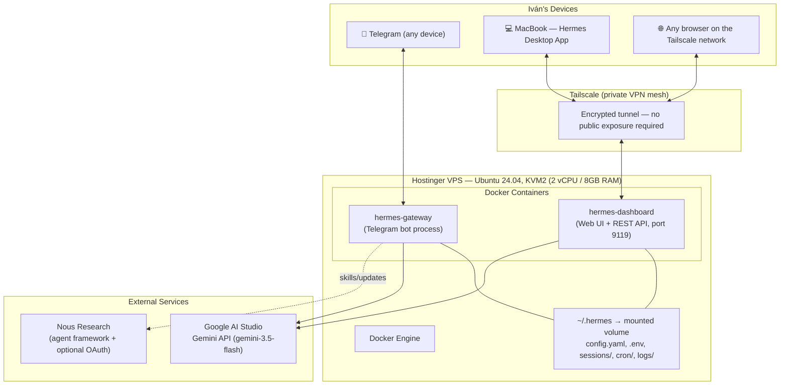

# Personal AI Infrastructure — Technical Documentation

**Owner:** Iván Koch
**Last updated:** July 31, 2026 (CoachMatch pipeline reliability fixes — WhatsApp watchdog rebuild, email-nurture bug, multi-lead execution bug — plus full VPS script/config migration into the repo, §18)
**Status:** Live / operational

---

## Summary (read this first)

This document describes a self-hosted, always-on AI agent system built to give a solo business owner (triathlon/running coaching business) persistent AI access to his business knowledge base — reachable from a phone, a browser, or a desktop app, without depending on a personal computer being powered on.

**What was built:** A single [Hermes Agent](https://github.com/NousResearch/hermes-agent) instance (Nous Research's open-source, self-improving AI agent framework) deployed via Docker on a self-managed Linux VPS. The agent is powered by Google's Gemini API and exposed through three interfaces — Telegram, a web dashboard, and a native desktop app — all reading and writing to the same underlying agent state, so there is one consistent "brain" regardless of entry point.

**Key technical decisions and why:**

| Decision | Reasoning |
|---|---|
| Self-managed VPS over a managed/turnkey product | The managed product tested first ("Managed Hermes") blocked external connections and general-purpose use (no root access, no exposed ports, no ability to run other services). A plain VPS was required to support the current setup plus planned future services (website hosting, workflow automation). |
| Docker deployment over native install | Isolates the agent process from the host OS; matches the vendor's own recommended production deployment path; simplifies updates (pull new image, recreate container). |
| Tailscale VPN + username/password auth over public OAuth | The dashboard needed to be reachable from a personal laptop without exposing it to the open internet. Public OAuth (Nous Portal) requires an HTTPS callback URL, which would have required a domain name and a reverse proxy with a TLS certificate — real infrastructure overhead for a single-user system. A private VPN (Tailscale) between the two devices removes the need for public exposure entirely, at which point simple username/password auth is appropriate and sufficient. |
| Gemini API, prepaid billing, no auto-reload | Cost control was a stated priority. Prepaid billing with auto-reload disabled means the system fails safe (stops working) rather than accumulating unexpected charges if usage spikes. |
| Local terminal execution backend (not Docker-in-Docker sandboxing) | The agent already runs inside its own Docker container (isolated from the host). Adding a second, nested Docker sandbox layer would have required mounting the host's Docker socket into the container — a well-known technique that effectively grants the container root-equivalent access to the host, which undermines the isolation it's meant to add. The existing outer-container boundary was judged sufficient for a single-operator system. |
| Computer Use tool disabled | The agent runs on a headless server with no desktop environment — this capability had no legitimate use case here and was disabled to reduce attack surface. |
| Telegram allowlist restricted to one user ID | Without this, anyone who discovered the bot's public username could message it and get full access to the agent (terminal, files, business data). |

---

## Architecture


```mermaid
flowchart TB
    subgraph Devices["Iván's Devices"]
        Phone["📱 Telegram (any device)"]
        Mac["💻 MacBook — Hermes Desktop App"]
        Browser["🌐 Any browser on the Tailscale network"]
    end

    subgraph VPN["Tailscale (private VPN mesh)"]
        TS["Encrypted tunnel — no public exposure required"]
    end

    subgraph VPS["Hostinger VPS — Ubuntu 24.04, KVM2 (2 vCPU / 8GB RAM)"]
        Docker["Docker Engine"]
        subgraph Containers["Docker Containers"]
            GW["hermes-gateway\n(Telegram bot process)"]
            DASH["hermes-dashboard\n(Web UI + REST API, port 9119)"]
        end
        Data["~/.hermes → mounted volume\nconfig.yaml, .env, sessions/, cron/, logs/"]
        GW --- Data
        DASH --- Data
    end

    subgraph External["External Services"]
        Gemini["Google AI Studio\nGemini API (gemini-3.5-flash)"]
        Nous["Nous Research\n(agent framework + optional OAuth)"]
    end

    Phone <--> GW
    Mac <--> TS <--> DASH
    Browser <--> TS
    GW --> Gemini
    DASH --> Gemini
    GW -.skills/updates.-> Nous
```

**In plain language:** there is one program (Hermes Agent) running on a rented server. It's split into two always-on processes — one listens for Telegram messages, the other serves a web dashboard. Both read the same configuration and memory files, and both call out to Google's Gemini model to actually "think." A private VPN (Tailscale) lets the MacBook and any browser on that network reach the dashboard securely, without putting it on the open internet.

---

## Components in detail

### 1. Compute — Hostinger VPS

- Plan: KVM2 (2 vCPU, 8GB RAM), plain Ubuntu 24.04, no pre-installed application template.
- Public IPv4: `179.197.76.70` (SSH/root access only; the dashboard's public binding is not used for login — see Security section).
- Chosen deliberately over Hostinger's packaged "Managed Hermes" and "Hermes Agent" marketplace products, both of which run in a locked-down environment with no root access, no exposed ports, and no way to install additional services. This VPS is a general-purpose box that can also host a website and run workflow automation (n8n) later, which the managed products could not.

### 2. Container runtime — Docker

Installed via Docker's official convenience script (`get.docker.com`). Two long-running containers, both configured with `--restart unless-stopped` so they survive reboots without manual intervention:

| Container | Image command | Purpose | Port |
|---|---|---|---|
| `hermes-gateway` | `nousresearch/hermes-agent gateway run` | Connects to Telegram, handles all bot messages | — (outbound only) |
| `hermes-dashboard` | `nousresearch/hermes-agent dashboard --host 0.0.0.0 --port 9119` | Web UI, REST API, session history, config management | 9119 |

Both containers mount the same host directory (`~/.hermes` → `/opt/data`), which is where all persistent state lives: configuration (`config.yaml`), secrets (`.env`), session transcripts, cron job definitions, and logs. Because both containers share this volume, they operate as one logical agent rather than two separate ones.

### 3. Model provider — Google Gemini (AI Studio)

- Model: `gemini-3.5-flash` — chosen for cost efficiency (flash-tier) and version stability (pinned release, not a "-preview" or "-latest" rolling alias that could change behavior unannounced).
- Billing: Paid tier ("Prepay" billing plan), $30 in prepaid credit, **auto-reload deliberately disabled**. When the balance hits $0, the service pauses rather than charging further — a conscious trade-off favoring predictable cost over uninterrupted uptime.
- Configured via "Full setup" during the Hermes setup wizard (rather than the "Quick Setup / Nous Portal" default) specifically to keep billing on the personally-funded Gemini key rather than a separate Nous Portal subscription.

### 4. Interfaces

**Telegram** — Primary day-to-day interface. A dedicated bot (created via BotFather) connects through the `hermes-gateway` container. Access is restricted via an `allowed_user_ids` allowlist (Telegram numeric user ID only) — an unrestricted bot would be discoverable and usable by anyone who found its username. The user's own Telegram DM is also configured as the "home channel," meaning scheduled/cron job output and cross-platform notifications land there by default.

**Web Dashboard** (`http://100.70.89.17:9119`, Tailscale address only) — Full browser-based admin interface: chat (embeds the same TUI used in the terminal), session history and search, live config editing, API key management, usage/cost analytics, cron job management, and log viewing.

**Hermes Desktop App** (macOS, native) — Configured under Settings → Gateway → Remote Gateway to connect to the same Tailscale address as the dashboard, rather than running its own separate local agent. This was the trickiest piece to get right (see "Notable engineering problems solved" below) and is what unifies all three interfaces into one shared brain, memory, and session history.

### 5. Networking & access control

- **Tailscale**: a WireGuard-based private mesh VPN. Both the VPS and the MacBook are joined to the same private "tailnet." The VPS gets a stable private address (`100.70.89.17`) reachable only by devices on that tailnet — not from the public internet.
- **Dashboard authentication**: two auth providers are registered and stacked (the login page offers both):
  - **Username/password** (`HERMES_DASHBOARD_BASIC_AUTH_*` environment variables, stored in `~/.hermes/.env`, file permissions `600`) — the provider actually in use, appropriate because access is already restricted to the private Tailscale network.
  - **Nous Portal OAuth** — registered (has a valid `agent:...` client ID) but **not currently usable from the public IP**, because Nous Portal requires an HTTPS callback URL for any non-localhost redirect, which this deployment doesn't have (no domain name or reverse proxy configured). Left in place as a future option if a domain + TLS is added later.
- **Terminal execution backend**: set to `local` (executes inside the already-isolated `hermes-gateway`/CLI container itself, not on the bare VPS host, and not in a second nested Docker sandbox).

### 6. Tooling configuration

Default agentic toolset enabled (web search, file operations, code execution, browser automation, memory, cron, task delegation, etc.), with two deliberate deviations from defaults:

- **Computer Use (desktop control) — disabled.** No desktop environment exists on this headless server; the capability had no use and was removed to reduce attack surface.
- **Free/no-key providers selected wherever available**, to avoid unnecessary new accounts and recurring costs: local headless Chromium for browser automation, DuckDuckGo for web search, Microsoft Edge TTS for speech. Image generation was left unconfigured (skipped) — every available provider was paid or subscription-based, and it isn't needed yet.

---

## Notable engineering problems solved

*Full narratives moved to `build-log.md` (July 29, 2026) — this doc keeps the one-line index so cross-references by number still resolve. Standing rules that came out of these live on here and in the runbooks.*

1. **Split-brain agent** — Desktop App ran its own local agent instead of connecting to the VPS; fixed via Remote Gateway setting.
2. **Managed hosting too restrictive** — "Managed Hermes" blocked external connections entirely; replaced with a plain self-managed VPS.
3. **Docker networking** — app bound to `127.0.0.1` inside the container, unreachable despite `-p` mapping; fixed with `--host 0.0.0.0`.
4. **OAuth redirect mismatch** — Nous Portal needed an HTTPS callback; solved with Tailscale + basic auth instead of a domain/TLS just for login.
5. **Docker-in-Docker sandbox failure** — would have required mounting the host Docker socket (root-equivalent); used `local` backend instead.
6. **Credential hygiene** — a PAT briefly committed publicly, auto-revoked by GitHub. Standing rule: secrets only ever into secure prompts/`.env`/masked fields. Bitwarden adopted July 22, 2026 as the durable vault; SSH keys replaced password login. Open follow-ups: Bitwarden master password out of Apple Passwords, Bitwarden 2FA/Emergency Access, hPanel 2FA.
7. **Hermes unreliability on sustained agentic work (flash-tier)** — narrated success while producing broken code. Standing rules: verify Hermes's claims against literal output; automation logic is written once by hand as a tested script, Hermes only *calls* it. (Twenty API key rotated July 22 as a precaution.)
8. **Google Cloud project silently closed over negligible billing** — abuse-detection false positive; fixed by linking a billing account; 20 days of pixel data lost. Lesson: check request logs before believing account-status banners.

## Cost structure (as of July 2026)

| Item | Cost | Notes |
|---|---|---|
| Hostinger KVM2 VPS | Per Hostinger's published KVM2 rate | Replaces the "Managed Hermes" plan below |
| Google Gemini API | $30 prepaid, manual reload only | Tier 1 (up to $250/month spend cap even if reload were enabled, which it isn't) |
| Old "Managed Hermes" plan | Still active, pending cancellation | Kept temporarily as a rollback safety net during migration; cancel once new setup is proven stable over a few days |
| Tailscale | Free tier | Sufficient for a 2-device personal tailnet |
| Telegram | Free | — |
| Google Cloud (`training-plan-analytics` project) | ~$0.01–0.015/month | Pixel tracking (Cloud Run + BigQuery); $20/month budget *alert* set (notification only, not a hard cap) after the July 2026 outage |

---

## Current status

Working end-to-end: Telegram bot responds using the VPS-hosted agent; the same agent is reachable via the web dashboard and the Mac Desktop App over Tailscale; all three interfaces share the same configuration, model, and memory. Model confirmed live and responding correctly (`gemini-3.5-flash`). Terminal/file tools confirmed functional via a live test (directory listing).

The business knowledge base (GitHub repo `triaperformance-docs` — pricing, methodology, business overview, growth roadmap, social proof) is cloned onto the VPS at `/opt/data/triaperformance-docs` (host path `~/.hermes/triaperformance-docs`), auto-updated daily via a system cron job (`git pull` at 6am server time), and the agent has been instructed and has persisted to memory that this is its source of truth for business questions. Verified live: asked to summarize the business, the agent correctly read all five documents and returned accurate, correctly-cited figures (revenue by channel, pricing policy, roadmap priorities).

The dashboard's port 9119 is now bound only to the Tailscale interface at the Docker level (`-p 100.70.89.17:9119:9119`, not `0.0.0.0`) — confirmed the public IP no longer connects at all, while the Tailscale address still works. This was necessary because Docker manipulates iptables directly and bypasses `ufw` rules for published container ports; binding to a specific host IP was the reliable fix (a `ufw allow`/`deny` rule on its own does not work against Docker-published ports).

As of July 17, 2026, this box also runs the CoachMatch lead pipeline end to end — n8n handles lead creation and the 3-email nurture sequence, Twenty CRM is the system of record, and Hermes runs a daily WhatsApp follow-up watchdog plus takes free-text status updates over Telegram (see section 8). Verified live with real leads: emails sending, deep links working, and a real Telegram message ("mark Aimee as lost, too expensive") correctly updating Twenty.

## 7. Website hosting — live as of July 16, 2026

`triaperformance.com` is served from the same VPS as Hermes, via native Caddy (not Docker — avoids the iptables/`ufw` interaction documented in problem #3 below, and Caddy's automatic Let's Encrypt HTTPS needed no manual cert work).

- **Webroot**: `/var/www/triaperformance` — deliberately outside `~/.hermes`, so a webserver misconfiguration can't expose Hermes's `.env` or session data.
- **Caddyfile** (`/etc/caddy/Caddyfile`): serves `triaperformance.com` and `www.triaperformance.com` as static files from the webroot, gzip enabled.
- **Source of truth**: the `website/` folder in the `triaperformance-docs` GitHub repo (same repo as the business knowledge base).
- **Deploy script**: `~/.hermes/deploy-website.sh` — pulls the repo and rsyncs `website/` into the webroot. Runs automatically via the existing 6am cron job (which now does knowledge-base sync *and* site deploy in one pass), or on demand via SSH or by asking Hermes to run it.
- **DNS (GoDaddy)**: root `@` and `www` A records now point to the VPS's public IP (`179.197.76.70`), replacing the old HubSpot-hosted site. Mail-related records (MX, SPF, DKIM, DMARC) were left untouched — those are what route `@triaperformance.com` mail through Google Workspace, and are unaffected by hosting changes.
- **Verified live**: `curl -I https://triaperformance.com` returns `HTTP/2 200` via Caddy with a valid TLS cert.

Guardrail carried over from the roadmap: Hermes's command-approval mode should stay on "ask," not "off," for anything that touches `/var/www/triaperformance` or the Caddy config directly — routine content updates go through the git deploy path above, not ad hoc edits.

## 8. Business process automation — CoachMatch lead pipeline (live as of July 17, 2026)

The full lead-to-follow-up pipeline for CoachMatch (TrainingPeaks' coach-matching product) has been rebuilt off HubSpot, split across two systems on purpose: **n8n** for anything deterministic and mechanical (parsing a fixed-template email, calling an API, sending a templated message), and **Hermes** for anything that needs judgment or free-text understanding (interpreting a natural-language status update). This mirrors the execution-ownership principle already in the growth roadmap.

### n8n — deployed via Docker on the same VPS, Tailscale-only, no reverse proxy (same pattern as Twenty)

**Workflow 1 — Lead creation** (IMAP trigger, fires on new mail): reads new CoachMatch lead emails from Gmail (scoped, read-only IMAP access — not broad Workspace access) → parses lead fields → checks for duplicates by attempting to create the Person in Twenty and branching on whether the mutation succeeds or fails on the email-uniqueness constraint → on a genuinely new lead: creates the Person, sends a Telegram notification (unchanged from the old HubSpot-era logic, new CRM target), sends email 1 of the nurture sequence immediately via SMTP, and sets `leadStatus = MESSAGE_SENT` with `emailTouchCount = 1`.

**Workflow 2 — Email nurture, emails 2 and 3** (Schedule Trigger, runs once daily): queries Twenty for everyone still at `leadStatus = MESSAGE_SENT` with `emailTouchCount < 3`, computes days since creation, and sends email 2 at the 24-hour mark or email 3 at 48 hours — one email per run per lead, tracked via `emailTouchCount`. The stop condition for the whole sequence is simply `leadStatus` staying at `MESSAGE_SENT`: if it moves to anything else (a reply on any channel, a manual update), the lead silently drops out of both this query and the WhatsApp watchdog below. No separate "unsubscribe" logic was built — one shared status field does the job for every channel.

**SMTP**: Gmail's SMTP (port 465, implicit TLS), same app password as the read-only IMAP credential, sending as `Iván Koch - Triaperformance <coach@triaperformance.com>`.

**Lead magnets**: the three existing PDF guides (nutrition, mental prep, training zones) were moved off HubSpot's file manager onto the website itself, at `triaperformance.com/guias/` — served by the same Caddy setup as the rest of the site, deployed through the same git pipeline.

### Hermes — the WhatsApp lead-status feedback loop

Unlike the email side, there's no WhatsApp Business API in this build (deliberately ruled out — overkill for the volume here, see growth roadmap guardrails). So the WhatsApp side of follow-up is a **feedback loop**: Hermes surfaces who needs a nudge and gives Iván a one-click way to message them, then listens for Iván's own plain-language report of what happened and writes it back to Twenty. Two scripts, deliberately narrow in scope after several early attempts by Hermes to write this logic itself produced broken or incomplete code (see Problem #7 below) — the scripts are fixed, tested, human-written; Hermes's job is limited to calling them correctly.

- **`~/.hermes/scripts/twenty_followup_check.py`** — runs daily via a Hermes-native cron job ("Twenty Lead Follow-up Watchdog," `~/.hermes/cron/jobs.json`). Queries Twenty for people at `leadStatus = MESSAGE_SENT` whose `lastTouchpoint` is more than 2 days old, builds a pre-filled `wa.me` deep link per person (follow-up message copy baked in), and prints a summary — silent if nobody's due, so there's no empty-message noise. Output is delivered to Iván's Telegram home channel automatically as part of the cron job's normal delivery.
- **`~/.hermes/scripts/update_lead_status.py`** — takes a name and one of the 8 valid `leadStatus` values (`NEW`, `MESSAGE_SENT`, `REPLIED`, `IN_CONVERSATION`, `LOST_NO_RESPONSE`, `LOST_NOT_INTERESTED`, `LOST_PRICE`, `WON_CUSTOMER`) as arguments, searches active (`MESSAGE_SENT`) leads for a name match, refuses to guess if it finds zero or more than one match, and — on exactly one match — runs the Twenty update mutation and refreshes `lastTouchpoint`.

**Telegram use cases now live:**
- Daily automatic nudge: "Following up needed — no status update in 2+ days: [name] · [days] · [WhatsApp link]" for each stale lead, silent otherwise.
- Free-text status updates, e.g. *"Fabian replied"* → `REPLIED`, *"mark Gaston as won (customer)"* → `WON_CUSTOMER`, *"mark Aimee as lost, too expensive"* → `LOST_PRICE`. Hermes's only job is mapping the sentence to exactly one of the 8 known enum values and calling the script with the right two arguments — it's instructed to ask for clarification rather than guess if the mapping isn't confident (e.g. "customer" alone, before "won" is added, isn't a valid value and shouldn't be silently mapped to one).

Twenty's GraphQL introspection is disabled on this instance, so neither Hermes nor n8n can discover schema/enum values programmatically — the valid `leadStatus` values above were confirmed directly by Iván from the Twenty UI and hardcoded into the script rather than guessed.

## 9. Analytics pipeline — plan-view tracking, GA4, Search Console & site-verification tools (live as of July 21, 2026)

**Site instrumentation.** Google Analytics 4 (property under `coach@triaperformance.com`) was added directly to `website/index.html`'s `<head>` (gtag.js, measurement ID `G-T69KEHW59J`), deployed through the normal git → cron deploy pipeline. Google Search Console was added as a Domain property for `triaperformance.com` — ownership auto-verified because the DNS TXT record from the pre-VPS HubSpot era was still in place, no new DNS work needed. GSC and GA4 are linked (Admin → Product Links) for combined search-query reporting inside GA4.

**TrainingPeaks plan-view pixel.** The 1x1 tracking pixel embedded in each TP plan listing posts `plan_id` + `price` to a Cloud Run service (`plan-tracker-bigquery`, project `training-plan-analytics`), which writes to BigQuery (`training-plan-analytics.tracking_data.plan_views`). This project lives under a separate personal account, `ivankoch87@gmail.com` — not the business Workspace account (`coach@triaperformance.com`) everything else in this document runs under. That split matters operationally: any cross-account work (like the GA4 link below) needs an explicit IAM grant.

*Outage, Jun 30–Jul 21, 2026 (fixed):* the project was silently disabled by a Google billing/abuse false positive — 20 days of data lost, full history since June 2025 intact, fixed by linking a billing account. A **$20/month budget alert** (notification only, not a hard cap — a hard cap would recreate this exact outage on purpose) is now scoped to the project. Full incident narrative: `build-log.md` (problem #8).

**GA4 → BigQuery export.** Enabled the same day (Admin → Product Links → BigQuery Links), exporting into the same `training-plan-analytics` project — daily export, not streaming (free tier, sufficient at this volume). Linking required granting `coach@triaperformance.com` the **Owner** role on the GCP project; Editor alone lacks `resourcemanager.projects.setIamPolicy`, which the linking flow needs to grant its own service account BigQuery access.

**New standing infrastructure — analytics Postgres on the VPS, own lane (same separation pattern as Twenty/n8n).** A dedicated `analytics-postgres` Docker container, bound to `127.0.0.1` only (nothing outside the box needs to reach it — no Tailscale exposure needed). Directory `~/.analytics/` (`data/`, `scripts/`, `credentials/`, `logs/`). Table `plan_views` mirrors the BigQuery schema (`event_timestamp`, `plan_id`, `price`, `ip_address`, `user_agent`, `referrer`) with a `UNIQUE(event_timestamp, plan_id, ip_address)` constraint, making repeated syncs safely idempotent. A read-only BigQuery service account (`pixel-sync-vps`, roles: BigQuery Data Viewer + Job User only) backs a Python script, `~/.analytics/scripts/sync_pixel_data.py`, which pulls everything with `event_timestamp >= MAX(event_timestamp already in Postgres)` and upserts — run nightly at 5am via cron (staggered clear of the existing 2am Twenty backup and 6am website/KB deploy). First run backfilled all 49,105 historical rows (June 2025 to date). A `plan_views_clean` view sits on top, replicating the bot/IP-filtering logic Iván already used in BigQuery (excludes a known non-customer IP and bot/crawler/spider/headless user agents) — the raw table stays untouched for audit, reporting queries use the clean view (21,217 rows after filtering, matching the existing trusted BigQuery query).

Purpose: this VPS copy is now the durable backup of the pixel data, independent of the personal Google Cloud account's billing/closure risk — the exact failure mode that just cost 20 days. It's also the first table in what's planned to become the VPS's broader analytics warehouse (pixel hits + future GSC pulls + sales CSVs + email signups — see `growth-roadmap.md` / `plan-storefront-project-brief.md`).

**Site-verification tools, same day.** Microsoft Clarity (heatmaps + session recordings) added via a manual script tag in `website/index.html`'s `<head>`, alongside the GA4 tag (Clarity project ID `xq3g7pvr9i`). Connected to the GA4 property under Clarity's Settings → Integrations, which lets recordings be filtered by GA4 traffic-source/segment data — worth noting this is a reporting-level correlation only, not a raw-data feed; Clarity's actual recordings and heatmaps live solely inside Clarity's own platform, no BigQuery/Postgres export exists for them. Bing Webmaster Tools and Ahrefs Webmaster Tools were both added via their "Import from Google Search Console" one-click path — no new DNS or file-upload work, both piggyback on the existing GSC domain verification. Same caveat as the GA4/GSC link above: Search Console data itself doesn't flow into GA4's or BigQuery's dataset, it's a reporting-level integration only — a genuine data pull would need the Search Console API separately.

Two items from the same tooling review deliberately not actioned: Rich Results Test (search.google.com/test/rich-results) needs no account and nothing to set up — it's a URL-paste validator to use once plan pages ship with Product schema (Phase 1/2 storefront SEO work, not built yet). Umami (self-hosted analytics) stays parked — only worth adding if GA4's own UI becomes a friction point, per the original call.

## 10. Storefront data pipeline — plan catalog + weekly-breakdown crawl (July 21, 2026)

**Why.** The storefront brief (`plan-storefront-project-brief.md`) calls for loading the plans inventory onto the VPS as Phase 1 step 1. Separately, Iván noticed TrainingPeaks' own plan pages render a stats table — "Average Weekly Breakdown" (workouts/week, weekly average duration, longest workout, per activity) — that TP calculates from the actual structured workouts and was never in the manually-maintained inventory CSV. Both landed in the same piece of work.

**New database, same container.** Rather than stand up new infrastructure, added a `storefront` database to the existing `analytics-postgres` container (same VPS, same "own lane" container as the pixel-tracking data — see §9), keeping it logically separate from the marketing-analytics `analytics` database on that same instance. Two tables:
- `plans_raw` — the full inventory CSV (`data/training_plans_inventory.csv` in the repo), loaded as an all-text staging table on purpose, since the source data has known issues (see cleanup below) that would break type constraints on a typed load. 407 rows loaded, cleaned to **386** by removing 13 "Not built" placeholder rows (plan_id literally `"Not built"`) and 8 rows with `link = "Expired"` (no overlap between the two groups). Duplicate `plan_id`s (439394, 439396, 439397, 612974 — already known, see storefront brief) were left as-is; no dedup logic applied yet.
- `plan_weekly_breakdown` — tidy format (one row per activity per plan: `plan_id`, `activity_type`, `weekly_count`, `weekly_avg`, `weekly_avg_unit`, `longest_workout`, `longest_workout_unit`). Units are mixed by design (duration `HH:MM:SS` for most activities, meters for swim, occasionally miles) so the value columns are text, not numeric.

**The crawl.** 330 of 407 plans are published with a working link — those were the crawl targets, using `mcp__workspace__web_fetch` against each plan's live TrainingPeaks page (confirmed via manual samples across every sport type — running, cycling, swimming, strength, triathlon, duathlon — that the stats table is server-rendered and parses cleanly with plain fetches, no JS rendering needed). First attempt used 6 parallel subagents and tripped TrainingPeaks' bot/rate-limit detection partway through; a second attempt with 2 parallel agents also hit it, plus an unrelated bash-tool hang. Net result after both waves: **190 of 330 plans successfully captured** (468 activity rows), **10 genuinely dead links** (mostly 404s on ultra-marathon plans, 2 with a literal `"Expired"` link value, 2 more that use non-standard mile-based units the parser doesn't yet handle), ~~**130 plans not yet attempted**~~ — paused deliberately rather than continuing to fight the rate limit; resumable later without redoing the 200 already-attempted plans (`data/plan_weekly_breakdown_errors.csv` has the exact list and reasons). **Finished July 29, 2026 — see update below.**

~~**Separately found, not yet fixed:** 6 plans marked `is_published = TRUE` in the inventory return a 404 on TrainingPeaks (434680, 443810, 443812, 443815, 443816, 491765) — different from the "Expired"/"Not built" rows above, these look like TP-side unpublishing that never made it back into the inventory CSV. Needs a manual check.~~ — **resolved between July 22–27:** 434680's link was fixed (confirmed live again in the July 29 crawl below); 443810/443812/443815/443816/491765 were confirmed genuinely dead and dropped from the source CSV entirely (see `plan-storefront-project-brief.md` §3 and git history on `data/training_plans_inventory.csv`).

**Update, July 29, 2026 — crawl finished; source CSV was already deduped, Postgres wasn't.** Two things closed out in the same session:

1. **Weekly-breakdown crawl completed.** Reconciled the crawl target list against the *current* inventory (381 rows, not the original 407 — 13 "not built" + 21 dead/duplicate rows have been dropped since this section was first written) rather than trusting the stale error list verbatim: 323 plans are currently published with a real link, 190 were already captured, leaving 133 to attempt (not the 130 estimated — the reconciliation caught that 434680's now-fixed link and the 2 mile-unit plans, 475339/476791, were still outstanding). All 133 were fetched sequentially via `mcp__workspace__web_fetch` at a ≥2s pace (no parallelism, matching the July 27 link-check's proven pacing) — **zero bot-detection/rate-limit signals the entire run.** Result: **301 of 323 published plans now have breakdown data** (765 activity rows total in `data/plan_weekly_breakdown.csv`), **22 confirmed dead** (`data/plan_weekly_breakdown_errors.csv`, cleaned of stale entries for plan_ids no longer in the catalog at all) — all 22 are race-year-stamped marathon variants (Tokyo/London/Boston/Barcelona/Santiago/Rio/Lima 2025–26 gym-volume series) returning TrainingPeaks' standard "Training Plan Not Found" page, consistent with expired race dates rather than throttling (confirmed by successfully fetching non-race-specific plans interleaved between clusters of these 404s). The mile-based unit gap is now handled: `weekly_avg`/`longest_workout` store the bare number, `weekly_avg_unit`/`longest_workout_unit` store `mi`. 301 crawled + 22 dead = 323 published, fully reconciled, nothing unaccounted for. **Not yet done:** loading these new rows into the live `plan_weekly_breakdown` Postgres table — file-level work only; see handoff.
2. **Finding from the crawl, fully resolved same day:** plan_ids 612974 (Lima Marathon, Spanish) and 612836 (Lima Marathon, Portuguese — see the dedup note below) both returned "Training Plan Not Found" despite `is_published = TRUE` in the inventory. Iván confirmed both are genuinely unpublished (not a TP outage or a crawler issue). Fixed everywhere: `is_published` flipped to `FALSE` for both in `data/training_plans_inventory.csv` (published+real-link count now **321**, was 323), their `data/plan_weekly_breakdown_errors.csv` reason text updated to state the real cause instead of a bare 404, and `plans_raw` on Postgres updated and confirmed via a live `SELECT` — both rows show `is_published = FALSE`. Nothing further needed on these two.

**Dedup status correction, closed out July 29, 2026.** This section previously said the 4 known duplicate `plan_id`s (439394, 439396, 439397, 612974) were "left as-is; no dedup logic applied yet" in `plans_raw`, and that Postgres (loaded July 21) predated the source CSV's July 22 fix (`git` commit `a3833e8`, per `plan-storefront-project-brief.md` §3) and would need the fix applied separately. **Live query against `plans_raw` (July 29) shows this was already wrong — no action was actually needed:** the table currently has exactly **381 rows**, matching the corrected CSV precisely, and `612836` (the corrected Portuguese Lima plan_id) is present with the right content. `plans_raw`'s primary key is on an internal `id` column, not `plan_id` — so this wasn't a constraint silently deduping on load; the table must have been reloaded from the already-fixed CSV at some point after July 22 (not documented when or by whom). Net effect: `plans_raw` and the source CSV already agree, zero duplicate `plan_id`s in either, nothing further to run. This section's "386 rows" figure and the "left as-is" claim above were stale as of this check — treat "381 rows, deduped" as the current true state going forward.

**Update, July 29, 2026 — new rows loaded into Postgres, confirmed via psql.** `plan_weekly_breakdown` now has **765 rows / 301 distinct plan_ids** (up from 468/190), verified by a live `COUNT(*)` query, not just file contents. Two real bugs hit and fixed getting there, worth keeping for next time: (1) `LIKE plan_weekly_breakdown INCLUDING ALL` on the staging table pulled in extra columns beyond the CSV's 7, so a column-less `\copy` failed with "missing data for column" — fixed by naming the 7 columns explicitly in both the `\copy` and the subsequent `INSERT ... SELECT`. (2) `plan_weekly_breakdown.csv` had mixed line endings — the pre-existing 473 rows were CRLF, but new rows appended during this session (both a manual 4-row addition and the subagent's 131-plan crawl) used plain LF, and the inconsistency made `\copy` throw "unquoted newline found in data". Fixed by normalizing the whole file to LF only (`sed -i 's/\r$//'`) before reloading — worth checking for on any future append to this file, since it's evidently been CRLF from whatever originally produced it.

**Source files, repo:** `data/training_plans_inventory.csv`, `data/plan_weekly_breakdown.csv`, `data/plan_weekly_breakdown_errors.csv`.

## 11. Website contact form → Twenty + email + Telegram (live as of July 22, 2026)

The last piece of the CoachMatch-pattern lead pipeline (§8) now also covers direct website leads. `website/index.html`'s contact form (name, email, WhatsApp, sport dropdown, goal) posts to same-origin `/api/contact-form`, which Caddy proxies internally to n8n. Full build is documented in `contact-form-pipeline-runbook.md`; short version:

- **Caddy** needed a `rewrite * /webhook/contact-form` inside the `route /api/contact-form` block before the `reverse_proxy` line — n8n always serves webhooks under a `webhook/` prefix internally, so proxying the raw path unchanged 404s at the Express layer even though the proxy itself is working.
- **n8n workflow** (`automation/contact-form-workflow.json`): dedupe check by email → create Person in Twenty → confirmation email → Telegram notification → `leadStatus = MESSAGE_SENT`, feeding into the same daily nurture workflow and Hermes WhatsApp watchdog a CoachMatch lead uses — no separate nurture logic needed.
- **Real Twenty Person schema, confirmed by reading back a live API response** (rather than guessed from the original HubSpot migration audit in `growth-roadmap.md`): the field is `sport` (not `sportPrimary`/`sport__all_`), and there's no `campaign_attribution` field — `leadSource` fills that role, and turned out to also be an enum (confirmed value: `WEBSITE_FORM`). `sport` itself is an enum too: `RUNNING`, `CYCLING`, `SWIMMING`, `TRIATHLON`, `DUATHLON` (all caps).
- **Confirmed enum values (Iván, source of truth, July 2026):**
  - `leadStatus`: `NEW`, `MESSAGE_SENT`, `REPLIED`, `IN_CONVERSATION`, `WON_CUSTOMER`, `LOST_NO_RESPONSE`, `LOST_NOT_INTERESTED`, `LOST_PRICE`
  - `leadSource`: confirmed via a real 400 from the live API (July 24, 2026) to be only `COACHMATCH`, `WEBSITE_FORM`, `REFERRAL`, `OTHER` — the `WEBSITE`/`ALL_ACCESS_SUBSCRIPTION` options Iván intended to add were never actually saved to the field (added somewhere that didn't take, or not saved). Subscription-lifecycle automation uses `OTHER` for new All-Access subscribers, since the TrainingPeaks confirmation email never tells us the real acquisition channel (website, Instagram, guide link, etc.) and `OTHER` is the most honest fit of the four real options. If Iván wants a dedicated value later, it needs to be added in Twenty under Settings → Data Model → Person → `leadSource` → Add option, then confirmed again the same way (a real API call, not assumed).
  - `customerType`: `PLAN_BUYER`, `ALL_ACCESS`, `OPT1_1_COACHING` — this is the field that actually distinguishes customer types from each other, not `leadSource`. Corrected July 25, 2026: previously documented as `1_1_COACHING` (never actually confirmed against a live response) — a real 400 from the backfill script's first live run gave the exact valid list, including the `OPT` prefix on the coaching value.
  - **Two separate date fields, confirmed July 25, 2026, easy to conflate**: `purchaseDate` is used for training-plan purchases (this is the field the subscription-lifecycle workflow, §12, already writes for All-Access). `signUpDate` is the separate field for subscribers and 1:1 coaching athletes, plain `YYYY-MM-DD` format — this is the one `backfill_existing_customers.py` (§13 addendum below) writes. Confirmed directly by Iván via Twenty's Data Model settings, not guessed.
  - `preferredLanguage`: `SPANISH`, `PORTUGUESE`, and `ENGLISH` all confirmed — `ENGLISH` verified July 24, 2026 via a live English-subscriber test through the subscription-lifecycle workflow (accepted with no 400).
- **n8n's generic "HTTP Header Auth" credential type doesn't prepend `Bearer ` automatically** — cost real debugging time, since the saved value is masked afterward with no way to re-confirm it visually. Worth remembering for any future n8n + Twenty credential setup.
- Confirmed working with a real production form submission on `triaperformance.com`.

## 12. CoachMatch mis-firing fix + subscription-lifecycle automation (July 24, 2026)

- **CoachMatch bug found and fixed**: the `Email Trigger (IMAP)` node in `CoachMatch Lead Automation` had zero filter criteria — it fired on every single email in the inbox, silently creating junk Person records in Twenty (blank fields via the regex parser's silent-empty-string fallback) for anything that wasn't a real CoachMatch lead. Fixed by Iván directly in n8n using a **Filter** node (not IF) checking `subject` contains "Coach Match" — confirmed working for both matching and non-matching test emails. Source archived at `automation/coachmatch-lead-automation.json` (built with an IF node as the first-pass fix; Iván's live version uses Filter instead — functionally equivalent, Filter is simpler for a single pass/drop condition).
- **New workflow: Subscription Lifecycle (New + Churn)** (`automation/subscription-lifecycle-automation.json`), watching a dedicated Gmail label (`TP-Subscriptions`, filtered from `receipt@trainingpeaks.com`, "Skip the Inbox" checked) rather than the main inbox — required specifically to avoid a mailbox race condition with CoachMatch's own IMAP poller (fetching mail flips the IMAP `\Seen` flag server-side regardless of which workflow's poll does it, so two pollers on the same folder can silently starve each other).
  - Parses the real "New subscription confirmation" and "Subscription cancellation" (exact match, not "contains" — collides with "...cancellation scheduled" otherwise) emails from TrainingPeaks.
  - Detects which All-Access product (ES/EN/PT) from the real confirmed product name strings (see `triaperformance-pricing-and-positioning.md`), sets `preferredLanguage` accordingly. Auth itself is language-agnostic; only the members-area *content* will be filtered by this field once built.
  - Upserts the Person in Twenty (dedupe by email), setting `customerType: ALL_ACCESS`, `leadStatus: WON_CUSTOMER`, `signUpDate`/`churnDate`, `planPurchased`.

**Correction, July 26, 2026** — the `Create Person (New Subscriber)` and `Update Person (Existing Subscriber)` nodes were setting `purchaseDate` instead of `signUpDate`. Only caught once the two-fields-mean-different-things distinction was confirmed in §13's backfill work: `purchaseDate` is for training-plan purchases, `signUpDate` is for subscribers and 1:1 coaching — All-Access is the latter. The churn side was already correct (`Mark Churned in Twenty` sets `churnDate` properly, no fix needed there). Fixed in both nodes to `signUpDate: new Date().toISOString().split('T')[0]` (plain `YYYY-MM-DD`, matching the confirmed working format, rather than the full ISO timestamp `purchaseDate` had been using). Known consequence: any All-Access subscriber created or updated through this workflow before this fix has `purchaseDate` wrongly populated and `signUpDate` blank — worth a manual one-time correction in Twenty for the handful of real subscribers affected (All-Access has had 2 subscribers total per the growth roadmap, so this is a small, easy cleanup, not a backfill-script-scale job).

*Update, July 29, 2026 — checked in Twenty, closed as a non-issue.* All 3 current All-Access customers (roadmap's "2 subscribers" figure was stale) have `signUpDate` correctly populated and `purchaseDate` blank. No corrections needed; the bad-data scenario this section warned about never actually materialized for any real subscriber.

*Update, July 29, 2026 — two more bugs found and fixed in the CoachMatch workflow (`automation/coachmatch-lead-automation.json`) during live testing, unrelated to the mis-firing/subscription-lifecycle items above but same file:*
- **Location-parsing bug.** The parser node (`Code in JavaScript`) assumed the email's `Location:` field always had exactly 3 comma-separated parts (`city, state, country`). Real CoachMatch emails don't always follow that — a lead with just `Location: Brazil` (1 part) put "Brazil" into `city` and left `country` blank; a lead with `Location: Guanajoato, Brazil` (2 parts) put "Brazil" into `state` instead of `country`. Since `country` is what the workflow keys off for `preferredLanguage`, the calling-code/ISO lookup, and `addressCountry`, this one bug cascaded into three visible symptoms: wrong `preferredLanguage` (Spanish instead of Portuguese for Brazilian leads), phone numbers incorrectly flagged as `no_phone: true` despite being valid, and blank `addressCountry` in Twenty. Fixed by re-parsing `Location` so the *last* comma-separated segment is always treated as country, regardless of how many segments exist.
- **WhatsApp-outreach suppression added.** New Filter node `Skip WhatsApp Outreach — BR/AR`, sitting between `If` (success branch) and `Code in JavaScript4`, blocks the outreach Telegram ping (the one with the WhatsApp link "so I reach out") when the lead is from Brazil or Argentina, or when there's no valid phone number at all. The automated pricing email (`Send an Email`) is untouched and still fires for everyone. First build of this filter had a real bug of its own — every `leftValue` was typed as `=={{ ... }}` (double `=`) instead of `={{ ... }}`, which made every condition evaluate as a literal string with a stray leading `=` character glued on, so the Brazil/Argentina checks always read "not equal" and the no-phone check was never actually empty. Fixed to single `=`, retested against Brazil, Argentina, and no-phone mock leads — confirmed blocked in all three cases live.
- Also confirmed, same session: the "raw HubSpot email HTML in Telegram" symptom originally flagged for this workflow was from *before* the July 24 IMAP-filter fix (§12 above) — it was actual mailer-daemon bounces and calendar-notification emails passing through the old zero-filter trigger, not a bug in the current duplicate-lead branch. No code change was needed for that specific complaint; the existing Filter node already covers it.
  - Tested end-to-end against realistic mock emails (via a temporary static Set node feeding the filters directly, since replaying already-read mail doesn't retrigger an IMAP poller that tracks by UID) — full matrix: new subscriber create, existing-subscriber update (routes to `Update Person`, generates a fresh token rather than reusing the old one — every new-sub event issues a new token, current behavior, not yet a deliberate design decision either way), all three languages (ES/EN/PT, `preferredLanguage: ENGLISH` confirmed accepted), churn matched (token(s) correctly flipped to `active = FALSE`) and churn unmatched (fires only the Telegram alert, no Twenty/Postgres writes). All green. Temporary Set node removed, test Person records cleaned out of Twenty, `Members Postgres` credential wired (was `REPLACE_ME`, now set), Gmail label filter confirmed in place, **workflow switched Active July 24, 2026.**

## 13. Members-area auth gate (built and deployed July 24, 2026)

Per-subscriber token system, not a shared password — a churn only revokes the one subscriber's access rather than requiring a rotate-and-rebroadcast to everyone else. Three pieces, all in `automation/members-area/`:

- **`schema.sql`** — new `members` database on the existing `analytics-postgres` container (same "own lane, same container" pattern as the pixel-tracking and storefront data, §9-10). One table, `subscriber_tokens` (twenty_person_id, email, token, preferred_language, active, created_at, revoked_at).
- **`auth_service/`** — tiny Flask service (`app.py` + `requirements.txt` + `Dockerfile`), bound to `127.0.0.1` only, never exposed beyond the VPS itself. Three routes: `GET /members/check` (called by Caddy's `forward_auth` on every `/members/*` request), `POST /members/login` (validates the token from the login form, sets an HttpOnly cookie), `POST /members/logout`.
- **`caddy-snippet.txt`** — the Caddyfile block gating `/members/*` behind the auth-check service, with a `handle_errors` redirect back to the login page on a 401. Flagged as first-pass, needs real testing the same way the `/api/contact-form` rewrite did — Caddy matcher syntax has version quirks.
- **`docker-compose.snippet.yml`** — deploy config for the auth service, port-bound to `127.0.0.1:8091` only.
- **`website/members/login/index.html`** and **`website/members/index.html`** — static login page and a placeholder members home (just confirms the gate works end-to-end; no real content yet).
- **Wired into the subscription-lifecycle workflow**: `Generate Member Token` (random 20-char token, ambiguous-character-free alphabet since it doubles as a human-typed password) → `Insert Token in Postgres` on new subscription, `Revoke Token in Postgres` on churn. Welcome email now includes the real login link + generated password instead of placeholder copy.
- **Access tracking**: `subscriber_tokens` also has `access_count` and `last_accessed_at`, incremented on every `/members/check` call (i.e. every page load inside `/members/`, not just the login event) — answers "how many times has this subscriber actually used it," which a login-only counter wouldn't (the cookie lasts a year, so logins are rare after the first one).
- **Password lookup + resend, both answered directly rather than assumed**: tokens are stored in plain text in `subscriber_tokens` by deliberate design (not hashed) specifically so Iván can query the table and see exactly which password belongs to which subscriber — a real security-adjacent tradeoff, acceptable given what's being protected is training content, not financial/personal data. Resend is now self-service: a new `Webhook - Resend Password` trigger (same `subscription-lifecycle-automation.json` file, independent branch) reached via `POST /members/forgot-password` (Caddy proxies straight to n8n, same rewrite pattern as `/api/contact-form`) looks up the active token by email and re-sends it over the same SMTP credential already used elsewhere — deliberately responds with the same generic message whether or not the email is a real subscriber, standard forgot-password privacy practice.
- **Postgres node schema**: the scaffolded parameter shape for the Postgres nodes held up against Iván's live n8n instance with no rework needed.
- **Resend-password bug found and fixed (July 24, 2026, live testing)**: the `Token Found?` IF node's condition was `{{ $json.length }} > 0` — but at that point `$json` is a single Postgres row object (`{token, preferred_language}`), not an array, so `.length` was always `undefined` and the condition always evaluated false. Net effect: even when a token *was* found, the workflow silently routed to the generic-response branch and skipped `Send Resend Email` — a subscriber would get the "check your inbox" confirmation with no actual email behind it. Fixed by changing the condition to check `{{ $json.token }}` is not empty instead of array length. A second latent bug in the same branch was fixed alongside it: `Look Up Active Token` (Postgres) emits zero output items on a genuine no-match, and n8n nodes don't fire on zero input items by default — meaning a not-found email would leave the webhook hanging indefinitely rather than returning the generic response. Fixed by enabling "Always Output Data" on that node. Both retested live and confirmed: a found email now receives the real password email, a not-found email gets the generic response with no hang and no email sent.
- **Frontend UX fix, same day**: `website/members/forgot-password/index.html` originally reset the form after submit, leaving the email input and button visible underneath the confirmation message — read as "did this do anything?" Fixed to hide both the form and the intro subtitle on success, leaving just the confirmation text and the "volver al login" link.
- **Deployed and live**: `members` database created, Gmail-label filter for `TP-Subscriptions` confirmed in place, `Members Postgres` credential wired in n8n, temporary Set node removed, subscription-lifecycle workflow active. Full resend/login/churn matrix retested end-to-end post-fix, all green.
- **GA4 added to all `/members/` pages, retroactively (July 24, 2026).** The tag was on every public marketing page but missed on the members pages when they were first built — added to all 8 (`login`, home, `forgot-password`, and the first 5 gated tool pages: `zonas`, `tests`, `carga`, `carrera`, `nutricion`, `kettlebell`) in one pass. Standing rule going forward, also added to `triaperformance-project-instructions.md`: every new page gets the GA4 tag at build time, not after.
- **`access_count` / `last_accessed_at`, what they actually mean**: `access_count` is a lifetime cumulative counter per token — it increments on every successful `/members/check` call, i.e. roughly once per page navigation inside `/members/` (via Caddy's `forward_auth`, which runs on every request under that path). It answers "has this subscriber ever engaged, and roughly how much in total" — it does **not** answer "how many distinct days/sessions," and can't be broken out by day/week/month; a value of 7 could be one five-minute binge or seven visits spread over a month, no way to tell from that column alone. `last_accessed_at` only holds the single most recent timestamp, not a history. For real daily/weekly/monthly active-user reporting, GA4 (now live on these pages, see above) is the right tool — its standard "Active users" report already breaks out 1-day/7-day/28-day active users automatically, segmentable by page path (`/members/*` vs. public pages) with no extra setup required, since it already tracks every pageview with a timestamp. The Postgres counter stays useful for its own thing — a fast per-subscriber lookup ("has X ever logged in") without needing to query GA4 — but it's not, and isn't meant to be, a general analytics source.
- **Access model expanded to 1:1 coaching, decision (July 24, 2026)**: members-area access is now also being used as a retention tool for 1:1 coaching athletes, not just All-Access subscribers -- "if they leave, they're also out of the members area." No code change needed for this: the auth gate is purely token-based (`subscriber_tokens.active`), completely decoupled from `customerType`, so granting access to a coaching athlete is just a data operation, not a schema or auth-service change. The one real gap this opens: All-Access churn is auto-detected (TrainingPeaks cancellation email -> automatic token revoke), but there's no equivalent signal for a 1:1 coaching relationship ending -- offboarding a coaching client from the members area is a manual step (see the manual-revoke query in the Appendix) until/unless a real signal for "this coaching client ended" exists somewhere to hook into.
- **Bulk backfill tool for existing customers**: `automation/members-area/backfill_existing_customers.py` (+ `backfill_template.csv`). One-time-use script, stdlib-only, for granting access to customers who predate the automation (both All-Access and 1:1 coaching -- there's no historical subscription email to replay for either category doing this in bulk any other way). Per row: looks up the Person in Twenty by email (dedupes against existing CoachMatch-era records), creates or updates via Twenty's REST API (deliberately not raw SQL against Twenty's own database -- self-hosted Twenty manages its own internal schema/search indexes/relations, and writing to it outside the API risks corrupting that), generates a token, and outputs a single multi-row SQL `INSERT` for `subscriber_tokens` -- it does not write to Postgres itself, and it sends zero emails on purpose (decided explicitly: no bulk email blast to existing customers). Needs Tailscale network access to reach Twenty (`100.70.89.17:3000`), so it has to run from Iván's Mac or via SSH on the VPS, not from a sandboxed environment without tailnet access. Doesn't protect against double-provisioning on a second run -- check `SELECT email FROM subscriber_tokens WHERE active = TRUE` first and exclude anyone already provisioned from the input CSV.
- **Backfill script hardened through real use, July 25, 2026** — full first real run was 35 1:1 coaching athletes from Iván's own ledger (`coaching_backfill_2026-07-25.csv`), not a general contact migration (see growth-roadmap.md distinction). Several real bugs and confirmed-schema corrections came out of actually running it against live Twenty + Postgres, not guessed:
  - `customerType` valid values confirmed via a real 400: `PLAN_BUYER`, `ALL_ACCESS`, `OPT1_1_COACHING` — previously documented (never confirmed) as `1_1_COACHING`, missing the `OPT` prefix.
  - Two separate, easily-conflated date fields confirmed directly by Iván in Twenty's Data Model settings: `purchaseDate` (training-plan purchases, already used by the subscription-lifecycle workflow) vs. `signUpDate` (subscribers and 1:1 coaching, plain `YYYY-MM-DD`) — the backfill script writes `signUpDate`, on both create and update (unlike `sport`/`planPurchased`/`leadSource`, which are only set on create, to avoid overwriting real data on existing records).
  - Added `phones` (composite field, mirroring the confirmed `emails` shape: `primaryPhoneNumber`, `primaryPhoneCallingCode`, `primaryPhoneCountryCode`), `athleteLevel`, and `addressCountry` to the script, all confirmed working against a real test record.
  - **Design decision on phone country resolution, confirmed by Iván**: the calling code embedded in the phone number itself is always authoritative for `primaryPhoneCountryCode` — never inferred from the free-text `addressCountry` field. These two fields deliberately mean different things: `addressCountry` is whatever the athlete self-declared on their onboarding form (origin/nationality), while the phone's own calling code reflects where they actually are / what number they actually use (e.g. Nadine Tischhauser is Latvian but lives in Mexico and uses a Latvian WhatsApp number; Elisa "Aki" Yamazaki is Japanese but lives in Mexico and uses a Mexican number). Initial concern that these were data-entry errors was wrong — confirmed both are correct as entered. `+1` numbers (shared by US/Canada/Puerto Rico/Barbados/etc.) are the one case still resolved via `addressCountry` as a tiebreaker, since the calling code alone is ambiguous there.
  - Real bug: the SQL-generation code built a 5-column `INSERT` (`twenty_person_id, email, token, preferred_language, active`) but only ever wrote 4 values, omitting `active` entirely — silent until actually run against Postgres (`INSERT has more target columns than expressions`). Fixed.
  - Real bug: `TWENTY_API_KEY` handling didn't account for Twenty's "HTTP Header Auth" credential type not auto-prepending `Bearer ` (same gotcha noted in §11) — if the value saved in Bitwarden already includes the `Bearer ` prefix (likely, since n8n's credential needed it typed in manually), the script was double-prefixing and getting a 401. Fixed to detect and handle either case.
  - New reference file: `automation/members-area/OPERATIONS.md` — day-to-day command cheat sheet (create a single new token, query all/one, deactivate, reactivate, count active, find never-logged-in, find duplicate active tokens, hard delete).
  - *Update, July 29, 2026 — Ronald Yesid (`rongoni6@hotmail.com`) checked for duplicate active tokens from this backfill.* Turned out not to be a true duplicate-active case: of his 2 rows, only 1 was ever active at a time. Deactivated the other (`DQ835eyS6BwAjuNgzzmT`, keeping `j5zzGEMHpaTRHxg3k2zA`) for cleanliness; confirmed via psql only one active token remains for that email.
- **Where "real analytics" goes next (planning note, not yet built)**: three genuinely different data sources answer three different questions, and they shouldn't be conflated into one number: (1) subscriber/customer counts (active All-Access count, churn, tenure) live in Twenty CRM (`customerType`, `purchaseDate`, `churnDate`) — a CRM query/report, not a web-analytics question; (2) aggregate usage (DAU/WAU/MAU, which tool pages get used, session length) is GA4's job, now instrumented; (3) per-subscriber tool usage tied to identity (e.g. "which athlete used the carb calculator, and how often") needs either GA4's User-ID feature (assign the member token/email as a GA4 user ID on login) or extending the current single-counter Postgres approach into a real per-event log table (`member_access_log`: token, page, timestamp — one row per visit instead of one mutable counter per token). Neither built yet. Longer term, this is the same "VPS Postgres as analytics warehouse" thread already sketched in §9/growth-roadmap.md (pixel hits + GSC + sales CSVs + email signups) — GA4's BigQuery export could eventually sync into that same warehouse alongside Twenty subscriber data, giving one queryable place for "all metrics" instead of switching between GA4, Twenty, and psql. Worth revisiting once there's enough member volume for the aggregate numbers to be meaningful.

## 14. Monday coaching check-in automation (built July 26, 2026)

Automates the manual half of "Lunes de feedback" (the weekly 1:1 coaching ritual documented in `methodology.md` §6) — drafting and preparing the weekly WhatsApp message per active athlete — while keeping the actual send manual (one click per athlete). No WhatsApp automation, no bulk sending, nothing contacts an athlete directly without Iván clicking it himself.

**Split across three pieces, same "deterministic script vs. judgment" division used everywhere else in this project (see problem #7):**

- **`automation/coaching-checkin/fetch_active_coaching_roster.py`** (deterministic, human-written) — queries Twenty for `customerType = OPT1_1_COACHING` with `churnDate` blank (decided explicitly *not* to reuse the members-area token's `active` flag for this — two separate concerns, kept separate on purpose), and picks the week's rotating extra-question theme deterministically from `ISO week number % 12` — no state to persist, cycles through the 12-theme list in `monday-message-voice-guide.md` roughly every 3 months.
- **`automation/coaching-checkin/monday-message-voice-guide.md`** — the drafting brief: canonical 3-part structure (feedback on last week / adjustments needed / any novelties) plus the new rotating 4th question, tone notes and real verbatim examples pulled from an actual 10-month WhatsApp thread (Francisco Manon, a real athlete who rarely responds — used specifically because the tone needed to hold steady regardless of response rate), and the 12-theme rotation pool (recovery/sleep, fueling, motivation, life balance, session enjoyment, pain/discomfort awareness — bounded by the same red-line in methodology.md §11, no diagnosing — gear check, confidence/readiness, environment, support system, self-awareness, big-picture goal check).
- **`automation/coaching-checkin/send_monday_checkin_digest.py`** (deterministic, human-written) — takes the roster + Hermes-drafted messages (one complete message per athlete, in their `preferredLanguage`), builds a `wa.me` deep link per person, and emails one HTML digest to `coach@triaperformance.com` — name, drafted message, one-click WhatsApp button, per athlete. Flags anyone missing a phone number rather than silently skipping them.

**Runs via a new Hermes cron job**, Monday 3am server time (`0 3 * * 1`), prompted to: run the fetch script, draft messages per the voice guide, then run the send script. This is a genuine new instance of the "Hermes for judgment, script for mechanics" execution-ownership principle from growth-roadmap.md — the first real day-to-day Hermes cron job beyond the existing CoachMatch WhatsApp watchdog (§8).

**Credentials**: needs `TWENTY_API_KEY` and `SMTP_USER`/`SMTP_PASSWORD` in `~/.hermes/.env`. The SMTP credential is a *separate* Gmail App Password from whatever n8n uses internally (n8n's credential field is write-only, can't be recovered — generating a fresh, independently-revocable one was simpler and safer than trying to extract the old one). Google App Passwords display in space-separated groups of 4 for readability only — stored in `.env` as one unbroken string, no spaces, no quotes (quoting is actually riskier here, since Docker's `--env-file` mechanism doesn't strip quote characters, unlike a shell `source`).

**Known dependency, same as §13**: this reuses the fact that `churnDate` isn't automated for 1:1 coaching yet — accuracy of both the members-area access list and now the Monday roster depends on Iván manually updating `churnDate` in Twenty when a coaching relationship ends.

**Not yet validated**: built and unit-tested (link building, HTML generation, theme rotation all confirmed with fake data), but hasn't run against a real Monday yet. First real run should be treated as a dry run — check the drafted messages actually vary from real prior weeks' wording, check the theme feels natural rather than bolted-on, check all `wa.me` links open correctly on click.

## 15. Website build step — Eleventy static site generator (built July 26, 2026; not yet cut over)

**Why.** The site was 19 hand-written HTML pages. Measured before starting: 6,583 lines total, 2,411 of them CSS, and **75% of that CSS was duplicate copies** — the ES/EN/PT homepages had byte-identical `<style>` blocks, so every style change was three or more edits. The forcing function wasn't the duplication though, it was **hreflang**: three languages plus a planned blog means every article needs `<link rel="alternate">` tags pointing at its siblings in the other two languages. Hand-maintaining that across 100+ articles is where it stops being feasible. Same concept as a PHP `include`, resolved at build time instead of per request — output is still ordinary static HTML for Caddy.

**Decisions.** Eleventy (v3) over Astro and Hugo: templates are HTML with ``, the smallest conceptual surface for AI-assisted editing, and the site has no React anywhere so Astro's islands bought nothing. **Build runs on the VPS**, not GitHub Actions — matches the goal of Hermes eventually doing everything from the box, and keeps a vendor out of the deploy path. The objection to VPS-building (a broken build half-deploying) is handled by building into a temp dir and only rsyncing after a guard confirms a real homepage was produced; see `automation/deploy-website.sh`.

**Structure.** Source in `site/`, output to `_site/` (gitignored, rebuilt at deploy). `site/_data/` holds `site.json` (domain, analytics IDs, price), `nav.json` (menus per language + two members-area variants), `forms.json` (every contact-form string per language). `site/_includes/` holds one base layout plus partials for analytics, nav, footer, the outbound-link tracker, and the contact form. Front-matter flags: `lang`, `transKey`, `navVariant`, `footerVariant`, `pageCss` (string or list), `noindex`, `noClarity`, `noTracking`, `noPrint`. Directory data file `site/members/members.json` applies the members defaults to that whole folder.

**hreflang mechanism.** Pages declare a `transKey`; an Eleventy collection groups every page sharing one and the layout emits the alternate tags plus a language switcher pointing at the *equivalent* page rather than the language homepage. Side effect: the three All-Access pages now have hreflang, which they never had in the hand-written site.

**Verified.** All 19 pages built and diffed against their originals: visible text identical line-for-line on every page, links identical except the intentional deltas below, form fields / sport options / phone-country options identical, and a declaration-level CSS check confirms **zero style rules lost** across all pages.

**Intentional deltas (not regressions):**
- Nav anchors are now absolute (`/#coaching`, not `#coaching`) so one nav definition is correct on every page of a language — the hand-written site needed a homepage variant and a subpage variant. Behaviour from the homepage is unchanged (still an in-page jump).
- The logo is a link on all pages; it was a plain `<div>` only on the three homepages. `text-decoration: none` was duplicated into every other page's CSS for exactly this reason and now lives once in `site.css`.
- Language switcher on the All-Access pages now goes to the equivalent All-Access page instead of dumping the visitor on the language homepage.

**Bugs caught by the diff, worth recording because none were visible by reading the code:**
1. Generating the homepage's plan card-links from the nav data changed their anchor text — the nav uses short Title Case labels, those card links use longer sentence-case anchor text chosen for SEO. Same destinations, deliberately different copy. Over-DRY mistake, reverted with a comment.
2. `site/README.md` was being built and published as a live page at `/README/`. Fixed with `.eleventyignore`.
3. Multi-stylesheet front matter serialised as a quoted string instead of a YAML list, leaving five members pages with **no CSS at all** — the built HTML looked fine, only the rendered stylesheet list showed it.
4. The testing-protocols page's `<footer class="no-print">` lost its class, which would have printed the footer on a page explicitly designed to be printed.

**Analytics unified across the whole site (decided July 26, 2026).** In the hand-written site, Microsoft Clarity and the GA4 outbound-link conversion tracker were on the public pages and on **none** of the 9 members pages — copy-paste drift, not a decision. Iván's call: every page now gets the same stack as the Spanish homepage — GA4, Clarity, and the conversion tracker — defined once in `analytics.njk` and `tracking.njk` rather than pasted per page. This does mean Clarity records session replays of logged-in subscribers; members pages remain `noindex` so they stay publicly undiscoverable. Per-page opt-out is still available via `noClarity: true` / `noTracking: true` in front matter. Verified after the change: all 19 pages carry all three tags. Also retired in the same pass: `website/googleTag.html`, a scratch file holding GA4 setup notes that was being publicly served at `/googleTag.html` for no reason — its content is now a comment in `site/_data/site.json`.

**Inconsistency found and deliberately preserved rather than silently changed:**
- The members area grew three different nav shapes and three different footers. Both real nav variants are now defined in `nav.json`; `kettlebell` keeps its own inline nav because it is an outlier in every sense — English copy on a Spanish members area, its own design language, and 173 of its 204 CSS lines unique to it. Worth unifying, flagged not fixed.

**Three deploy-path failures, July 26–27, 2026 — all fixed, one shared root cause: the VPS held state the repo didn't control** (an rsync'd `0700` webroot permission causing a site-wide 403, a local commit diverging the branch and silently halting deploys, and a stale copy of the deploy script that couldn't pull its own fix). The invariant the fixes converge on: **the VPS owns nothing** — it resets to origin (`fetch` + `reset --hard` + `clean -fd`), rebuilds into a temp directory, re-copies its own script after a proven run, and generated data lives outside the checkout (e.g. `PLAN_LINK_STATUS` → `~/.hermes/plan_link_status.json`). A fourth bug in the same pass: the post-deploy verification itself false-alarmed (curl sends no SNI for a bare IP; fixed with `--resolve`). Full narratives, diagnosis commands (`namei -l`), and lessons: `build-log.md`; operational rules: `website-build-cutover-runbook.md` ("The VPS checkout is disposable").

**Not cut over yet.** `website/` is untouched and still in the repo; the build now produces the served HTML but the old hand-written folder has not been deleted. Cutover sequence: install Node on the VPS → replace `~/.hermes/deploy-website.sh` with the version in `automation/` → run it manually once and diff `/var/www/triaperformance` against the current site → then delete `website/` from the repo and move `images/`, `hubfs/`, `guias/` into `site/assets/` (the Eleventy config currently passthrough-copies them from their old location).

**Sitemap + robots.txt added, July 28, 2026 — GSC "Duplicate without user-selected canonical."** After cutover, Google Search Console flagged this reason for the first time. Investigation ruled out a template bug: `base.njk`'s canonical tag (`{{ page.url | absoluteUrl }}`) is unconditional and self-referencing, verified correct and distinct on every built page (checked `index.html`, `en/index.html`, `pt/index.html`, `all-access/index.html`, `en/all-access/index.html` directly in `_site/`); no www/non-www mismatch (`absoluteUrl`'s base is a single hardcoded string); no stale orphaned pages (`deploy-website.sh` uses `rsync -a --delete`). What was actually missing: **no `sitemap.xml` or `robots.txt` existed anywhere in the repo** — the migration shipped hreflang but nothing telling Google which of the resulting URLs are canonical at a site level, which is a known contributing factor for this exact GSC category right after a structural change on a multi-language site.

Fix: `site/sitemap.njk` (permalink `/sitemap.xml`, `eleventyExcludeFromCollections: true` so it doesn't try to list itself) walks `collections.all`, skips anything with `noindex: true` (i.e. all of `/members/*`, via the existing `members.json` directory default — nothing new to maintain there), and for each surviving page emits `<loc>`, `<lastmod>` (from Eleventy's own file date), and the same hreflang alternates as the HTML `<head>` (via `xhtml:link`, pulling from `collections.translations[transKey]` and `site.langOrder` — identical mechanism to `base.njk`, so the two can't drift). `site/robots.txt` is a static file passed through via a new `addPassthroughCopy` entry in `.eleventy.js`, disallowing `/members/` (belt-and-braces; that path is already `noindex` and gated by Caddy `forward_auth`) and pointing at the sitemap.

Verified with a real build (`npx @11ty/eleventy --output=/tmp/tp-sitemap-test`): output is 16 URLs — the 3 homepages, 3 All-Access pages, 4 plan pages, 3 blog indexes, 3 blog articles, in all three languages — zero members pages, hreflang blocks match the HTML exactly, XML parses clean. Next step, not yet done: submit `https://triaperformance.com/sitemap.xml` in Search Console and pull the actual list of flagged URLs from Indexing > Pages to confirm whether the existing GSC flags were pre-migration stale entries (should self-resolve on re-crawl) or something that needs a further fix.

Sitemap submitted July 28, 2026 and confirmed live via `curl https://triaperformance.com/sitemap.xml` and `curl https://triaperformance.com/robots.txt` — both serving correctly from the real domain, matching the local build output exactly.

**Full analytics/SEO-tooling sanity check across the migration, July 28, 2026.** Prompted by the cutover, checked every tool listed in `infrastructure.html` §9 survived Eleventy intact, verified against a real build's actual HTML output rather than just reading the templates:
- **GA4** (`G-T69KEHW59J`) and **Microsoft Clarity** (`xq3g7pvr9i`) — both present on all 25 built pages (grepped `gtag/js?id=` and `clarity.ms/tag` across every file in `_site/`, zero pages missing either). They live once in `site/_includes/partials/analytics.njk`, included unconditionally by `base.njk`, so this can't drift per-page the way the old hand-written site did (Clarity was missing from all 9 members pages there — see the July 26 entry above).
- **GA4 conversion-event tracker** (`begin_checkout`, `select_plan`, `whatsapp_click`, in `tracking.njk`) — also present on all 25 pages; only conditional on `noTracking`, which no page currently sets.
- **Google Search Console** — a Domain property verified via a DNS TXT record (not a per-page meta tag or script), so it was never at risk from the template migration at all. Confirmed unaffected.
- **Bing Webmaster Tools** and **Ahrefs Webmaster Tools** — both were added via "Import from Google Search Console" (see `infrastructure.html` §9), which piggybacks on the same DNS verification rather than adding their own site-verification tag. Same conclusion: nothing in these tools' setup depends on page HTML, so the Eleventy migration could not have broken them. No verification action needed on these two beyond confirming GSC itself is still verified (it is — same DNS record, untouched by the site rebuild).

Net finding: **nothing in the analytics/SEO tool stack was actually at risk from the migration** — GA4/Clarity/conversion-tracking are template-level and were spot-checked in real build output above; GSC/Bing/Ahrefs are DNS-level and structurally can't be touched by a template change. The one real, concrete gap the migration introduced was the missing sitemap.xml/robots.txt (fixed above), not a regression in any of the previously-installed tools.

A standing "new/modified page" checklist covering all of this (analytics inheritance, `noindex`, `transKey`, sitemap inclusion, why GSC/Bing/Ahrefs need no per-page action) is now in `triaperformance-project-instructions.md` under "Technical/build work," so this doesn't need re-verifying by hand on every future page.

## 16. Eleventy Phase 5 cleanup — completed, scope revised (July 29, 2026)

Original plan (cutover runbook steps 17–19) was to move `images`, `hubfs`, and `guias` into `site/assets/` and delete all of `website/`. Revised mid-session: `website/hubfs` is now **permanent**, not migration debt. TrainingPeaks' own marketplace pages hotlink the exact route `triaperformance.com/hubfs/tp_marketplace/*.png` across roughly 300 live plan listings — confirmed directly with Iván. There's no way to update ~300 external references after the fact, so unlike everything else in `website/`, this one folder (and its `.eleventy.js` passthrough line) stays exactly where it is, indefinitely.

Only `images` and `guias` were moved (`git mv` into `site/assets/`). Everything that referenced the old `/images/...` and `/guias/...` paths was updated to `/assets/...`: `site/assets/css/site.css` (hero background), the 3 marathon-plan blog articles, and `site/members/index.njk`.

Two real bugs found and fixed along the way, neither caused by the migration itself, both just never noticed until this session touched the links:
- **`/guias/` had no index page and always 404'd**, even before the move — the two links pointing at a bare `/guias/` directory were relying on directory listing that was never actually enabled anywhere. Built a real page instead of patching around it: `site/members/guias/index.njk`, gated behind the existing `/members/*` auth (Iván's call — the guides are a subscriber benefit, not a public lead magnet, despite the FAQ copy saying "no other login needed," which is still accurate since it just means no *separate* login beyond the one members-area session). First draft of this page used `members-home.css` for its card-grid styling, which produced a dark-content/white-nav mismatch — `members-home.css` is a one-off dark theme scoped to the members *homepage's* own nav class (`.site-nav`) and was never meant to pair with the regular subpage nav class (`.site-nav-sticky`), which every other `/members/*` subpage uses and is light-themed. Fixed by dropping `members-home.css` and just using `members.css` + the base `site.css` card/label classes, matching every other subpage.
- **The old `/guias/*.pdf` URLs are linked from already-sent live email sequences**, so they can't just be updated. Added 3 explicit Caddy redirects (`/guias/zonas-de-entrenamiento.pdf`, `/guias/pre-entreno.pdf`, `/guias/intervalos.pdf`, each → its `/assets/guias/...` equivalent, `permanent`) — deliberately not a `/guias/*` wildcard, since that would also catch requests for the new real `/members/guias/` page and bounce visitors into the (index-less) `/assets/guias/` folder instead.

Also found, logged as a separate content item rather than fixed here: the 3 guides only exist in Spanish. The EN/PT marathon blog articles used to link to the Spanish PDF anyway — removed that paragraph from both articles as a stopgap (Iván's call) rather than leave a mismatched-language link; real translations would be new content work, not an infra fix.

One process note for future sessions: a batch of edits (CSS fix, template link fixes, the new guides page) sat as uncommitted working-tree changes after a `git rm`+`commit`+`push` that only picked up what was already staged — worth remembering that `git commit` without `-A` or a prior `git add` silently leaves unstaged modifications behind, which showed up live as a broken hero image and a stale link until caught and pushed in a second commit.

*Update, July 29, 2026 — GSC "Duplicate without user-selected canonical" real root cause found and fixed.* The one flagged URL (`https://triaperformance.com/`) had Google selecting `https://www.triaperformance.com/` as its canonical instead of the declared tag, despite the template being correct (per above). Actual cause: the live Caddyfile grouped both hostnames into one site block (`triaperformance.com, www.triaperformance.com { ... }`), serving identical content as two separate live 200 pages with no redirect between them — a server-level issue, not a template one, so the earlier "no www/non-www mismatch" check (which only looked at `absoluteUrl`'s hardcoded base in the template) didn't catch it. Fixed by splitting into two Caddy blocks: the apex domain keeps all existing directives (members-area auth gate, contact-form proxy, headers) unchanged, and `www.triaperformance.com` is now its own block doing `redir https://triaperformance.com{uri} permanent`. Verified live: `curl -I https://www.triaperformance.com/` → `301` to the apex domain, `curl -I https://triaperformance.com/` → normal `200`. The other flagged categories in GSC that session were all non-issues: `/es/` 404 (expected — Spanish now serves at root, no `/es/` path in the current site), the `http://www.triaperformance.com/` "page with redirect" entry (just Caddy's automatic HTTP→HTTPS upgrade, unrelated), and three `?hsLang=...` URLs last crawled in February (pre-dates the July cutover entirely, stale HubSpot-era relics, self-resolving).

## 17. Plan Storefront Phase 1, part 1 — catalog + individual plan-page template (built July 30, 2026, not yet deployed)

First real build session on the storefront's core deliverable (`open-loops.md`'s one big branch, `plan-storefront-project-brief.md`, `growth-roadmap.md` storefront section). Scope this session: the individual plan-page template and the 3 catalog pages with facet filters. Not in scope: the AI plan picker (Phase 2), B-lite (Phase 3), direct checkout (deferred behind a revenue trigger). Everything below is built and locally verified (`npx eleventy --output=...`, clean build, zero template-syntax leaks, page counts confirmed against the data) but **not deployed** — deploy is Iván's `git commit`/push + the VPS cron pull, per standing practice.

**Data layer** — `site/_data/plans.js` extended (not duplicated; the file already existed from the content-engine Phase 0 work) to join `data/plan_weekly_breakdown.csv` (765 rows / 301 plans) onto the existing inventory load, and to compute per-plan: `displayName` (emoji stripped for display — 251/321 published plan names carry one), `slug` (`slugify(name) + "-" + plan_id`, guarantees uniqueness even where names collide across difficulty tiers), `pageUrl` (this site's own plan-page URL, not the TP link), `weeksBucket` (facet bucket: 1-8/9-12/13-18/19+), and `byLanguage` groups (es 179 / en 108 / pt 34 of 321 total linkable plans). 20 published plans have no weekly-breakdown row; `weeklyBreakdown: null` and the template renders a fallback sentence instead of an empty table — verified in the build (found and checked one: `maraton-tokyo-2026-...-439350`).

**URL scheme** (confirmed with Iván before generating): individual plans at `/planes/p/<slugified-name>-<plan_id>/` (ES), `/en/plans/p/.../` (EN), `/pt/planos/p/.../` (PT) — name-first for SEO, ID-suffix for uniqueness. Catalogs at `/planes/`, `/en/plans/`, `/pt/planos/`. No `transKey` on individual plan pages (Iván confirmed: plans in different languages are not translations of each other, no forced hreflang between them); the 3 catalog index pages do share a `transKey` (`plan-catalog`).

**Individual plan template** — one shared partial (`site/_includes/partials/plan-page-content.njk`) included by 3 thin Eleventy pagination shells (`site/planes/p/plan.njk`, `site/en/plans/p/plan.njk`, `site/pt/planos/p/plan.njk`), each paginating `plans.byLanguage.<lang>` with `size: 1`. Renders: name/price/duration/difficulty/sport/distance, the weekly-breakdown table (sessions/week, avg duration, longest session, rest days — degrades gracefully when absent), feature flags (strength/weight-loss/time-goal), the All-Access promo module (`site/_includes/partials/all-access-module.njk`, price+URL from the new `site/_data/allAccess.json` — $39.99 ES/EN, $29.99 PT, matching the live All-Access pages), inline skippable email capture next to the buy button, the "Buy on TrainingPeaks" CTA (UTM + `plan_id` appended via a new `withUtm` Eleventy filter, built on the URL API so it's correct regardless of existing query strings), and Product schema (JSON-LD, price + availability — deliberately no `aggregateRating`, since review-per-plan sourcing is still an open question per the brief, and fabricating ratings would be a Rich-Results-Test violation, not a shortcut). Iván still needs to run the actual Rich Results Test against a live URL post-deploy — flagged in the roadmap for exactly this moment, not done here (no live URL exists yet).

**Catalog + facets** — `site/_includes/partials/plan-catalog-grid.njk`, included by the 3 new catalog index pages and (see below) the 4 existing category pages. Static site, no backend: every plan card renders server-side from the data (crawlable and functional with JS off) with `data-*` attributes (sport/distance/difficulty/weeksbucket/features); `site/assets/js/catalog-filters.js` only toggles visibility client-side (OR within a facet group, AND across groups — standard e-commerce pattern). Facet option lists (sport/distance/difficulty) are computed from the actual data via a new `facetValues` Eleventy filter, not hand-maintained, so they can't drift from the CSV.

**The 4 existing hand-written category pages** (`site/planes/{triatlon,running,hyrox,bajar-de-peso}/index.njk`) had their hardcoded plan-card grids (hand-pasted TP links, no UTM/plan_id, no facets) replaced with the same catalog component, preset to that category's filter — same URLs preserved (they're indexed), same intro/hero copy preserved verbatim, only the grid section changed. Presets needed 3 different mechanisms because the source data models these three categories differently: `presetSport="Triathlon"` / `presetSport="Running"` (sport is a real CSV column), `presetDistance="HYROX"` (HYROX is a `distance` value under `sport=Running`, not its own sport, in the source data — this was not obvious going in), `presetFeature="weightloss"` (weight-loss is the `weight_loss` boolean flag, not a sport or distance). Getting this right required checking the actual CSV rather than assuming the category page's implicit taxonomy matched the data model.

**Two real Eleventy bugs found and fixed while building this, worth remembering for future pagination work:**
- Front-matter string values (`title`, `description`) are **not** auto-templated the way `permalink` is — a first pass shipped `<title>{{ plan.displayName }} — ...</title>` as literal text in the rendered HTML. Fix: move those two keys into an `eleventyComputed` block, which *is* rendered through the configured `dataTemplateEngine` (njk, per `.eleventy.js`) with the pagination item's own data in scope.
- That fix then double-escaped any plan name containing `&` (`&amp;amp;`) — the `eleventyComputed` string autoescapes once, then `base.njk`'s own `{{ title }}` autoescapes again. Fixed with `| safe` inside the `eleventyComputed` template (the same pattern the existing contact-form.njk already used for `| dump | safe`, just not one I'd connected to this failure mode until it showed up).
- Pagination's `addAllPagesToCollections` defaults to `false` in Eleventy 3.x — only the *first* item of a paginated template lands in `collections.all` unless you opt in. First build silently produced a sitemap with 3 plan pages instead of 321 (one per language's pagination "page 1"). Fixed by adding `pagination.addAllPagesToCollections: true` to all 3 plan-page shells. Sitemap now correctly carries all 321 individual plan URLs + the 3 new catalog URLs (340 total, up from the pre-storefront baseline — in line with the "~330 URLs, expected, fine" note in the growth roadmap).

**Email capture — spec'd, not live.** Front end ships today (every plan page has the capture form, posts to `/api/plan-lead`); nothing on the backend exists yet. Full spec, Caddy route, and a ready-to-import n8n workflow (`automation/plan-lead-workflow.json`, cloned from `contact-form-workflow.json` with the phone-branch removed) are in the new `plan-lead-pipeline-runbook.md`. Blocked on: Iván adding `PLAN_CATALOG` to Twenty's `leadSource` enum (Settings → Data Model) and confirming it with a real API call — not assumed, per standing practice, since Twenty introspection is disabled on this instance and every past enum assumption in this project has needed a live check to confirm. One live design decision flagged in the runbook rather than assumed: whether plan-catalog leads should enter the same WhatsApp coaching-nurture watchdog as contact-form leads — defaulted to `excludeFromSequence: true` (colder signal, didn't ask to be contacted) but easy to flip.

**What's still open for the next slice:** deploy this (commit/push + cron pull) and get real URLs to run Rich Results Test against; wire up the email-capture backend per the new runbook; decide whether/how to build the review-quote-to-plan mapping needed for `aggregateRating` in the schema; race-specific landing pages (`open-loops.md` NEXT #2) are explicitly gated on this template shipping, so they're next in sequence once this is live.

## 18. CoachMatch pipeline reliability fixes + full VPS script/config migration into the repo (July 31, 2026)

Three real, independent bugs found and fixed in the same session, all via the same discipline: read the actual node input/output or execution data before proposing a fix, rather than guessing from the symptom. Also closed out the "blind scripts" problem — every Python script and the live Caddy config that used to exist only on the VPS now lives in the repo.

**Bug 1 — WhatsApp follow-up watchdog never advanced past the first nudge.** `twenty_followup_check.py` (the daily Hermes cron, §8) was read-only by original design — it built a `wa.me` deep link and posted it to Telegram but never wrote back to Twenty. Consequence: `whatsappTouchCount` stayed at 1 forever and the same generic nudge text repeated daily, so a real third/closing message never fired. Rebuilt so the script now: picks the message by `whatsappTouchCount` (1 → the existing check-in nudge, now "message 2"; 2 → a new closing message with Instagram/reviews/website links, "message 3"), writes `whatsappTouchCount` and `lastTouchpoint` back to Twenty the moment it builds that day's nudge (optimistic — the nudge itself counts as the touch, matching how Iván was doing this manually), excludes leads with no phone on file entirely (nothing to click, was cluttering the digest), and auto-sets `leadStatus = LOST_NO_RESPONSE` once a lead has been silent 7+ days after message 3 (only `leadStatus` changes at that point — `lastTouchpoint` is left alone since no new touch happened). Now archived at `automation/twenty_followup_check.py`. **Not yet run against a real batch as of this writing** — first live run is Aug 1.

**Bug 2 — email nurture (`emailTouchCount`) stuck at 1, a GraphQL type mismatch.** The "CoachMatch – Email Nurture 2-3" n8n workflow (Schedule Trigger, daily, emails 2/3 — see §8) declared its query variable as `$maxTouch: Float!` but compared it against `emailTouchCount`, an Int-typed field in Twenty's schema (introspection is disabled on this instance, so this was never confirmed at build time — guessed, and wrong). The type mismatch failed the entire query silently every day, before any candidate was ever fetched, on an unattended cron nobody was watching. Fixed by dropping the variable and hardcoding `emailTouchCount: { lt: 3 }` directly in the query string (same pattern already used in the WhatsApp script — no variable, nothing to mismatch). Confirmed live: manually executed, a real email went out, and the follow-up mutation returned `data.updatePerson.id` matching the correct person with no `errors`. Archived at `automation/coachmatch-email-nurture-2-3.json`.

**Bug 3 — leads stuck at `leadStatus: NEW` with blank touch counts despite an email actually going out.** Root cause, found by inspecting a real stuck lead (a Chilean athlete) whose execution turned out to contain **two** leads at once (n8n's IMAP trigger can deliver more than one new CoachMatch email per poll if they arrive close together — confirmed live, ~1 in 5 executions). Four Code nodes in `coachmatch-lead-automation.json` — **Code in JavaScript3** (duplicate-lead Telegram message), **4** (WhatsApp outreach summary), **5** (WhatsApp follow-up mutation), **6** (email follow-up mutation) — were written single-item style (`$('NodeName').item...`, `return [{ json: {...} }]`) but never had their execution mode explicitly set, so they defaulted to n8n's "Run Once for All Items." With 2 leads in one execution, each of these nodes ran exactly **once total** instead of once per lead, silently updating/notifying only the first lead in the batch (the built-in Send Email node handles multiple items correctly natively, which is why the email itself always went out to everyone — only the custom follow-up mutations were affected). Fixed by explicitly setting `"mode": "runOnceForEachItem"` on all four nodes and changing their `return` from a one-element array to a single object (required in that mode). Archived, live-fixed and reported working (Iván: "Working now. Good bug catch").

**Manual cleanup required from bugs 2 and 3, one-time.** Leads processed by the buggy code before these fixes need their Twenty fields corrected by hand (both an incorrect `emailTouchCount`/`whatsappTouchCount`/`leadStatus`, or a missing one) to avoid a duplicate send next cycle — done ad hoc as each was found (e.g. the Chilean lead, Agustín Calderón) rather than as a bulk pass; no comprehensive backfill query was run to catch every historical instance of either bug. Worth a one-time audit if stale-looking `NEW`/blank-count leads keep turning up.

**Full script + config migration — the "blind scripts" problem, closed.** Before this session, three Python scripts and the live Caddy config existed *only* on the VPS, edited by hand over SSH/nano when they needed to change — no version history, no review, easy to silently drift from anything documented here. All four are now tracked in the repo:
- `automation/twenty_followup_check.py`, `automation/update_lead_status.py` — both invoked by Hermes's own job/agent mechanisms via a fixed filename (`~/.hermes/scripts/<name>.py`). Rather than change how Hermes calls them, the physical file at that fixed path was replaced with a ~6-line dispatcher (`git pull` on the repo mirror, then `runpy.run_path()` the real script from `automation/`) — Hermes's config never needs to change again, only the repo file does.
- `automation/analytics/sync_pixel_data.py` — invoked via a plain crontab line (`~/.analytics/venv/bin/python ...`), no dispatcher needed since crontab is freely user-editable text; the line itself now does `cd ~/.hermes/triaperformance-docs && git pull -q &&` before invoking the repo copy.
- `automation/Caddyfile` — the live `/etc/caddy/Caddyfile` config. Folded into the existing daily `deploy-website.sh` cron job rather than given its own mechanism: every run now diffs the repo's copy against the live one, and only on a difference does it validate the *repo's* copy with `caddy validate` before ever touching the live file — a bad commit fails loudly there and leaves the running config alone — then `cp`s it over and `systemctl reload caddy`. Confirmed the executing user already has passwordless `sudo` for both commands (`sudo -n caddy validate ...` returned a clean "Valid configuration", exit 0 — no sudoers change was needed).

**New standing practice, going forward (also added to the project's custom instructions):** every Python script that runs on the VPS — via Hermes cron, Hermes's agent, or plain crontab — gets written into `automation/` in this repo from day one, never authored directly on the box. The same now applies to Caddy config changes. The only manual, non-git step left anywhere in this pipeline is the n8n workflow UI itself (still no live API/MCP connection to n8n), and even there, every workflow gets archived back to the repo the same session it's built or changed.

**Also codified from bug 3, specifically for n8n Code nodes going forward:** always set the node's execution mode explicitly (`Run Once for All Items` vs `Run Once for Each Item`) rather than leaving it on the default — code written in single-item style (`.item`, `.first()`, a hardcoded one-element `return`) needs "Run Once for Each Item" or it will silently misbehave the moment more than one item reaches it in a single execution, exactly as happened here. A single-item manual test in the n8n UI cannot catch this class of bug — it needs a real or replayed multi-item execution.

## Open items / not yet done

*Note, July 29, 2026: the live, prioritized list of open items across the whole project is now `open-loops.md` (repo root). This section stays as the technical detail behind those items — but check `open-loops.md` first for what's actually next.*

- **Rebuilt WhatsApp follow-up watchdog (§18) not yet run against a real multi-lead batch** — first live cron run is Aug 1, 2026. Confirm message 2/3 progression and the auto-`LOST_NO_RESPONSE` rule actually fire correctly before trusting it fully unattended.
- **No comprehensive audit run for historical leads affected by the email-nurture or multi-item execution bugs (§18)** — corrections were made ad hoc as specific stuck leads were found (e.g. Agustín Calderón), not via a bulk query across all CoachMatch leads created before the July 31 fixes. Worth a one-time pass if more stale `NEW`/blank-count leads surface.
- ~~Old "Managed Hermes" plan not yet cancelled~~ — **cancelled, confirmed July 29, 2026.**
- MCP tool integrations (Google Workspace, HubSpot) — planned, not started.
- Threading Hermes into the live website workflow (drafting content, updating pages, weekly SEO checks) — infrastructure is ready, day-to-day usage isn't set up yet. (The Monday coaching check-in, §14, is now the first real exception to this — Hermes doing real recurring day-to-day work.)
- Historical HubSpot contact migration into Twenty (2,073 contacts, scope decision still open) and full HubSpot decommission — CoachMatch is running side-by-side with the old HubSpot flow for now, not cut over. Explicitly separate from the customer-only backfill in §13 (see growth-roadmap.md).
- ~~Monday coaching check-in automation (§14) hasn't run against a real Monday yet~~ — **validated against a real Monday, confirmed July 29, 2026 ("worked perfectly"). §14 is fully live.**
- Ronald Yesid (`rongoni6@hotmail.com`) likely has 2-3 duplicate active tokens in `subscriber_tokens` from repeated live testing of the backfill script on July 25 — real athlete, not test data, but worth deduplicating down to one active token (`SELECT email, count(*) FROM subscriber_tokens WHERE active = TRUE GROUP BY email HAVING count(*) > 1;` from `OPERATIONS.md` will surface it).
- "Who's in Twenty but has no Members Area access at all" has no query yet (flagged in `OPERATIONS.md`) — currently a manual comparison, worth building once the athlete list is large enough that eyeballing stops being reliable.
- Deeper analytics build (GA4 User-ID per subscriber, a real per-event access log, BigQuery sync into the VPS analytics warehouse) — planning-only, see §13's "Where real analytics goes next" note.
- A duplicate-lead Telegram notification was observed pulling in raw old HubSpot email HTML instead of a clean summary — noted, not yet fixed.
- `plan-tracker-bigquery` (Cloud Function, 2nd gen, deployed via the console's inline source editor — not in a git repo) — source now archived at `automation/pixel-tracker/main.py`. Migrating off the decommissioned Python 3.9 runtime to 3.12 (July 2026). Also root-caused and closed out (permanently, not just "open") why the `referrer` column was always `https://www.trainingpeaks.com/` regardless of real traffic source: the pixel is a static `` tag hand-pasted into each plan's TrainingPeaks HTML description (bulk-generated via spreadsheet formula from the plans inventory CSV) — not a JS snippet, no access to the current page's URL/query string/referrer at authoring time. The HTTP Referer this function sees is therefore always the page containing the pixel (the TP plan page itself), never the page that sent the visitor to TrainingPeaks. This is a hard limitation of the embed method — not fixable via Caddy/Referrer-Policy, not fixable via UTM params (nothing dynamic can reach this pixel), not a bug in the function. Real visitor-source attribution now lives entirely in GA4 on triaperformance.com (see the July 2026 GA4 conversion-event work); this BigQuery pixel's only real signal going forward is plan-view volume by `plan_id`, not traffic source.
- Storefront crawl (§10): 130 of 330 plans still uncrawled, paused on TrainingPeaks rate-limiting. **Now known to be gettable**: the July 27 link check (below) walked all 323 published plan URLs sequentially at 1.5s intervals with zero throttle events, so a sequential crawl at that pacing works where parallel workers did not.
- ~~6 plans marked published in the inventory return a 404 on TrainingPeaks (§10)~~ — **closed July 27, 2026, this was wrong.** A full link check of all 323 published plans returned **323 OK, 0 dead, 0 inconclusive**. Of the six IDs originally flagged, `434680` was live and buyable the whole time, and the other five (`443810`, `443812`, `443815`, `443816`, `491765`) are not rows in the inventory at all — they were removed in the July 22 refresh, the day after the crawl that flagged them. The finding was an artifact of a rate-limited, partial (190/330) crawl being recorded as fact. Standing lesson: a partial crawl's failures are evidence about the crawl, not about the targets. Link status is now measured by `automation/check-plan-links.py` and consumed by the site build, rather than maintained as a list in prose.
- `plans_raw` still has 4 known duplicate `plan_id`s (439394, 439396, 439397, 612974) — no dedup logic applied during the Jul 21 cleanup, only the "Not built"/"Expired" rows were removed.

---

## Appendix: key commands reference

```bash
# Install Docker
curl -fsSL https://get.docker.com | sh

# Deploy Hermes Agent — interactive setup wizard
mkdir -p ~/.hermes && cd ~/.hermes
docker run -it --rm -v ~/.hermes:/opt/data nousresearch/hermes-agent setup

# Run a one-off interactive chat session (for testing)
docker run -it --rm -v ~/.hermes:/opt/data nousresearch/hermes-agent

# Reconfigure a single setting without redoing the whole wizard
docker run -it --rm -v ~/.hermes:/opt/data nousresearch/hermes-agent setup terminal
docker run -it --rm -v ~/.hermes:/opt/data nousresearch/hermes-agent gateway setup
docker run -it --rm -v ~/.hermes:/opt/data nousresearch/hermes-agent config set <key> <value>

# Start the Telegram gateway as a persistent background service
docker run -d --name hermes-gateway --restart unless-stopped \
  -v ~/.hermes:/opt/data nousresearch/hermes-agent gateway run

# Start the web dashboard as a persistent background service
docker run -d --name hermes-dashboard --restart unless-stopped \
  -v ~/.hermes:/opt/data -p 9119:9119 \
  nousresearch/hermes-agent dashboard --host 0.0.0.0 --port 9119 --no-open

# Tailscale setup
curl -fsSL https://tailscale.com/install.sh | sh
tailscale up          # prints a browser URL to authorize this device
tailscale ip -4        # shows this device's private tailnet IP

# Diagnostics
docker ps -a                       # container status
docker logs <container-name>       # container logs
ufw status verbose                 # firewall status

# Firewall — allow SSH + Tailscale only, deny everything else by default
ufw allow OpenSSH
ufw allow in on tailscale0
ufw enable

# Members-area — manually deactivate a subscriber token (e.g. cleaning up test data,
# or revoking access outside the normal churn-email flow)
docker exec -it analytics-postgres psql -U analytics -d members -c \
  "UPDATE subscriber_tokens SET active = FALSE, revoked_at = now() WHERE email = 'someone@example.com' AND active = TRUE;"

# Check a subscriber's token status
docker exec -it analytics-postgres psql -U analytics -d members -c \
  "SELECT email, active, revoked_at FROM subscriber_tokens WHERE email = 'someone@example.com';"

# Business knowledge base — clone + daily auto-update
git clone https://github.com/ivanKoch/triaperformance-docs.git ~/.hermes/triaperformance-docs
(crontab -l 2>/dev/null; echo "0 6 * * * cd ~/.hermes/triaperformance-docs && git pull >> ~/.hermes/logs/kb-sync.log 2>&1") | crontab -
```

## Appendix: where credentials actually live

No secret values are recorded in this document, by design. For reference, here is *where* each credential is stored:

| Credential | Location |
|---|---|
| Gemini API key | `~/.hermes/.env` on the VPS (`GOOGLE_API_KEY` or similar) |
| Telegram bot token | `~/.hermes/.env` on the VPS |
| Dashboard username/password | `~/.hermes/.env` on the VPS (`HERMES_DASHBOARD_BASIC_AUTH_*`), file permissions restricted to `600` |
| Nous Portal OAuth client ID | `config.yaml` (`dashboard.oauth.client_id`) — not a secret value, safe to store in config |
| Tailscale device auth | Managed by the Tailscale client itself, tied to the account's login |
| BigQuery service account key (`pixel-sync-vps`, read-only) | `~/.analytics/credentials/bigquery-sa.json` on the VPS, permissions `600` |
| Analytics Postgres password + BigQuery table reference | `~/.analytics/.env` on the VPS, permissions `600` |
