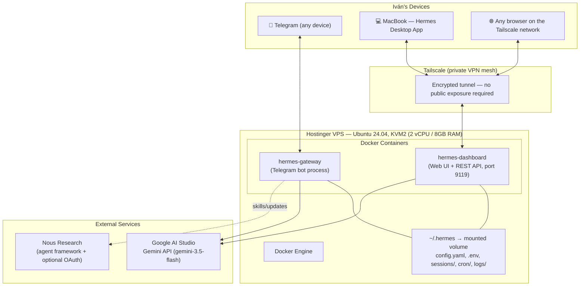

# Personal AI Infrastructure — Technical Documentation

**Owner:** Iván Koch
**Last updated:** August 13, 2026 (**§26 added — members zones calculator**: `/members/zonas/` and `/members/tests/` retired into it, dark chrome, free guide download in place of the capture; three bugs found, including a pre-existing full-screen horizontal scroll on every dark members page caused by `backdrop-filter` changing what the fixed nav is positioned against. *Earlier same day: §25* — zone calculator + lead magnet now live in ES/EN/PT**, which is the members-i18n branch's stated definition of done: 8 new pages on localised slugs, full `zonesUi` translation, three guide PDFs from one templated builder, and the EN/PT article CTAs and nav dropdowns released from the hold they were put under on Aug 10 and 12. *Same-day earlier entry: **§24 — zone-calculator lead magnet**: the 16-page three-sport guide built as a generated PDF, plus the n8n/Caddy delivery pipeline cloned from the plan-lead pattern and handed over with three steps left that only Iván can run. *Same-day earlier entry: **§23 — zone-calculator layout bugs**: the four public calculator pages had three different left edges and a table that overhung the nav, all three causes in CSS, found on Iván's first desktop look and fixed against measurements from a real headless browser rather than a reading of the stylesheet. Carries a process lesson worth more than the fix — a rule present in the source is not a rule that applies. *Previous entry, August 12, 2026: §8 — **WhatsApp follow-up watchdog now skips BR/AR**, matching the n8n workflow's existing `Skip WhatsApp Outreach — BR/AR` filter; those leads were still landing in `MESSAGE_SENT` and generating daily WhatsApp nudges. They now close on the email sequence instead. *Previous entry, August 10, 2026: §22 added — **members area extended to three languages**: `/members/en/` and `/members/pt/` behind the same single Caddy gate, login routed by the token's `preferred_language` rather than by which login page was opened, `next` validated against open redirects, and a ghost "Members Access" button added to the public nav in all three languages. Shell only — no tools translated yet, by design. *Same-day earlier entry: §12 — **All-Access welcome email rewritten in ES/EN/PT and tested live**, closing the last hardcoded-Spanish path; a placeholder NOTE that was rendering as the first line of the subscriber email removed; the new-subscriber Telegram moved from parallel to sequential to remove a forward reference. *Previous entry, August 9, 2026: **§21 added — athlete intake pipeline live**: Google Form → Apps Script → Caddy → n8n → Postgres → Gemini briefing. Completes 1:1 onboarding from payment to planning brief. §12 also carries a same-week addendum: the product classifier, the ALL_ACCESS routing bug it uncovered, and the full coaching branch. *Previous entry, August 8, 2026: KB consolidation — the "Open items / not yet done" section is **retired**; it had become a second, drifting copy of `open-loops.md`. Five items that lived only here were promoted there; the section now says so and explains what it cost. No technical content changed. *Previous entry, August 6, 2026: §17 — SEO metadata pass, intent hub pages, plan-page content sections generated from data, asset cache-busting after stale JS cost three debugging rounds; §17 also corrected — the Plan Storefront is live, not "not yet deployed".*)
**Status:** Live / operational

---

## Summary (read this first)

This document describes a self-hosted, always-on AI agent system built to give a solo business owner (triathlon/running coaching business) persistent AI access to his business knowledge base — reachable from a phone, a browser, or a desktop app, without depending on a personal computer being powered on.

**What was built:** A single [Hermes Agent](https://github.com/NousResearch/hermes-agent) instance (Nous Research's open-source, self-improving AI agent framework) deployed via Docker on a self-managed Linux VPS. The agent is powered by Google's Gemini API and exposed through three interfaces — Telegram, a web dashboard, and a native desktop app — all reading and writing to the same underlying agent state, so there is one consistent "brain" regardless of entry point.

**Key technical decisions and why:**

| Decision | Reasoning |
|---|---|
| Self-managed VPS over a managed/turnkey product | The managed product tested first ("Managed Hermes") blocked external connections and general-purpose use (no root access, no exposed ports, no ability to run other services). A plain VPS was required to support the current setup plus planned future services (website hosting, workflow automation). |
| Docker deployment over native install | Isolates the agent process from the host OS; matches the vendor's own recommended production deployment path; simplifies updates (pull new image, recreate container). |
| Tailscale VPN + username/password auth over public OAuth | The dashboard needed to be reachable from a personal laptop without exposing it to the open internet. Public OAuth (Nous Portal) requires an HTTPS callback URL, which would have required a domain name and a reverse proxy with a TLS certificate — real infrastructure overhead for a single-user system. A private VPN (Tailscale) between the two devices removes the need for public exposure entirely, at which point simple username/password auth is appropriate and sufficient. |
| Gemini API, prepaid billing, no auto-reload | Cost control was a stated priority. Prepaid billing with auto-reload disabled means the system fails safe (stops working) rather than accumulating unexpected charges if usage spikes. |
| Local terminal execution backend (not Docker-in-Docker sandboxing) | The agent already runs inside its own Docker container (isolated from the host). Adding a second, nested Docker sandbox layer would have required mounting the host's Docker socket into the container — a well-known technique that effectively grants the container root-equivalent access to the host, which undermines the isolation it's meant to add. The existing outer-container boundary was judged sufficient for a single-operator system. |
| Computer Use tool disabled | The agent runs on a headless server with no desktop environment — this capability had no legitimate use case here and was disabled to reduce attack surface. |
| Telegram allowlist restricted to one user ID | Without this, anyone who discovered the bot's public username could message it and get full access to the agent (terminal, files, business data). |

---

## Architecture


```mermaid
flowchart TB
    subgraph Devices["Iván's Devices"]
        Phone["📱 Telegram (any device)"]
        Mac["💻 MacBook — Hermes Desktop App"]
        Browser["🌐 Any browser on the Tailscale network"]
    end

    subgraph VPN["Tailscale (private VPN mesh)"]
        TS["Encrypted tunnel — no public exposure required"]
    end

    subgraph VPS["Hostinger VPS — Ubuntu 24.04, KVM2 (2 vCPU / 8GB RAM)"]
        Docker["Docker Engine"]
        subgraph Containers["Docker Containers"]
            GW["hermes-gateway\n(Telegram bot process)"]
            DASH["hermes-dashboard\n(Web UI + REST API, port 9119)"]
        end
        Data["~/.hermes → mounted volume\nconfig.yaml, .env, sessions/, cron/, logs/"]
        GW --- Data
        DASH --- Data
    end

    subgraph External["External Services"]
        Gemini["Google AI Studio\nGemini API (gemini-3.5-flash)"]
        Nous["Nous Research\n(agent framework + optional OAuth)"]
    end

    Phone <--> GW
    Mac <--> TS <--> DASH
    Browser <--> TS
    GW --> Gemini
    DASH --> Gemini
    GW -.skills/updates.-> Nous
```

**In plain language:** there is one program (Hermes Agent) running on a rented server. It's split into two always-on processes — one listens for Telegram messages, the other serves a web dashboard. Both read the same configuration and memory files, and both call out to Google's Gemini model to actually "think." A private VPN (Tailscale) lets the MacBook and any browser on that network reach the dashboard securely, without putting it on the open internet.

---

## Components in detail

### 1. Compute — Hostinger VPS

- Plan: KVM2 (2 vCPU, 8GB RAM), plain Ubuntu 24.04, no pre-installed application template.
- Public IPv4: `179.197.76.70` (SSH/root access only; the dashboard's public binding is not used for login — see Security section).
- Chosen deliberately over Hostinger's packaged "Managed Hermes" and "Hermes Agent" marketplace products, both of which run in a locked-down environment with no root access, no exposed ports, and no way to install additional services. This VPS is a general-purpose box that can also host a website and run workflow automation (n8n) later, which the managed products could not.

### 2. Container runtime — Docker

Installed via Docker's official convenience script (`get.docker.com`). Two long-running containers, both configured with `--restart unless-stopped` so they survive reboots without manual intervention:

| Container | Image command | Purpose | Port |
|---|---|---|---|
| `hermes-gateway` | `nousresearch/hermes-agent gateway run` | Connects to Telegram, handles all bot messages | — (outbound only) |
| `hermes-dashboard` | `nousresearch/hermes-agent dashboard --host 0.0.0.0 --port 9119` | Web UI, REST API, session history, config management | 9119 |

Both containers mount the same host directory (`~/.hermes` → `/opt/data`), which is where all persistent state lives: configuration (`config.yaml`), secrets (`.env`), session transcripts, cron job definitions, and logs. Because both containers share this volume, they operate as one logical agent rather than two separate ones.

### 3. Model provider — Google Gemini (AI Studio)

- Model: `gemini-3.5-flash` — chosen for cost efficiency (flash-tier) and version stability (pinned release, not a "-preview" or "-latest" rolling alias that could change behavior unannounced).
- Billing: Paid tier ("Prepay" billing plan), $30 in prepaid credit, **auto-reload deliberately disabled**. When the balance hits $0, the service pauses rather than charging further — a conscious trade-off favoring predictable cost over uninterrupted uptime.
- Configured via "Full setup" during the Hermes setup wizard (rather than the "Quick Setup / Nous Portal" default) specifically to keep billing on the personally-funded Gemini key rather than a separate Nous Portal subscription.

### 4. Interfaces

**Telegram** — Primary day-to-day interface. A dedicated bot (created via BotFather) connects through the `hermes-gateway` container. Access is restricted via an `allowed_user_ids` allowlist (Telegram numeric user ID only) — an unrestricted bot would be discoverable and usable by anyone who found its username. The user's own Telegram DM is also configured as the "home channel," meaning scheduled/cron job output and cross-platform notifications land there by default.

**Web Dashboard** (`http://100.70.89.17:9119`, Tailscale address only) — Full browser-based admin interface: chat (embeds the same TUI used in the terminal), session history and search, live config editing, API key management, usage/cost analytics, cron job management, and log viewing.

**Hermes Desktop App** (macOS, native) — Configured under Settings → Gateway → Remote Gateway to connect to the same Tailscale address as the dashboard, rather than running its own separate local agent. This was the trickiest piece to get right (see "Notable engineering problems solved" below) and is what unifies all three interfaces into one shared brain, memory, and session history.

### 5. Networking & access control

- **Tailscale**: a WireGuard-based private mesh VPN. Both the VPS and the MacBook are joined to the same private "tailnet." The VPS gets a stable private address (`100.70.89.17`) reachable only by devices on that tailnet — not from the public internet.
- **Dashboard authentication**: two auth providers are registered and stacked (the login page offers both):
  - **Username/password** (`HERMES_DASHBOARD_BASIC_AUTH_*` environment variables, stored in `~/.hermes/.env`, file permissions `600`) — the provider actually in use, appropriate because access is already restricted to the private Tailscale network.
  - **Nous Portal OAuth** — registered (has a valid `agent:...` client ID) but **not currently usable from the public IP**, because Nous Portal requires an HTTPS callback URL for any non-localhost redirect, which this deployment doesn't have (no domain name or reverse proxy configured). Left in place as a future option if a domain + TLS is added later.
- **Terminal execution backend**: set to `local` (executes inside the already-isolated `hermes-gateway`/CLI container itself, not on the bare VPS host, and not in a second nested Docker sandbox).

### 6. Tooling configuration

Default agentic toolset enabled (web search, file operations, code execution, browser automation, memory, cron, task delegation, etc.), with two deliberate deviations from defaults:

- **Computer Use (desktop control) — disabled.** No desktop environment exists on this headless server; the capability had no use and was removed to reduce attack surface.
- **Free/no-key providers selected wherever available**, to avoid unnecessary new accounts and recurring costs: local headless Chromium for browser automation, DuckDuckGo for web search, Microsoft Edge TTS for speech. Image generation was left unconfigured (skipped) — every available provider was paid or subscription-based, and it isn't needed yet.

---

## Notable engineering problems solved

*Full narratives moved to `build-log.md` (July 29, 2026) — this doc keeps the one-line index so cross-references by number still resolve. Standing rules that came out of these live on here and in the runbooks.*

1. **Split-brain agent** — Desktop App ran its own local agent instead of connecting to the VPS; fixed via Remote Gateway setting.
2. **Managed hosting too restrictive** — "Managed Hermes" blocked external connections entirely; replaced with a plain self-managed VPS.
3. **Docker networking** — app bound to `127.0.0.1` inside the container, unreachable despite `-p` mapping; fixed with `--host 0.0.0.0`.
4. **OAuth redirect mismatch** — Nous Portal needed an HTTPS callback; solved with Tailscale + basic auth instead of a domain/TLS just for login.
5. **Docker-in-Docker sandbox failure** — would have required mounting the host Docker socket (root-equivalent); used `local` backend instead.
6. **Credential hygiene** — a PAT briefly committed publicly, auto-revoked by GitHub. Standing rule: secrets only ever into secure prompts/`.env`/masked fields. Bitwarden adopted July 22, 2026 as the durable vault; SSH keys replaced password login. Open follow-ups: Bitwarden master password out of Apple Passwords, Bitwarden 2FA/Emergency Access, hPanel 2FA.
7. **Hermes unreliability on sustained agentic work (flash-tier)** — narrated success while producing broken code. Standing rules: verify Hermes's claims against literal output; automation logic is written once by hand as a tested script, Hermes only *calls* it. (Twenty API key rotated July 22 as a precaution.)
8. **Google Cloud project silently closed over negligible billing** — abuse-detection false positive; fixed by linking a billing account; 20 days of pixel data lost. Lesson: check request logs before believing account-status banners.

## Cost structure (as of July 2026)

| Item | Cost | Notes |
|---|---|---|
| Hostinger KVM2 VPS | Per Hostinger's published KVM2 rate | Replaces the "Managed Hermes" plan below |
| Google Gemini API | $30 prepaid, manual reload only | Tier 1 (up to $250/month spend cap even if reload were enabled, which it isn't) |
| ~~Old "Managed Hermes" plan~~ | ~~Still active, pending cancellation~~ — **cancelled, confirmed July 29, 2026** *(struck Aug 6, 2026 — this row still read "pending cancellation" for a week after the cancellation was recorded further down this same file's Open items list)* | Was a rollback safety net during migration; no longer billing |
| Tailscale | Free tier | Sufficient for a 2-device personal tailnet |
| Telegram | Free | — |
| Google Cloud (`training-plan-analytics` project) | ~$0.01–0.015/month | Pixel tracking (Cloud Run + BigQuery); $20/month budget *alert* set (notification only, not a hard cap) after the July 2026 outage |

---

## Current status

Working end-to-end: Telegram bot responds using the VPS-hosted agent; the same agent is reachable via the web dashboard and the Mac Desktop App over Tailscale; all three interfaces share the same configuration, model, and memory. Model confirmed live and responding correctly (`gemini-3.5-flash`). Terminal/file tools confirmed functional via a live test (directory listing).

The business knowledge base (GitHub repo `triaperformance-docs` — pricing, methodology, business overview, growth roadmap, social proof) is cloned onto the VPS at `/opt/data/triaperformance-docs` (host path `~/.hermes/triaperformance-docs`), auto-updated daily via a system cron job (`git pull` at 6am server time), and the agent has been instructed and has persisted to memory that this is its source of truth for business questions. Verified live: asked to summarize the business, the agent correctly read all five documents and returned accurate, correctly-cited figures (revenue by channel, pricing policy, roadmap priorities).

The dashboard's port 9119 is now bound only to the Tailscale interface at the Docker level (`-p 100.70.89.17:9119:9119`, not `0.0.0.0`) — confirmed the public IP no longer connects at all, while the Tailscale address still works. This was necessary because Docker manipulates iptables directly and bypasses `ufw` rules for published container ports; binding to a specific host IP was the reliable fix (a `ufw allow`/`deny` rule on its own does not work against Docker-published ports).

As of July 17, 2026, this box also runs the CoachMatch lead pipeline end to end — n8n handles lead creation and the 3-email nurture sequence, Twenty CRM is the system of record, and Hermes runs a daily WhatsApp follow-up watchdog plus takes free-text status updates over Telegram (see section 8). Verified live with real leads: emails sending, deep links working, and a real Telegram message ("mark Aimee as lost, too expensive") correctly updating Twenty.

## 7. Website hosting — live as of July 16, 2026

`triaperformance.com` is served from the same VPS as Hermes, via native Caddy (not Docker — avoids the iptables/`ufw` interaction documented in problem #3 below, and Caddy's automatic Let's Encrypt HTTPS needed no manual cert work).

- **Webroot**: `/var/www/triaperformance` — deliberately outside `~/.hermes`, so a webserver misconfiguration can't expose Hermes's `.env` or session data.
- **Caddyfile** (`/etc/caddy/Caddyfile`): serves `triaperformance.com` and `www.triaperformance.com` as static files from the webroot, gzip enabled.
- **Source of truth**: the `website/` folder in the `triaperformance-docs` GitHub repo (same repo as the business knowledge base).
- **Deploy script**: `~/.hermes/deploy-website.sh` — pulls the repo and rsyncs `website/` into the webroot. Runs automatically via the existing 6am cron job (which now does knowledge-base sync *and* site deploy in one pass), or on demand via SSH or by asking Hermes to run it.
- **DNS (GoDaddy)**: root `@` and `www` A records now point to the VPS's public IP (`179.197.76.70`), replacing the old HubSpot-hosted site. Mail-related records (MX, SPF, DKIM, DMARC) were left untouched — those are what route `@triaperformance.com` mail through Google Workspace, and are unaffected by hosting changes.
- **Verified live**: `curl -I https://triaperformance.com` returns `HTTP/2 200` via Caddy with a valid TLS cert.

Guardrail carried over from the roadmap: Hermes's command-approval mode should stay on "ask," not "off," for anything that touches `/var/www/triaperformance` or the Caddy config directly — routine content updates go through the git deploy path above, not ad hoc edits.

## 8. Business process automation — CoachMatch lead pipeline (live as of July 17, 2026)

The full lead-to-follow-up pipeline for CoachMatch (TrainingPeaks' coach-matching product) has been rebuilt off HubSpot, split across two systems on purpose: **n8n** for anything deterministic and mechanical (parsing a fixed-template email, calling an API, sending a templated message), and **Hermes** for anything that needs judgment or free-text understanding (interpreting a natural-language status update). This mirrors the execution-ownership principle already in the growth roadmap.

### n8n — deployed via Docker on the same VPS, Tailscale-only, no reverse proxy (same pattern as Twenty)

**Workflow 1 — Lead creation** (IMAP trigger, fires on new mail): reads new CoachMatch lead emails from Gmail (scoped, read-only IMAP access — not broad Workspace access) → parses lead fields → checks for duplicates by attempting to create the Person in Twenty and branching on whether the mutation succeeds or fails on the email-uniqueness constraint → on a genuinely new lead: creates the Person, sends a Telegram notification (unchanged from the old HubSpot-era logic, new CRM target), sends email 1 of the nurture sequence immediately via SMTP, and sets `leadStatus = MESSAGE_SENT` with `emailTouchCount = 1`.

**Workflow 2 — Email nurture, emails 2 and 3** (Schedule Trigger, runs once daily): queries Twenty for everyone still at `leadStatus = MESSAGE_SENT` with `emailTouchCount < 3`, computes days since creation, and sends email 2 at the 24-hour mark or email 3 at 48 hours — one email per run per lead, tracked via `emailTouchCount`. The stop condition for the whole sequence is simply `leadStatus` staying at `MESSAGE_SENT`: if it moves to anything else (a reply on any channel, a manual update), the lead silently drops out of both this query and the WhatsApp watchdog below. No separate "unsubscribe" logic was built — one shared status field does the job for every channel.

**SMTP**: Gmail's SMTP (port 465, implicit TLS), same app password as the read-only IMAP credential, sending as `Iván Koch - Triaperformance <coach@triaperformance.com>`.

**Lead magnets**: the three existing PDF guides (nutrition, mental prep, training zones) were moved off HubSpot's file manager onto the website itself, at `triaperformance.com/guias/` — served by the same Caddy setup as the rest of the site, deployed through the same git pipeline. *Update, July 29, 2026 — path changed:* the PDFs now live at `/assets/guias/*.pdf` after the Eleventy Phase 5 cleanup, with three explicit Caddy redirects from the old `/guias/<file>.pdf` URLs (which are linked from already-sent emails). The bare `/guias/` path has no index and 404s; the real page is the gated, `noindex` `/members/guias/`. See §16.

### Hermes — the WhatsApp lead-status feedback loop

Unlike the email side, there's no WhatsApp Business API in this build (deliberately ruled out — overkill for the volume here, see growth roadmap guardrails). So the WhatsApp side of follow-up is a **feedback loop**: Hermes surfaces who needs a nudge and gives Iván a one-click way to message them, then listens for Iván's own plain-language report of what happened and writes it back to Twenty. Two scripts, deliberately narrow in scope after several early attempts by Hermes to write this logic itself produced broken or incomplete code (see Problem #7 below) — the scripts are fixed, tested, human-written; Hermes's job is limited to calling them correctly.

- **`~/.hermes/scripts/twenty_followup_check.py`** — runs daily via a Hermes-native cron job ("Twenty Lead Follow-up Watchdog," `~/.hermes/cron/jobs.json`). Queries Twenty for people at `leadStatus = MESSAGE_SENT` whose `lastTouchpoint` is more than 2 days old, builds a pre-filled `wa.me` deep link per person (follow-up message copy baked in), and prints a summary — silent if nobody's due, so there's no empty-message noise. Output is delivered to Iván's Telegram home channel automatically as part of the cron job's normal delivery. *(Update, Aug 12, 2026 — the script now also skips **Brazil and Argentina**. The n8n lead workflow has a `Skip WhatsApp Outreach — BR/AR` filter node so those leads never receive WhatsApp outreach, but they still run the email branch, which sets `leadStatus = MESSAGE_SENT` exactly like everyone else. This script filtered on status alone and never looked at country, so it kept building `wa.me` nudges for BR/AR leads and notifying Iván daily about follow-ups that were never supposed to happen. Fix: the GraphQL query now also fetches `addressCountry`, and a `NO_WHATSAPP_COUNTRIES = {brazil, brasil, argentina}` check runs before the phone/touch-count logic. Those leads produce no nudge and no digest line; they close on the email sequence instead — `emailTouchCount >= 3` plus `LOST_NO_RESPONSE_DAYS` (7) of silence auto-sets `LOST_NO_RESPONSE`, so they don't accumulate in `MESSAGE_SENT` forever. Note this check is deliberately placed **before** the "no phone on file" skip, so a BR/AR lead with no phone still gets closed out. Verified against a stubbed 5-lead fixture (BR/AR at 2 and 3 emails, a Colombian lead due for message 2, a Spanish lead due to be marked lost) — correct routing on all five; not yet observed on a real cron run.)*
- **`~/.hermes/scripts/update_lead_status.py`** — takes a name and one of the valid `leadStatus` values (`NEW`, `MESSAGE_SENT`, `REPLIED`, `IN_CONVERSATION`, `LOST_NO_RESPONSE`, `LOST_NOT_INTERESTED`, `LOST_PRICE`, `WON_CUSTOMER`) as arguments. *(Note, Aug 6, 2026 — a ninth value, `CHURNED_CUSTOMER`, now exists in Twenty but is **not** in this script's hardcoded list, so Hermes cannot set it. Add it to `automation/update_lead_status.py` when the churn convention is decided.)*, searches active (`MESSAGE_SENT`) leads for a name match, refuses to guess if it finds zero or more than one match, and — on exactly one match — runs the Twenty update mutation and refreshes `lastTouchpoint`.

**Telegram use cases now live:**
- Daily automatic nudge: "Following up needed — no status update in 2+ days: [name] · [days] · [WhatsApp link]" for each stale lead, silent otherwise.
- Free-text status updates, e.g. *"Fabian replied"* → `REPLIED`, *"mark Gaston as won (customer)"* → `WON_CUSTOMER`, *"mark Aimee as lost, too expensive"* → `LOST_PRICE`. Hermes's only job is mapping the sentence to exactly one of the 8 known enum values and calling the script with the right two arguments — it's instructed to ask for clarification rather than guess if the mapping isn't confident (e.g. "customer" alone, before "won" is added, isn't a valid value and shouldn't be silently mapped to one).

Twenty's GraphQL introspection is disabled on this instance, so neither Hermes nor n8n can discover schema/enum values programmatically — the valid `leadStatus` values above were confirmed directly by Iván from the Twenty UI and hardcoded into the script rather than guessed.

*Update, August 5, 2026 — n8n patched 2.30.5 → 2.33.4 in response to n8n's bi-weekly security advisory (multiple High-severity CVEs: GraphQL node credential-header leak, MCP node-schema path traversal RCE, JS task runner sandbox escape via prototype pollution, Git node code execution via repo-local config, among others — full list in the advisory email). Minor-version bump only, no breaking changes per n8n semver. Container recreated in place via `docker run` (image `n8nio/n8n:2.33.4`, same env, same `/root/.n8n` bind mount, same Tailscale-only port binding `100.70.89.17:5678`), preceded by a tarball backup of `/root/.n8n` to `~/n8n-backup-20260805.tar.gz`. Verified live: all workflows (CoachMatch lead creation/nurture, contact-form pipeline, subscription-lifecycle, content-engine publish) still Active post-upgrade, and a real website form submission confirmed end-to-end.

## 9. Analytics pipeline — plan-view tracking, GA4, Search Console & site-verification tools (live as of July 21, 2026)

**Site instrumentation.** Google Analytics 4 (property under `coach@triaperformance.com`) was added directly to `website/index.html`'s `<head>` (gtag.js, measurement ID `G-T69KEHW59J`), deployed through the normal git → cron deploy pipeline. Google Search Console was added as a Domain property for `triaperformance.com` — ownership auto-verified because the DNS TXT record from the pre-VPS HubSpot era was still in place, no new DNS work needed. GSC and GA4 are linked (Admin → Product Links) for combined search-query reporting inside GA4.

**TrainingPeaks plan-view pixel.** The 1x1 tracking pixel embedded in each TP plan listing posts `plan_id` + `price` to a Cloud Run service (`plan-tracker-bigquery`, project `training-plan-analytics`), which writes to BigQuery (`training-plan-analytics.tracking_data.plan_views`). This project lives under a separate personal account, `ivankoch87@gmail.com` — not the business Workspace account (`coach@triaperformance.com`) everything else in this document runs under. That split matters operationally: any cross-account work (like the GA4 link below) needs an explicit IAM grant.

*Outage, Jun 30–Jul 21, 2026 (fixed):* the project was silently disabled by a Google billing/abuse false positive — 20 days of data lost, full history since June 2025 intact, fixed by linking a billing account. A **$20/month budget alert** (notification only, not a hard cap — a hard cap would recreate this exact outage on purpose) is now scoped to the project. Full incident narrative: `build-log.md` (problem #8).

**GA4 → BigQuery export.** Enabled the same day (Admin → Product Links → BigQuery Links), exporting into the same `training-plan-analytics` project — daily export, not streaming (free tier, sufficient at this volume). Linking required granting `coach@triaperformance.com` the **Owner** role on the GCP project; Editor alone lacks `resourcemanager.projects.setIamPolicy`, which the linking flow needs to grant its own service account BigQuery access.

**New standing infrastructure — analytics Postgres on the VPS, own lane (same separation pattern as Twenty/n8n).** A dedicated `analytics-postgres` Docker container, bound to `127.0.0.1` only (nothing outside the box needs to reach it — no Tailscale exposure needed). Directory `~/.analytics/` (`data/`, `scripts/`, `credentials/`, `logs/`). Table `plan_views` mirrors the BigQuery schema (`event_timestamp`, `plan_id`, `price`, `ip_address`, `user_agent`, `referrer`) with a `UNIQUE(event_timestamp, plan_id, ip_address)` constraint, making repeated syncs safely idempotent. A read-only BigQuery service account (`pixel-sync-vps`, roles: BigQuery Data Viewer + Job User only) backs a Python script, `~/.analytics/scripts/sync_pixel_data.py`, which pulls everything with `event_timestamp >= MAX(event_timestamp already in Postgres)` and upserts — run nightly at 5am via cron (staggered clear of the existing 2am Twenty backup and 6am website/KB deploy). First run backfilled all 49,105 historical rows (June 2025 to date). A `plan_views_clean` view sits on top, replicating the bot/IP-filtering logic Iván already used in BigQuery (excludes a known non-customer IP and bot/crawler/spider/headless user agents) — the raw table stays untouched for audit, reporting queries use the clean view (21,217 rows after filtering, matching the existing trusted BigQuery query).

Purpose: this VPS copy is now the durable backup of the pixel data, independent of the personal Google Cloud account's billing/closure risk — the exact failure mode that just cost 20 days. It's also the first table in what's planned to become the VPS's broader analytics warehouse (pixel hits + future GSC pulls + sales CSVs + email signups — see `growth-roadmap.md` §Training Plan Storefront).

**Site-verification tools, same day.** Microsoft Clarity (heatmaps + session recordings) added via a manual script tag in `website/index.html`'s `<head>`, alongside the GA4 tag (Clarity project ID `xq3g7pvr9i`). Connected to the GA4 property under Clarity's Settings → Integrations, which lets recordings be filtered by GA4 traffic-source/segment data — worth noting this is a reporting-level correlation only, not a raw-data feed; Clarity's actual recordings and heatmaps live solely inside Clarity's own platform, no BigQuery/Postgres export exists for them. Bing Webmaster Tools and Ahrefs Webmaster Tools were both added via their "Import from Google Search Console" one-click path — no new DNS or file-upload work, both piggyback on the existing GSC domain verification. Same caveat as the GA4/GSC link above: Search Console data itself doesn't flow into GA4's or BigQuery's dataset, it's a reporting-level integration only — a genuine data pull would need the Search Console API separately.

Two items from the same tooling review deliberately not actioned: Rich Results Test (search.google.com/test/rich-results) needs no account and nothing to set up — it's a URL-paste validator to use once plan pages ship with Product schema (Phase 1/2 storefront SEO work, not built yet). Umami (self-hosted analytics) stays parked — only worth adding if GA4's own UI becomes a friction point, per the original call.

*Update, July 31, 2026 — UTM convention for external channel links (distinct from the internal plan→TrainingPeaks UTMs in §17).* `utm_source` = platform (`google`, `facebook`, `linkedin`, `strava`, `trainingpeaks`, `whatsapp`, `email`, `instagram`). `utm_medium` = placement type (`gbp_profile`, `gbp_post`, `bio`, `signature`, `directory`). `utm_campaign` = `profile` for evergreen bio/profile links, or a specific slug for time-bound content (e.g. a GBP post topic/date). `utm_content` = optional variant when a channel needs to split traffic (e.g. running vs. triatlón). Base URL can be the homepage or any specific page (plan page, All-Access landing) — same UTM tail applies regardless of destination. First applied July 31, 2026 across Instagram bio, Google Business Profile (profile + posts), Facebook, LinkedIn, Strava, TrainingPeaks bio, WhatsApp Business, and email signature.

## 10. Storefront data pipeline — plan catalog + weekly-breakdown crawl (July 21, 2026)

**Why.** The storefront plan called for loading the plans inventory onto the VPS as Phase 1 step 1 (that brief was retired Aug 8, 2026; the surviving strategy lives in `growth-roadmap.md` §Training Plan Storefront). Separately, Iván noticed TrainingPeaks' own plan pages render a stats table — "Average Weekly Breakdown" (workouts/week, weekly average duration, longest workout, per activity) — that TP calculates from the actual structured workouts and was never in the manually-maintained inventory CSV. Both landed in the same piece of work.

**New database, same container.** Rather than stand up new infrastructure, added a `storefront` database to the existing `analytics-postgres` container (same VPS, same "own lane" container as the pixel-tracking data — see §9), keeping it logically separate from the marketing-analytics `analytics` database on that same instance. Two tables:
- `plans_raw` — the full inventory CSV (`data/training_plans_inventory.csv` in the repo), loaded as an all-text staging table on purpose, since the source data has known issues (see cleanup below) that would break type constraints on a typed load. 407 rows loaded, cleaned to **386** by removing 13 "Not built" placeholder rows (plan_id literally `"Not built"`) and 8 rows with `link = "Expired"` (no overlap between the two groups). Duplicate `plan_id`s (439394, 439396, 439397, 612974 — already known, see storefront brief) were left as-is; no dedup logic applied yet.
- `plan_weekly_breakdown` — tidy format (one row per activity per plan: `plan_id`, `activity_type`, `weekly_count`, `weekly_avg`, `weekly_avg_unit`, `longest_workout`, `longest_workout_unit`). Units are mixed by design (duration `HH:MM:SS` for most activities, meters for swim, occasionally miles) so the value columns are text, not numeric.

**The crawl.** 330 of 407 plans are published with a working link — those were the crawl targets, using `mcp__workspace__web_fetch` against each plan's live TrainingPeaks page (confirmed via manual samples across every sport type — running, cycling, swimming, strength, triathlon, duathlon — that the stats table is server-rendered and parses cleanly with plain fetches, no JS rendering needed). First attempt used 6 parallel subagents and tripped TrainingPeaks' bot/rate-limit detection partway through; a second attempt with 2 parallel agents also hit it, plus an unrelated bash-tool hang. Net result after both waves: **190 of 330 plans successfully captured** (468 activity rows), **10 genuinely dead links** (mostly 404s on ultra-marathon plans, 2 with a literal `"Expired"` link value, 2 more that use non-standard mile-based units the parser doesn't yet handle), ~~**130 plans not yet attempted**~~ — paused deliberately rather than continuing to fight the rate limit; resumable later without redoing the 200 already-attempted plans (`data/plan_weekly_breakdown_errors.csv` has the exact list and reasons). **Finished July 29, 2026 — see update below.**

*A dead-links finding that used to sit here was **deleted August 8, 2026** at Iván's instruction. It was disproven by a full link check on July 27 — every published plan returned OK — but it had been struck through rather than removed, so it kept getting read, re-quoted and re-raised for three weeks afterwards. Struck-through text still reads as text, and a claim restated in order to deny it is still restated. It is not repeated here. **The lesson survives; the finding does not:** a partial crawl's failures are evidence about the crawl, not about the targets. Link status is measured by `automation/check-plan-links.py`, never maintained in prose.*

**Update, July 29, 2026 — crawl finished; source CSV was already deduped, Postgres wasn't.** Two things closed out in the same session:

1. **Weekly-breakdown crawl completed.** Reconciled the crawl target list against the *current* inventory (381 rows, not the original 407 — 13 "not built" + 21 dead/duplicate rows have been dropped since this section was first written) rather than trusting the stale error list verbatim: 323 plans are currently published with a real link, 190 were already captured, leaving 133 to attempt (not the 130 estimated — the reconciliation caught that 434680's now-fixed link and the 2 mile-unit plans, 475339/476791, were still outstanding). All 133 were fetched sequentially via `mcp__workspace__web_fetch` at a ≥2s pace (no parallelism, matching the July 27 link-check's proven pacing) — **zero bot-detection/rate-limit signals the entire run.** Result: **301 of 323 published plans now have breakdown data** (765 activity rows total in `data/plan_weekly_breakdown.csv`), **22 confirmed dead** (`data/plan_weekly_breakdown_errors.csv`, cleaned of stale entries for plan_ids no longer in the catalog at all) — all 22 are race-year-stamped marathon variants (Tokyo/London/Boston/Barcelona/Santiago/Rio/Lima 2025–26 gym-volume series) returning TrainingPeaks' standard "Training Plan Not Found" page, consistent with expired race dates rather than throttling (confirmed by successfully fetching non-race-specific plans interleaved between clusters of these 404s). The mile-based unit gap is now handled: `weekly_avg`/`longest_workout` store the bare number, `weekly_avg_unit`/`longest_workout_unit` store `mi`. 301 crawled + 22 dead = 323 published, fully reconciled, nothing unaccounted for. **Not yet done:** loading these new rows into the live `plan_weekly_breakdown` Postgres table — file-level work only; see handoff.
2. **Finding from the crawl, fully resolved same day:** plan_ids 612974 (Lima Marathon, Spanish) and 612836 (Lima Marathon, Portuguese — see the dedup note below) both returned "Training Plan Not Found" despite `is_published = TRUE` in the inventory. Iván confirmed both are genuinely unpublished (not a TP outage or a crawler issue). Fixed everywhere: `is_published` flipped to `FALSE` for both in `data/training_plans_inventory.csv` (published+real-link count now **321**, was 323), their `data/plan_weekly_breakdown_errors.csv` reason text updated to state the real cause instead of a bare 404, and `plans_raw` on Postgres updated and confirmed via a live `SELECT` — both rows show `is_published = FALSE`. Nothing further needed on these two.

**Dedup status correction, closed out July 29, 2026.** This section previously said the 4 known duplicate `plan_id`s (439394, 439396, 439397, 612974) were "left as-is; no dedup logic applied yet" in `plans_raw`, and that Postgres (loaded July 21) predated the source CSV's July 22 fix (`git` commit `a3833e8`) and would need the fix applied separately. **Live query against `plans_raw` (July 29) shows this was already wrong — no action was actually needed:** the table currently has exactly **381 rows**, matching the corrected CSV precisely, and `612836` (the corrected Portuguese Lima plan_id) is present with the right content. `plans_raw`'s primary key is on an internal `id` column, not `plan_id` — so this wasn't a constraint silently deduping on load; the table must have been reloaded from the already-fixed CSV at some point after July 22 (not documented when or by whom). Net effect: `plans_raw` and the source CSV already agree, zero duplicate `plan_id`s in either, nothing further to run. This section's "386 rows" figure and the "left as-is" claim above were stale as of this check — treat "381 rows, deduped" as the current true state going forward.

**Update, July 29, 2026 — new rows loaded into Postgres, confirmed via psql.** `plan_weekly_breakdown` now has **765 rows / 301 distinct plan_ids** (up from 468/190), verified by a live `COUNT(*)` query, not just file contents. Two real bugs hit and fixed getting there, worth keeping for next time: (1) `LIKE plan_weekly_breakdown INCLUDING ALL` on the staging table pulled in extra columns beyond the CSV's 7, so a column-less `\copy` failed with "missing data for column" — fixed by naming the 7 columns explicitly in both the `\copy` and the subsequent `INSERT ... SELECT`. (2) `plan_weekly_breakdown.csv` had mixed line endings — the pre-existing 473 rows were CRLF, but new rows appended during this session (both a manual 4-row addition and the subagent's 131-plan crawl) used plain LF, and the inconsistency made `\copy` throw "unquoted newline found in data". Fixed by normalizing the whole file to LF only (`sed -i 's/\r$//'`) before reloading — worth checking for on any future append to this file, since it's evidently been CRLF from whatever originally produced it.

**Source files, repo:** `data/training_plans_inventory.csv`, `data/plan_weekly_breakdown.csv`, `data/plan_weekly_breakdown_errors.csv`.

## 11. Website contact form → Twenty + email + Telegram (live as of July 22, 2026)

The last piece of the CoachMatch-pattern lead pipeline (§8) now also covers direct website leads. `website/index.html`'s contact form (name, email, WhatsApp, sport dropdown, goal) posts to same-origin `/api/contact-form`, which Caddy proxies internally to n8n. Full build is documented in `contact-form-pipeline-runbook.md`; short version:

- **Caddy** needed a `rewrite * /webhook/contact-form` inside the `route /api/contact-form` block before the `reverse_proxy` line — n8n always serves webhooks under a `webhook/` prefix internally, so proxying the raw path unchanged 404s at the Express layer even though the proxy itself is working.
- **n8n workflow** (`automation/contact-form-workflow.json`): dedupe check by email → create Person in Twenty → confirmation email → Telegram notification → `leadStatus = MESSAGE_SENT`, feeding into the same daily nurture workflow and Hermes WhatsApp watchdog a CoachMatch lead uses — no separate nurture logic needed.
- **Real Twenty Person schema, confirmed by reading back a live API response** (rather than guessed from the original HubSpot migration audit in `growth-roadmap.md`): the field is `sport` (not `sportPrimary`/`sport__all_`), and there's no `campaign_attribution` field — `leadSource` fills that role, and turned out to also be an enum (confirmed value: `WEBSITE_FORM`). `sport` itself is an enum too: `RUNNING`, `CYCLING`, `SWIMMING`, `TRIATHLON`, `DUATHLON` (all caps).
- **Confirmed enum values (Iván, source of truth, July 2026):**
  - `leadStatus`: `NEW`, `MESSAGE_SENT`, `REPLIED`, `IN_CONVERSATION`, `WON_CUSTOMER`, `LOST_NO_RESPONSE`, `LOST_NOT_INTERESTED`, `LOST_PRICE`, **`CHURNED_CUSTOMER`** *(added by Iván in the Twenty UI, Aug 6, 2026 — now 9 values. **Nothing writes it yet**: the subscription-lifecycle workflow handles a cancellation by setting `churnDate` and deactivating the member token, and leaves `leadStatus` at `WON_CUSTOMER`. So a churned subscriber is currently indistinguishable from an active one by status alone. See the open item below before wiring anything to it.)*
  - `leadSource`: `COACHMATCH`, `WEBSITE_FORM`, `REFERRAL`, `OTHER`, **`PLAN_CATALOG`** *(added by Iván, confirmed present Aug 6, 2026 — used by the plan-catalog capture, see `plan-lead-pipeline-runbook.md`)*. Originally confirmed via a real 400 from the live API (July 24, 2026) to be only `COACHMATCH`, `WEBSITE_FORM`, `REFERRAL`, `OTHER` — the `WEBSITE`/`ALL_ACCESS_SUBSCRIPTION` options Iván intended to add were never actually saved to the field (added somewhere that didn't take, or not saved). Subscription-lifecycle automation uses `OTHER` for new All-Access subscribers, since the TrainingPeaks confirmation email never tells us the real acquisition channel (website, Instagram, guide link, etc.) and `OTHER` is the most honest fit of the four real options. If Iván wants a dedicated value later, it needs to be added in Twenty under Settings → Data Model → Person → `leadSource` → Add option, then confirmed again the same way (a real API call, not assumed). *Update, Aug 8, 2026 — full list re-read off the Data Model screen by Iván: `COACHMATCH`, `WEBSITE_FORM`, `REFERRAL`, `OTHER`, `PLAN_CATALOG`, **`INSTAGRAM`** — six values. Only `INSTAGRAM` is new to this doc; the other five were already recorded correctly. `COACHMATCH` already existing settles the question raised in `athlete-onboarding-flow.md` §3.2 B2 — no new value needs creating for the CoachMatch onboarding branch.*
  - `customerType`: `PLAN_BUYER`, `ALL_ACCESS`, `OPT1_1_COACHING` — this is the field that actually distinguishes customer types from each other, not `leadSource`. Corrected July 25, 2026: previously documented as `1_1_COACHING` (never actually confirmed against a live response) — a real 400 from the backfill script's first live run gave the exact valid list, including the `OPT` prefix on the coaching value.
  - `coachingStartDate` *(new field, created by Iván Aug 8, 2026 — API name confirmed on the Data Model screen, type Date, `YYYY-MM-DD`)*. **This makes three date fields on Person, not two.** It holds the date coaching service actually begins, which is not the signup date: a CoachMatch athlete can choose a future start (TrainingPeaks even suggests coaches push athletes to the last day of the month so the card is charged then and the remainder of the month is free — Iván deliberately doesn't do this, but athletes can still pick a future date). For Private/TP Payments there is no athlete-selectable start, so `coachingStartDate` equals `signUpDate`. See `athlete-onboarding-flow.md` §3.1.
  - **Two separate date fields, confirmed July 25, 2026, easy to conflate**: `purchaseDate` is used for training-plan purchases (this is the field the subscription-lifecycle workflow, §12, already writes for All-Access). `signUpDate` is the separate field for subscribers and 1:1 coaching athletes, plain `YYYY-MM-DD` format — this is the one `backfill_existing_customers.py` (§13 addendum below) writes. Confirmed directly by Iván via Twenty's Data Model settings, not guessed.
  - `preferredLanguage`: `SPANISH`, `PORTUGUESE`, and `ENGLISH` all confirmed — `ENGLISH` verified July 24, 2026 via a live English-subscriber test through the subscription-lifecycle workflow (accepted with no 400).
- **n8n's generic "HTTP Header Auth" credential type doesn't prepend `Bearer ` automatically** — cost real debugging time, since the saved value is masked afterward with no way to re-confirm it visually. Worth remembering for any future n8n + Twenty credential setup.
- Confirmed working with a real production form submission on `triaperformance.com`.

## 12. CoachMatch mis-firing fix + subscription-lifecycle automation (July 24, 2026)

- **CoachMatch bug found and fixed**: the `Email Trigger (IMAP)` node in `CoachMatch Lead Automation` had zero filter criteria — it fired on every single email in the inbox, silently creating junk Person records in Twenty (blank fields via the regex parser's silent-empty-string fallback) for anything that wasn't a real CoachMatch lead. Fixed by Iván directly in n8n using a **Filter** node (not IF) checking `subject` contains "Coach Match" — confirmed working for both matching and non-matching test emails. Source archived at `automation/coachmatch-lead-automation.json` (built with an IF node as the first-pass fix; Iván's live version uses Filter instead — functionally equivalent, Filter is simpler for a single pass/drop condition).
- **New workflow: Subscription Lifecycle (New + Churn)** (`automation/subscription-lifecycle-automation.json`), watching a dedicated Gmail label (`TP-Subscriptions`, filtered from `receipt@trainingpeaks.com`, "Skip the Inbox" checked) rather than the main inbox — required specifically to avoid a mailbox race condition with CoachMatch's own IMAP poller (fetching mail flips the IMAP `\Seen` flag server-side regardless of which workflow's poll does it, so two pollers on the same folder can silently starve each other).
  - Parses the real "New subscription confirmation" and "Subscription cancellation" (exact match, not "contains" — collides with "...cancellation scheduled" otherwise) emails from TrainingPeaks.
  - Detects which All-Access product (ES/EN/PT) from the real confirmed product name strings (see `triaperformance-pricing-and-positioning.md`), sets `preferredLanguage` accordingly. Auth itself is language-agnostic; only the members-area *content* will be filtered by this field once built.
  - Upserts the Person in Twenty (dedupe by email), setting `customerType: ALL_ACCESS`, `leadStatus: WON_CUSTOMER`, `signUpDate`/`churnDate`, `planPurchased`.

**Correction, July 26, 2026** — the `Create Person (New Subscriber)` and `Update Person (Existing Subscriber)` nodes were setting `purchaseDate` instead of `signUpDate`. Only caught once the two-fields-mean-different-things distinction was confirmed in §13's backfill work: `purchaseDate` is for training-plan purchases, `signUpDate` is for subscribers and 1:1 coaching — All-Access is the latter. The churn side was already correct (`Mark Churned in Twenty` sets `churnDate` properly, no fix needed there). Fixed in both nodes to `signUpDate: new Date().toISOString().split('T')[0]` (plain `YYYY-MM-DD`, matching the confirmed working format, rather than the full ISO timestamp `purchaseDate` had been using). Known consequence: any All-Access subscriber created or updated through this workflow before this fix has `purchaseDate` wrongly populated and `signUpDate` blank — worth a manual one-time correction in Twenty for the handful of real subscribers affected (All-Access has had 2 subscribers total per the growth roadmap, so this is a small, easy cleanup, not a backfill-script-scale job).

*Update, August 8, 2026 — product classifier added; a real routing bug found and fixed.* Building the 1:1 coaching onboarding flow (`athlete-onboarding-flow.md`) surfaced that **`Filter - Is New Subscription` matched on subject alone**, and All-Access and Private 1:1 coaching share the subject `New subscription confirmation` because both are built in the same TP Payments product builder. `Create Person (New Subscriber)` then hardcoded `customerType: 'ALL_ACCESS'`. So any Private coaching signup ran the full All-Access chain: wrong `customerType`, a members-area token issued, and the All-Access welcome email sent. `detectLanguage()` did set `language_unrecognized: true` — verified against the real product name `Coaching personalizado - Un deporte (running, ciclismo, natación)`, which matches none of the three All-Access patterns — but **nothing branched on that flag**, so it was a notification, not a gate.

**Blast radius: zero.** Audited Aug 8, 2026 — no new subscriptions of any kind since the workflow went live July 24, so no "NO RECONOCIDO" Telegram alerts and no damaged records. Nothing to repair.

**The fix, live and tested Aug 8, 2026** — 8 nodes added (mirrored into `automation/subscription-lifecycle-automation.json`, now 36 nodes):

- **`Classify Product`** (Code, `Run Once for All Items`) sits between `Map Language + Build Twenty Fields` and the rest of the chain, and sets `productType` from **two explicit allowlists** — All-Access (3 patterns) and Private coaching (`1-1 coaching`). Confirmed by Iván Aug 8: exactly one active Private product, `Triaperformance 1-1 Coaching`, $149/mo + $50 startup fee, promocode `NOSTARTUP`.
- **`Route by Product`** (Switch v3.2) → `All-Access` to the existing chain, `Private Coaching` to a Telegram, and a **fallback `Unknown` output that alerts and writes nothing**.
- **CoachMatch is now handled at all.** Its email (`Congratulations, You Have Been Hired by a New Athlete`, from the same `receipt@trainingpeaks.com` and so the same `TP-Subscriptions` label) previously matched neither filter and **fell off the end of the trigger silently** — the likely reason the July 29 signup was done fully by hand. A third filter, `Parse CoachMatch Hire` and a Telegram now cover it.

**The generalizable lesson, worth more than the fix:** the branch had no `UNKNOWN` case, so an unrecognised input didn't stop — it proceeded on an implicit default. Any classifier that can only say *"this"* or *"assume this"* will eventually mislabel something. Both allowlists must be explicit and the fall-through must write nothing and shout.

*Update, same day — the full 1:1 onboarding chain shipped on top of this.* The workflow is now **49 nodes**. Beyond the classifier above, it carries a complete coaching branch: both channels converge into one `Normalize Coaching Athlete` node → dedupe-by-email upsert into Twenty (`customerType: OPT1_1_COACHING`, `leadStatus: WON_CUSTOMER`, `signUpDate`, `coachingStartDate`, `planPurchased`) → members token generated and inserted → **welcome email in ES/EN/PT** with the members password and the intake-form link → Telegram. Full record, including every decision and its reasoning: `athlete-onboarding-flow.md` §3.1–3.4.

Three things worth carrying forward from building it:

- **The update path writes six fields and no more.** `sport`, `athleteLevel`, `phones`, `preferredLanguage`, `addressCountry` and `leadSource` are create-only, because `coachmatch-lead-automation.json` already populates them at *lead* creation — overwriting them at conversion would destroy the qualification data the lead pipeline collected. Create-only for acquisition facts, always-write for conversion facts.
- **`queryReplacement` on the Postgres node splits its input on commas and drops trailing empties.** An empty `preferredLanguage` produced a live `there is no parameter $4`. Fixed with an `'UNKNOWN'` sentinel + `NULLIF`. **Standing rule: free text (error messages, notes, anything user-supplied) must never go through `queryReplacement` — use the node's `Insert` operation, which binds properly.**

  *Update, August 12, 2026 — **the `NULLIF` half of that fix was itself a bug, and it propagated.** `NULLIF($4, 'UNKNOWN')` turns the sentinel into a NULL, and the column it was being written to (`subscriber_tokens.preferred_language`) is `NOT NULL DEFAULT 'SPANISH'`. **A column DEFAULT applies only when the column is ABSENT from the INSERT — never when it is present and NULL**, so the default cannot rescue it: the insert would simply fail, leaving a new coaching athlete with a Twenty record and a welcome email but no members-area token. It had not fired only because a separate cosmetic bug meant the value always arrived as `=UNKNOWN`, which is not equal to `'UNKNOWN'`, so `NULLIF` passed it through untouched. Two bugs cancelling out.*

  ***The corrected pattern is a whitelist, not a sentinel.*** *Both token inserts in `subscription-lifecycle-automation.json` now read `CASE WHEN $4 IN ('SPANISH', 'ENGLISH', 'PORTUGUESE') THEN $4 ELSE 'SPANISH' END`. This is strictly better than the `COALESCE(NULLIF(...), 'SPANISH')` originally proposed: it validates against the three values that actually exist rather than blacklisting one known-bad string, so `UNKNOWN`, `=UNKNOWN`, an empty string, a NULL and any future leaked expression all resolve to the same safe value. It also makes the database agree with `auth_service/app.py`, which already falls back to Spanish for anything it doesn't recognise — previously the column and the code had two different opinions about what an unrecognised language means.*

  *Update, August 12, 2026 (same day, after testing) — **the `=` prefix leaks on real values, not only on the `UNKNOWN` sentinel, and the source is one field.** Confirmed by a two-run live test: with the athlete's Twenty record holding `preferredLanguage: "ENGLISH"`, `subscriber_tokens` received `SPANISH`. The leak is in `Coaching Athlete Upserted` assignment #3 and nowhere else — assignment #4 (`leadSourceExisting`), same node, same syntax, compares clean against `'UNKNOWN'` in the Telegram template while #3 does not. The signature (`=UNKNOWN` in output, expression otherwise evaluating correctly) is a stored value beginning `==`: n8n consumes the first `=` as its expression marker and the second becomes a literal character in the result. **Look at the raw value of that one field, not at the node's rendered preview** — the preview shows the evaluated result and hides the leading `=`.*

  *Two things this makes standing practice. **(1) Test a language/enum field with a real non-default value, never only with its fallback.** The `UNKNOWN` path was tested repeatedly and showed the bug as a cosmetic oddity; one run with a genuine `ENGLISH` turned the same evidence into a routing failure. A fallback value is the one case where "wrong" and "defaulted" look identical. **(2) A strict comparison in a downstream template is a free assertion.** The Telegram node's `=== 'UNKNOWN'` ternary is what proved the value was corrupt, and its sibling field printing correctly is what localised the fault to a single assignment — neither was written as a test, and both did more diagnostic work than the query did.*

  ***Generalised rule, worth more than either instance: a sentinel value only works if you control every producer of that field.*** *Here we didn't — the `=` prefix leak proved it. A whitelist of the values you accept degrades safely when an unexpected producer appears; a blacklist of the one value you expect does not. Note this is the same shape as the `CONTENT_DB_DSN` truncation recorded in §content-engine: a value that is structurally special to the syntax it is being pasted into.*
- **Twenty's duplicate detection considers more than the field you filter on.** Dedupe by email passed, then `createPerson` rejected with `A duplicate entry was detected` because a hand-created athlete existed under the same *name*. With 35 athletes imported by the July 25 backfill this will recur, so `Create Person (Coaching)` uses **On Error → Continue (using error output)** into a dedicated Telegram that names the manual fix. The node's error output is used rather than `neverError: true` deliberately — `neverError` turns a failure into a success-shaped item that flows on until something else breaks, which is the same implicit fall-through as the bug above.

Also shipped alongside: `automation/n8n-error-collector-workflow.json` (Error Trigger → `n8n_errors` table) and `automation/n8n-daily-error-digest-workflow.json` (08:00 email, grouped by workflow, silent on a clean day). Set as the Error Workflow per workflow. The rule chosen: **interrupt for a person, batch for a machine** — a paying athlete stuck without access still gets an immediate Telegram; everything else waits for the morning digest.

~~One thing deliberately **not** changed: `Send Welcome Email` on the All-Access branch remains **hardcoded Spanish**.~~ *Closed August 10, 2026 — rewritten in ES/EN/PT and tested live on all three products.* A new `Build All-Access Welcome` Code node sits between `Insert Token in Postgres` and `Send Welcome Email`; the send node now carries only `{{ $json.to / .subject / .body }}`. Copy and reasoning: `athlete-onboarding-flow.md` §8.

**A worse bug was found in the same node while fixing it.** The body began with the literal line *"NOTE: placeholder copy -- rewrite once the plan-application instructions and guide links are finalized (task: welcome email package)."* It sat inside the `text` parameter after the `=` expression marker, so it **rendered as the first line of the email to the subscriber**. Never delivered — no All-Access signup had come in since this workflow went live on July 24. **A note-to-self written inside a live template is indistinguishable from copy.** Notes belong in a code comment, a sticky note, or a field that isn't sent.

Two smaller corrections made in the same pass:

- **`Telegram Notify New Subscriber` was moved from parallel to sequential.** `Insert Token in Postgres` previously fanned out to *both* the email and the Telegram. The Telegram now reports which language went out, which is a **forward reference** to a node running on the sibling branch — it happens to work under n8n's current branch ordering, and would break silently if that ordering ever changed. Chained: `Insert Token → Build All-Access Welcome → Send Welcome Email → Telegram`.
- **No plan count appears anywhere in the copy.** `open-loops.md` records the catalogue figure moving four times in five days. Templates outlive the numbers written into them.

*Update, July 29, 2026 — checked in Twenty, closed as a non-issue.* All 3 current All-Access customers (roadmap's "2 subscribers" figure was stale) have `signUpDate` correctly populated and `purchaseDate` blank. No corrections needed; the bad-data scenario this section warned about never actually materialized for any real subscriber.

*Update, July 29, 2026 — two more bugs found and fixed in the CoachMatch workflow (`automation/coachmatch-lead-automation.json`) during live testing, unrelated to the mis-firing/subscription-lifecycle items above but same file:*
- **Location-parsing bug.** The parser node (`Code in JavaScript`) assumed the email's `Location:` field always had exactly 3 comma-separated parts (`city, state, country`). Real CoachMatch emails don't always follow that — a lead with just `Location: Brazil` (1 part) put "Brazil" into `city` and left `country` blank; a lead with `Location: Guanajoato, Brazil` (2 parts) put "Brazil" into `state` instead of `country`. Since `country` is what the workflow keys off for `preferredLanguage`, the calling-code/ISO lookup, and `addressCountry`, this one bug cascaded into three visible symptoms: wrong `preferredLanguage` (Spanish instead of Portuguese for Brazilian leads), phone numbers incorrectly flagged as `no_phone: true` despite being valid, and blank `addressCountry` in Twenty. Fixed by re-parsing `Location` so the *last* comma-separated segment is always treated as country, regardless of how many segments exist.
- **WhatsApp-outreach suppression added.** New Filter node `Skip WhatsApp Outreach — BR/AR`, sitting between `If` (success branch) and `Code in JavaScript4`, blocks the outreach Telegram ping (the one with the WhatsApp link "so I reach out") when the lead is from Brazil or Argentina, or when there's no valid phone number at all. The automated pricing email (`Send an Email`) is untouched and still fires for everyone. First build of this filter had a real bug of its own — every `leftValue` was typed as `=={{ ... }}` (double `=`) instead of `={{ ... }}`, which made every condition evaluate as a literal string with a stray leading `=` character glued on, so the Brazil/Argentina checks always read "not equal" and the no-phone check was never actually empty. Fixed to single `=`, retested against Brazil, Argentina, and no-phone mock leads — confirmed blocked in all three cases live.
- Also confirmed, same session: the "raw HubSpot email HTML in Telegram" symptom originally flagged for this workflow was from *before* the July 24 IMAP-filter fix (§12 above) — it was actual mailer-daemon bounces and calendar-notification emails passing through the old zero-filter trigger, not a bug in the current duplicate-lead branch. No code change was needed for that specific complaint; the existing Filter node already covers it.
  - Tested end-to-end against realistic mock emails (via a temporary static Set node feeding the filters directly, since replaying already-read mail doesn't retrigger an IMAP poller that tracks by UID) — full matrix: new subscriber create, existing-subscriber update (routes to `Update Person`, generates a fresh token rather than reusing the old one — every new-sub event issues a new token, current behavior, not yet a deliberate design decision either way), all three languages (ES/EN/PT, `preferredLanguage: ENGLISH` confirmed accepted), churn matched (token(s) correctly flipped to `active = FALSE`) and churn unmatched (fires only the Telegram alert, no Twenty/Postgres writes). All green. Temporary Set node removed, test Person records cleaned out of Twenty, `Members Postgres` credential wired (was `REPLACE_ME`, now set), Gmail label filter confirmed in place, **workflow switched Active July 24, 2026.**

## 13. Members-area auth gate (built and deployed July 24, 2026)

Per-subscriber token system, not a shared password — a churn only revokes the one subscriber's access rather than requiring a rotate-and-rebroadcast to everyone else. Three pieces, all in `automation/members-area/`:

- **`schema.sql`** — new `members` database on the existing `analytics-postgres` container (same "own lane, same container" pattern as the pixel-tracking and storefront data, §9-10). One table, `subscriber_tokens` (twenty_person_id, email, token, preferred_language, active, created_at, revoked_at).
- **`auth_service/`** — tiny Flask service (`app.py` + `requirements.txt` + `Dockerfile`), bound to `127.0.0.1` only, never exposed beyond the VPS itself. Three routes: `GET /members/check` (called by Caddy's `forward_auth` on every `/members/*` request), `POST /members/login` (validates the token from the login form, sets an HttpOnly cookie), `POST /members/logout`.
- **`caddy-snippet.txt`** — the Caddyfile block gating `/members/*` behind the auth-check service, with a `handle_errors` redirect back to the login page on a 401. Flagged as first-pass, needs real testing the same way the `/api/contact-form` rewrite did — Caddy matcher syntax has version quirks.
- **`docker-compose.snippet.yml`** — deploy config for the auth service, port-bound to `127.0.0.1:8091` only.
- **`website/members/login/index.html`** and **`website/members/index.html`** — static login page and a placeholder members home (just confirms the gate works end-to-end; no real content yet).
- **Wired into the subscription-lifecycle workflow**: `Generate Member Token` (random 20-char token, ambiguous-character-free alphabet since it doubles as a human-typed password) → `Insert Token in Postgres` on new subscription, `Revoke Token in Postgres` on churn. Welcome email now includes the real login link + generated password instead of placeholder copy.
- **Access tracking**: `subscriber_tokens` also has `access_count` and `last_accessed_at`, incremented on every `/members/check` call (i.e. every page load inside `/members/`, not just the login event) — answers "how many times has this subscriber actually used it," which a login-only counter wouldn't (the cookie lasts a year, so logins are rare after the first one).
- **Password lookup + resend, both answered directly rather than assumed**: tokens are stored in plain text in `subscriber_tokens` by deliberate design (not hashed) specifically so Iván can query the table and see exactly which password belongs to which subscriber — a real security-adjacent tradeoff, acceptable given what's being protected is training content, not financial/personal data. Resend is now self-service: a new `Webhook - Resend Password` trigger (same `subscription-lifecycle-automation.json` file, independent branch) reached via `POST /members/forgot-password` (Caddy proxies straight to n8n, same rewrite pattern as `/api/contact-form`) looks up the active token by email and re-sends it over the same SMTP credential already used elsewhere — deliberately responds with the same generic message whether or not the email is a real subscriber, standard forgot-password privacy practice.
- **Postgres node schema**: the scaffolded parameter shape for the Postgres nodes held up against Iván's live n8n instance with no rework needed.
- **Resend-password bug found and fixed (July 24, 2026, live testing)**: the `Token Found?` IF node's condition was `{{ $json.length }} > 0` — but at that point `$json` is a single Postgres row object (`{token, preferred_language}`), not an array, so `.length` was always `undefined` and the condition always evaluated false. Net effect: even when a token *was* found, the workflow silently routed to the generic-response branch and skipped `Send Resend Email` — a subscriber would get the "check your inbox" confirmation with no actual email behind it. Fixed by changing the condition to check `{{ $json.token }}` is not empty instead of array length. A second latent bug in the same branch was fixed alongside it: `Look Up Active Token` (Postgres) emits zero output items on a genuine no-match, and n8n nodes don't fire on zero input items by default — meaning a not-found email would leave the webhook hanging indefinitely rather than returning the generic response. Fixed by enabling "Always Output Data" on that node. Both retested live and confirmed: a found email now receives the real password email, a not-found email gets the generic response with no hang and no email sent.
- **Frontend UX fix, same day**: `website/members/forgot-password/index.html` originally reset the form after submit, leaving the email input and button visible underneath the confirmation message — read as "did this do anything?" Fixed to hide both the form and the intro subtitle on success, leaving just the confirmation text and the "volver al login" link.
- **Deployed and live**: `members` database created, Gmail-label filter for `TP-Subscriptions` confirmed in place, `Members Postgres` credential wired in n8n, temporary Set node removed, subscription-lifecycle workflow active. Full resend/login/churn matrix retested end-to-end post-fix, all green.
- **GA4 added to all `/members/` pages, retroactively (July 24, 2026).** The tag was on every public marketing page but missed on the members pages when they were first built — added to all 8 (`login`, home, `forgot-password`, and the first 5 gated tool pages: `zonas`, `tests`, `carga`, `carrera`, `nutricion`, `kettlebell`) in one pass. Standing rule going forward, also added to `triaperformance-project-instructions.md`: every new page gets the GA4 tag at build time, not after.
- **`access_count` / `last_accessed_at`, what they actually mean**: `access_count` is a lifetime cumulative counter per token — it increments on every successful `/members/check` call, i.e. roughly once per page navigation inside `/members/` (via Caddy's `forward_auth`, which runs on every request under that path). It answers "has this subscriber ever engaged, and roughly how much in total" — it does **not** answer "how many distinct days/sessions," and can't be broken out by day/week/month; a value of 7 could be one five-minute binge or seven visits spread over a month, no way to tell from that column alone. `last_accessed_at` only holds the single most recent timestamp, not a history. For real daily/weekly/monthly active-user reporting, GA4 (now live on these pages, see above) is the right tool — its standard "Active users" report already breaks out 1-day/7-day/28-day active users automatically, segmentable by page path (`/members/*` vs. public pages) with no extra setup required, since it already tracks every pageview with a timestamp. The Postgres counter stays useful for its own thing — a fast per-subscriber lookup ("has X ever logged in") without needing to query GA4 — but it's not, and isn't meant to be, a general analytics source.
- **Access model expanded to 1:1 coaching, decision (July 24, 2026)**: members-area access is now also being used as a retention tool for 1:1 coaching athletes, not just All-Access subscribers -- "if they leave, they're also out of the members area." No code change needed for this: the auth gate is purely token-based (`subscriber_tokens.active`), completely decoupled from `customerType`, so granting access to a coaching athlete is just a data operation, not a schema or auth-service change. The one real gap this opens: All-Access churn is auto-detected (TrainingPeaks cancellation email -> automatic token revoke), but there's no equivalent signal for a 1:1 coaching relationship ending -- offboarding a coaching client from the members area is a manual step (see the manual-revoke query in the Appendix) until/unless a real signal for "this coaching client ended" exists somewhere to hook into.
- **Bulk backfill tool for existing customers**: `automation/members-area/backfill_existing_customers.py` (+ `backfill_template.csv`). One-time-use script, stdlib-only, for granting access to customers who predate the automation (both All-Access and 1:1 coaching -- there's no historical subscription email to replay for either category doing this in bulk any other way). Per row: looks up the Person in Twenty by email (dedupes against existing CoachMatch-era records), creates or updates via Twenty's REST API (deliberately not raw SQL against Twenty's own database -- self-hosted Twenty manages its own internal schema/search indexes/relations, and writing to it outside the API risks corrupting that), generates a token, and outputs a single multi-row SQL `INSERT` for `subscriber_tokens` -- it does not write to Postgres itself, and it sends zero emails on purpose (decided explicitly: no bulk email blast to existing customers). Needs Tailscale network access to reach Twenty (`100.70.89.17:3000`), so it has to run from Iván's Mac or via SSH on the VPS, not from a sandboxed environment without tailnet access. Doesn't protect against double-provisioning on a second run -- check `SELECT email FROM subscriber_tokens WHERE active = TRUE` first and exclude anyone already provisioned from the input CSV.
- **Backfill script hardened through real use, July 25, 2026** — full first real run was 35 1:1 coaching athletes from Iván's own ledger (`coaching_backfill_2026-07-25.csv`), not a general contact migration (see growth-roadmap.md distinction). Several real bugs and confirmed-schema corrections came out of actually running it against live Twenty + Postgres, not guessed:
  - `customerType` valid values confirmed via a real 400: `PLAN_BUYER`, `ALL_ACCESS`, `OPT1_1_COACHING` — previously documented (never confirmed) as `1_1_COACHING`, missing the `OPT` prefix.
  - Two separate, easily-conflated date fields confirmed directly by Iván in Twenty's Data Model settings: `purchaseDate` (training-plan purchases, already used by the subscription-lifecycle workflow) vs. `signUpDate` (subscribers and 1:1 coaching, plain `YYYY-MM-DD`) — the backfill script writes `signUpDate`, on both create and update (unlike `sport`/`planPurchased`/`leadSource`, which are only set on create, to avoid overwriting real data on existing records).
  - Added `phones` (composite field, mirroring the confirmed `emails` shape: `primaryPhoneNumber`, `primaryPhoneCallingCode`, `primaryPhoneCountryCode`), `athleteLevel`, and `addressCountry` to the script, all confirmed working against a real test record.
  - **Design decision on phone country resolution, confirmed by Iván**: the calling code embedded in the phone number itself is always authoritative for `primaryPhoneCountryCode` — never inferred from the free-text `addressCountry` field. These two fields deliberately mean different things: `addressCountry` is whatever the athlete self-declared on their onboarding form (origin/nationality), while the phone's own calling code reflects where they actually are / what number they actually use (e.g. Nadine Tischhauser is Latvian but lives in Mexico and uses a Latvian WhatsApp number; Elisa "Aki" Yamazaki is Japanese but lives in Mexico and uses a Mexican number). Initial concern that these were data-entry errors was wrong — confirmed both are correct as entered. `+1` numbers (shared by US/Canada/Puerto Rico/Barbados/etc.) are the one case still resolved via `addressCountry` as a tiebreaker, since the calling code alone is ambiguous there.
  - Real bug: the SQL-generation code built a 5-column `INSERT` (`twenty_person_id, email, token, preferred_language, active`) but only ever wrote 4 values, omitting `active` entirely — silent until actually run against Postgres (`INSERT has more target columns than expressions`). Fixed.
  - Real bug: `TWENTY_API_KEY` handling didn't account for Twenty's "HTTP Header Auth" credential type not auto-prepending `Bearer ` (same gotcha noted in §11) — if the value saved in Bitwarden already includes the `Bearer ` prefix (likely, since n8n's credential needed it typed in manually), the script was double-prefixing and getting a 401. Fixed to detect and handle either case.
  - New reference file: `automation/members-area/OPERATIONS.md` — day-to-day command cheat sheet (create a single new token, query all/one, deactivate, reactivate, count active, find never-logged-in, find duplicate active tokens, hard delete).
  - *Update, July 29, 2026 — Ronald Yesid (`rongoni6@hotmail.com`) checked for duplicate active tokens from this backfill.* Turned out not to be a true duplicate-active case: of his 2 rows, only 1 was ever active at a time. Deactivated the other (`DQ835eyS6BwAjuNgzzmT`, keeping `j5zzGEMHpaTRHxg3k2zA`) for cleanliness; confirmed via psql only one active token remains for that email.
- ***Update, August 10, 2026 — the auth service was living only on the VPS, outside the repo. Fourth confirmed instance of this pattern.*** Found while deploying §22. The live service runs from `/root/.members-auth/` (compose file `docker-compose.yml`, build context `./auth_service`), a directory created July 24 that has no relationship to the repo clone at `/root/.hermes/triaperformance-docs`. The repo copy at `automation/members-area/auth_service/` was a **reference copy, not the source** — editing it changed nothing, and `docker compose up -d --build` would have rebuilt the old code with a successful build and a healthy container. Silent by construction.
  The two copies had not drifted (`diff` showed only the §22 changes; file mtimes were untouched since July 24 15:06), so nothing was lost — but that was luck, not design. This is the same failure the July 31 migration (§18) was supposed to end; the auth service predates it by a week and was simply missed, because a *reference* copy in the repo looks identical to a *source* copy until you check what the build context points at.
  **Fixed the same day** by pointing the compose build context at the repo: `build: /root/.hermes/triaperformance-docs/automation/members-area/auth_service`. The compose file itself deliberately stays on the box and out of git — it carries the real `MEMBERS_DB_DSN` password; the repo keeps `docker-compose.snippet.yml` with `CHANGE_ME`. After this, an auth-service change is push → `docker compose up -d --build`, with no copy step to forget.

  ***Correction, August 12, 2026 — the line above is wrong. The fix did not take.*** *The first run of `automation/audit-runtime-paths.sh` flagged the container, and reading the live compose file settled it: it still says `build: ./auth_service`, relative to `/root/.members-auth/`. **The live auth service is still built from outside the clone**, exactly as it was before August 10, and `automation/members-area/auth_service/app.py` is still a reference copy that changes nothing when edited. Whether the change was never applied or was applied and lost, the record said "fixed" for two days while the runtime disagreed.*
  ***The lesson is not "be more careful."*** *This entry was written the same day as the fix, in good faith, describing an intended end state — and there is no way to tell an intended state from a verified one by reading it later. **A fix to a runtime path is not recorded as done until the runtime has been re-inspected and the inspection output pasted into the note.** For this class specifically that means `grep -n -A4 build: <compose file>` after the rebuild, not the diff of the change. That is now the standard this section is held to, and it is why the audit script exists: `git diff` proves what you edited, never what the box loads.*
  ***Actually fixed August 12, 2026, with the inspection output that the first attempt lacked.*** *`diff` first confirmed the two `app.py` copies were still identical (171 lines each), so the rebuild could not change behaviour — the check the Aug 10 attempt skipped. Then the build context was repointed and rebuilt. Evidence, in the order it was gathered:*

```
$ grep -n -E 'build:|image:' /root/.members-auth/docker-compose.yml
9:    build: /root/.hermes/triaperformance-docs/automation/members-area/auth_service

$ docker ps --filter name=members-auth --format '{{.Names}}  {{.Status}}'
members-auth-members-auth-1  Up 5 seconds

$ curl -s -o /dev/null -w '%{http_code}\n' http://127.0.0.1:8091/members/check
401
```

  *The 401 is the correct answer, not a failure: `/members/check` returning 401 to an unauthenticated request is exactly what the Caddy `forward_auth` gate depends on. **`docker inspect … com.docker.compose.service.build.context` returned empty**, which is normal — this compose version does not write that label, and it is why `automation/audit-runtime-paths.sh` was changed the same day to report a labels-only match as CHECK rather than as a finding.*

  ***What this evidence does and does not prove.*** *It proves the compose file points into the clone and that the container was rebuilt after that edit. It does not, by itself, prove the running image was compiled from those bytes — and that distinction is the entire subject of this section, so it should not be glossed. **The free, decisive proof arrives the next time `app.py` genuinely changes:** edit it in the repo, push, let the box pull, `docker compose up -d --build`, and confirm the change is live. Until that has happened once, treat this as strong evidence rather than a closed loop. A green container has already misled this project once, on August 10, and the lesson was not that the container lied — it was that "it is running" answers a different question from "it is running the code I edited."*
  **The generalisable test, worth applying to anything else containerised on this box:** a file existing in the repo proves nothing. Ask what path the *runtime* reads — a compose `build:` context, a crontab line, a Dockerfile `COPY` source — and confirm that path is inside the repo clone. `docker inspect <container> --format '{{index .Config.Labels "com.docker.compose.project.working_dir"}}'` answers it in one command for anything compose-managed.
- **Where "real analytics" goes next (planning note, not yet built)**: three genuinely different data sources answer three different questions, and they shouldn't be conflated into one number: (1) subscriber/customer counts (active All-Access count, churn, tenure) live in Twenty CRM (`customerType`, `purchaseDate`, `churnDate`) — a CRM query/report, not a web-analytics question; (2) aggregate usage (DAU/WAU/MAU, which tool pages get used, session length) is GA4's job, now instrumented; (3) per-subscriber tool usage tied to identity (e.g. "which athlete used the carb calculator, and how often") needs either GA4's User-ID feature (assign the member token/email as a GA4 user ID on login) or extending the current single-counter Postgres approach into a real per-event log table (`member_access_log`: token, page, timestamp — one row per visit instead of one mutable counter per token). Neither built yet. Longer term, this is the same "VPS Postgres as analytics warehouse" thread already sketched in §9/growth-roadmap.md (pixel hits + GSC + sales CSVs + email signups) — GA4's BigQuery export could eventually sync into that same warehouse alongside Twenty subscriber data, giving one queryable place for "all metrics" instead of switching between GA4, Twenty, and psql. Worth revisiting once there's enough member volume for the aggregate numbers to be meaningful.

## 14. Monday coaching check-in automation (built July 26, 2026)

Automates the manual half of "Lunes de feedback" (the weekly 1:1 coaching ritual documented in `methodology.md` §6) — drafting and preparing the weekly WhatsApp message per active athlete — while keeping the actual send manual (one click per athlete). No WhatsApp automation, no bulk sending, nothing contacts an athlete directly without Iván clicking it himself.

**Split across three pieces, same "deterministic script vs. judgment" division used everywhere else in this project (see problem #7):**

- **`automation/coaching-checkin/fetch_active_coaching_roster.py`** (deterministic, human-written) — queries Twenty for `customerType = OPT1_1_COACHING` with `churnDate` blank (decided explicitly *not* to reuse the members-area token's `active` flag for this — two separate concerns, kept separate on purpose), and picks the week's rotating extra-question theme deterministically from `ISO week number % 12` — no state to persist, cycles through the 12-theme list in `monday-message-voice-guide.md` roughly every 3 months.
- **`automation/coaching-checkin/monday-message-voice-guide.md`** — the drafting brief: canonical 3-part structure (feedback on last week / adjustments needed / any novelties) plus the new rotating 4th question, tone notes and real verbatim examples pulled from an actual 10-month WhatsApp thread (Francisco Manon, a real athlete who rarely responds — used specifically because the tone needed to hold steady regardless of response rate), and the 12-theme rotation pool (recovery/sleep, fueling, motivation, life balance, session enjoyment, pain/discomfort awareness — bounded by the same red-line in methodology.md §11, no diagnosing — gear check, confidence/readiness, environment, support system, self-awareness, big-picture goal check).
- **`automation/coaching-checkin/send_monday_checkin_digest.py`** (deterministic, human-written) — takes the roster + Hermes-drafted messages (one complete message per athlete, in their `preferredLanguage`), builds a `wa.me` deep link per person, and emails one HTML digest to `coach@triaperformance.com` — name, drafted message, one-click WhatsApp button, per athlete. Flags anyone missing a phone number rather than silently skipping them.

**Runs via a new Hermes cron job**, Monday 3am server time (`0 3 * * 1`), prompted to: run the fetch script, draft messages per the voice guide, then run the send script. This is a genuine new instance of the "Hermes for judgment, script for mechanics" execution-ownership principle from growth-roadmap.md — the first real day-to-day Hermes cron job beyond the existing CoachMatch WhatsApp watchdog (§8).

**Credentials**: needs `TWENTY_API_KEY` and `SMTP_USER`/`SMTP_PASSWORD` in `~/.hermes/.env`. The SMTP credential is a *separate* Gmail App Password from whatever n8n uses internally (n8n's credential field is write-only, can't be recovered — generating a fresh, independently-revocable one was simpler and safer than trying to extract the old one). Google App Passwords display in space-separated groups of 4 for readability only — stored in `.env` as one unbroken string, no spaces, no quotes (quoting is actually riskier here, since Docker's `--env-file` mechanism doesn't strip quote characters, unlike a shell `source`).

**Known dependency, same as §13**: this reuses the fact that `churnDate` isn't automated for 1:1 coaching yet — accuracy of both the members-area access list and now the Monday roster depends on Iván manually updating `churnDate` in Twenty when a coaching relationship ends.

**Not yet validated**: built and unit-tested (link building, HTML generation, theme rotation all confirmed with fake data), but hasn't run against a real Monday yet. First real run should be treated as a dry run — check the drafted messages actually vary from real prior weeks' wording, check the theme feels natural rather than bolted-on, check all `wa.me` links open correctly on click.

## 15. Website build step — Eleventy static site generator (built July 26, 2026; not yet cut over)

**Why.** The site was 19 hand-written HTML pages. Measured before starting: 6,583 lines total, 2,411 of them CSS, and **75% of that CSS was duplicate copies** — the ES/EN/PT homepages had byte-identical `<style>` blocks, so every style change was three or more edits. The forcing function wasn't the duplication though, it was **hreflang**: three languages plus a planned blog means every article needs `<link rel="alternate">` tags pointing at its siblings in the other two languages. Hand-maintaining that across 100+ articles is where it stops being feasible. Same concept as a PHP `include`, resolved at build time instead of per request — output is still ordinary static HTML for Caddy.

**Decisions.** Eleventy (v3) over Astro and Hugo: templates are HTML with ``, the smallest conceptual surface for AI-assisted editing, and the site has no React anywhere so Astro's islands bought nothing. **Build runs on the VPS**, not GitHub Actions — matches the goal of Hermes eventually doing everything from the box, and keeps a vendor out of the deploy path. The objection to VPS-building (a broken build half-deploying) is handled by building into a temp dir and only rsyncing after a guard confirms a real homepage was produced; see `automation/deploy-website.sh`.

**Structure.** Source in `site/`, output to `_site/` (gitignored, rebuilt at deploy). `site/_data/` holds `site.json` (domain, analytics IDs, price), `nav.json` (menus per language + two members-area variants), `forms.json` (every contact-form string per language). `site/_includes/` holds one base layout plus partials for analytics, nav, footer, the outbound-link tracker, and the contact form. Front-matter flags: `lang`, `transKey`, `navVariant`, `footerVariant`, `pageCss` (string or list), `noindex`, `noClarity`, `noTracking`, `noPrint`. Directory data file `site/members/members.json` applies the members defaults to that whole folder.

**hreflang mechanism.** Pages declare a `transKey`; an Eleventy collection groups every page sharing one and the layout emits the alternate tags plus a language switcher pointing at the *equivalent* page rather than the language homepage. Side effect: the three All-Access pages now have hreflang, which they never had in the hand-written site.

**Verified.** All 19 pages built and diffed against their originals: visible text identical line-for-line on every page, links identical except the intentional deltas below, form fields / sport options / phone-country options identical, and a declaration-level CSS check confirms **zero style rules lost** across all pages.

**Intentional deltas (not regressions):**
- Nav anchors are now absolute (`/#coaching`, not `#coaching`) so one nav definition is correct on every page of a language — the hand-written site needed a homepage variant and a subpage variant. Behaviour from the homepage is unchanged (still an in-page jump).
- The logo is a link on all pages; it was a plain `<div>` only on the three homepages. `text-decoration: none` was duplicated into every other page's CSS for exactly this reason and now lives once in `site.css`.
- Language switcher on the All-Access pages now goes to the equivalent All-Access page instead of dumping the visitor on the language homepage.

**Bugs caught by the diff, worth recording because none were visible by reading the code:**
1. Generating the homepage's plan card-links from the nav data changed their anchor text — the nav uses short Title Case labels, those card links use longer sentence-case anchor text chosen for SEO. Same destinations, deliberately different copy. Over-DRY mistake, reverted with a comment.
2. `site/README.md` was being built and published as a live page at `/README/`. Fixed with `.eleventyignore`.
3. Multi-stylesheet front matter serialised as a quoted string instead of a YAML list, leaving five members pages with **no CSS at all** — the built HTML looked fine, only the rendered stylesheet list showed it.
4. The testing-protocols page's `<footer class="no-print">` lost its class, which would have printed the footer on a page explicitly designed to be printed.

**Analytics unified across the whole site (decided July 26, 2026).** In the hand-written site, Microsoft Clarity and the GA4 outbound-link conversion tracker were on the public pages and on **none** of the 9 members pages — copy-paste drift, not a decision. Iván's call: every page now gets the same stack as the Spanish homepage — GA4, Clarity, and the conversion tracker — defined once in `analytics.njk` and `tracking.njk` rather than pasted per page. This does mean Clarity records session replays of logged-in subscribers; members pages remain `noindex` so they stay publicly undiscoverable. Per-page opt-out is still available via `noClarity: true` / `noTracking: true` in front matter. Verified after the change: all 19 pages carry all three tags. Also retired in the same pass: `website/googleTag.html`, a scratch file holding GA4 setup notes that was being publicly served at `/googleTag.html` for no reason — its content is now a comment in `site/_data/site.json`.

**Inconsistency found and deliberately preserved rather than silently changed:**
- The members area grew three different nav shapes and three different footers. Both real nav variants are now defined in `nav.json`; `kettlebell` keeps its own inline nav because it is an outlier in every sense — English copy on a Spanish members area, its own design language, and 173 of its 204 CSS lines unique to it. Worth unifying, flagged not fixed.

**Three deploy-path failures, July 26–27, 2026 — all fixed, one shared root cause: the VPS held state the repo didn't control** (an rsync'd `0700` webroot permission causing a site-wide 403, a local commit diverging the branch and silently halting deploys, and a stale copy of the deploy script that couldn't pull its own fix). The invariant the fixes converge on: **the VPS owns nothing** — it resets to origin (`fetch` + `reset --hard` + `clean -fd`), rebuilds into a temp directory, re-copies its own script after a proven run, and generated data lives outside the checkout (e.g. `PLAN_LINK_STATUS` → `~/.hermes/plan_link_status.json`). A fourth bug in the same pass: the post-deploy verification itself false-alarmed (curl sends no SNI for a bare IP; fixed with `--resolve`). Full narratives, diagnosis commands (`namei -l`), and lessons: `build-log.md`; operational rules: `website-build-cutover-runbook.md` ("The VPS checkout is disposable").

**Not cut over yet.** `website/` is untouched and still in the repo; the build now produces the served HTML but the old hand-written folder has not been deleted. Cutover sequence: install Node on the VPS → replace `~/.hermes/deploy-website.sh` with the version in `automation/` → run it manually once and diff `/var/www/triaperformance` against the current site → then delete `website/` from the repo and move `images/`, `hubfs/`, `guias/` into `site/assets/` (the Eleventy config currently passthrough-copies them from their old location).

**Sitemap + robots.txt added, July 28, 2026 — GSC "Duplicate without user-selected canonical."** After cutover, Google Search Console flagged this reason for the first time. Investigation ruled out a template bug: `base.njk`'s canonical tag (`{{ page.url | absoluteUrl }}`) is unconditional and self-referencing, verified correct and distinct on every built page (checked `index.html`, `en/index.html`, `pt/index.html`, `all-access/index.html`, `en/all-access/index.html` directly in `_site/`); no www/non-www mismatch (`absoluteUrl`'s base is a single hardcoded string); no stale orphaned pages (`deploy-website.sh` uses `rsync -a --delete`). What was actually missing: **no `sitemap.xml` or `robots.txt` existed anywhere in the repo** — the migration shipped hreflang but nothing telling Google which of the resulting URLs are canonical at a site level, which is a known contributing factor for this exact GSC category right after a structural change on a multi-language site.

Fix: `site/sitemap.njk` (permalink `/sitemap.xml`, `eleventyExcludeFromCollections: true` so it doesn't try to list itself) walks `collections.all`, skips anything with `noindex: true` (i.e. all of `/members/*`, via the existing `members.json` directory default — nothing new to maintain there), and for each surviving page emits `<loc>`, `<lastmod>` (from Eleventy's own file date), and the same hreflang alternates as the HTML `<head>` (via `xhtml:link`, pulling from `collections.translations[transKey]` and `site.langOrder` — identical mechanism to `base.njk`, so the two can't drift). `site/robots.txt` is a static file passed through via a new `addPassthroughCopy` entry in `.eleventy.js`, disallowing `/members/` (belt-and-braces; that path is already `noindex` and gated by Caddy `forward_auth`) and pointing at the sitemap.

Verified with a real build (`npx @11ty/eleventy --output=/tmp/tp-sitemap-test`): output is 16 URLs — the 3 homepages, 3 All-Access pages, 4 plan pages, 3 blog indexes, 3 blog articles, in all three languages — zero members pages, hreflang blocks match the HTML exactly, XML parses clean. Next step, not yet done: submit `https://triaperformance.com/sitemap.xml` in Search Console and pull the actual list of flagged URLs from Indexing > Pages to confirm whether the existing GSC flags were pre-migration stale entries (should self-resolve on re-crawl) or something that needs a further fix.

Sitemap submitted July 28, 2026 and confirmed live via `curl https://triaperformance.com/sitemap.xml` and `curl https://triaperformance.com/robots.txt` — both serving correctly from the real domain, matching the local build output exactly.

**Full analytics/SEO-tooling sanity check across the migration, July 28, 2026.** Prompted by the cutover, checked every tool listed in `infrastructure.html` §9 survived Eleventy intact, verified against a real build's actual HTML output rather than just reading the templates:
- **GA4** (`G-T69KEHW59J`) and **Microsoft Clarity** (`xq3g7pvr9i`) — both present on all 25 built pages (grepped `gtag/js?id=` and `clarity.ms/tag` across every file in `_site/`, zero pages missing either). They live once in `site/_includes/partials/analytics.njk`, included unconditionally by `base.njk`, so this can't drift per-page the way the old hand-written site did (Clarity was missing from all 9 members pages there — see the July 26 entry above).
- **GA4 conversion-event tracker** (`begin_checkout`, `select_plan`, `whatsapp_click`, in `tracking.njk`) — also present on all 25 pages; only conditional on `noTracking`, which no page currently sets.
- **Google Search Console** — a Domain property verified via a DNS TXT record (not a per-page meta tag or script), so it was never at risk from the template migration at all. Confirmed unaffected.
- **Bing Webmaster Tools** and **Ahrefs Webmaster Tools** — both were added via "Import from Google Search Console" (see `infrastructure.html` §9), which piggybacks on the same DNS verification rather than adding their own site-verification tag. Same conclusion: nothing in these tools' setup depends on page HTML, so the Eleventy migration could not have broken them. No verification action needed on these two beyond confirming GSC itself is still verified (it is — same DNS record, untouched by the site rebuild).

Net finding: **nothing in the analytics/SEO tool stack was actually at risk from the migration** — GA4/Clarity/conversion-tracking are template-level and were spot-checked in real build output above; GSC/Bing/Ahrefs are DNS-level and structurally can't be touched by a template change. The one real, concrete gap the migration introduced was the missing sitemap.xml/robots.txt (fixed above), not a regression in any of the previously-installed tools.

A standing "new/modified page" checklist covering all of this (analytics inheritance, `noindex`, `transKey`, sitemap inclusion, why GSC/Bing/Ahrefs need no per-page action) is now in `triaperformance-project-instructions.md` under "Technical/build work," so this doesn't need re-verifying by hand on every future page.

## 16. Eleventy Phase 5 cleanup — completed, scope revised (July 29, 2026)

Original plan (cutover runbook steps 17–19) was to move `images`, `hubfs`, and `guias` into `site/assets/` and delete all of `website/`. Revised mid-session: `website/hubfs` is now **permanent**, not migration debt. TrainingPeaks' own marketplace pages hotlink the exact route `triaperformance.com/hubfs/tp_marketplace/*.png` across roughly 300 live plan listings — confirmed directly with Iván. There's no way to update ~300 external references after the fact, so unlike everything else in `website/`, this one folder (and its `.eleventy.js` passthrough line) stays exactly where it is, indefinitely.

Only `images` and `guias` were moved (`git mv` into `site/assets/`). Everything that referenced the old `/images/...` and `/guias/...` paths was updated to `/assets/...`: `site/assets/css/site.css` (hero background), the 3 marathon-plan blog articles, and `site/members/index.njk`.

Two real bugs found and fixed along the way, neither caused by the migration itself, both just never noticed until this session touched the links:
- **`/guias/` had no index page and always 404'd**, even before the move — the two links pointing at a bare `/guias/` directory were relying on directory listing that was never actually enabled anywhere. Built a real page instead of patching around it: `site/members/guias/index.njk`, gated behind the existing `/members/*` auth (Iván's call — the guides are a subscriber benefit, not a public lead magnet, despite the FAQ copy saying "no other login needed," which is still accurate since it just means no *separate* login beyond the one members-area session). First draft of this page used `members-home.css` for its card-grid styling, which produced a dark-content/white-nav mismatch — `members-home.css` is a one-off dark theme scoped to the members *homepage's* own nav class (`.site-nav`) and was never meant to pair with the regular subpage nav class (`.site-nav-sticky`), which every other `/members/*` subpage uses and is light-themed. Fixed by dropping `members-home.css` and just using `members.css` + the base `site.css` card/label classes, matching every other subpage.
- **The old `/guias/*.pdf` URLs are linked from already-sent live email sequences**, so they can't just be updated. Added 3 explicit Caddy redirects (`/guias/zonas-de-entrenamiento.pdf`, `/guias/pre-entreno.pdf`, `/guias/intervalos.pdf`, each → its `/assets/guias/...` equivalent, `permanent`) — deliberately not a `/guias/*` wildcard, since that would also catch requests for the new real `/members/guias/` page and bounce visitors into the (index-less) `/assets/guias/` folder instead.

Also found, logged as a separate content item rather than fixed here: the 3 guides only exist in Spanish. The EN/PT marathon blog articles used to link to the Spanish PDF anyway — removed that paragraph from both articles as a stopgap (Iván's call) rather than leave a mismatched-language link; real translations would be new content work, not an infra fix.

One process note for future sessions: a batch of edits (CSS fix, template link fixes, the new guides page) sat as uncommitted working-tree changes after a `git rm`+`commit`+`push` that only picked up what was already staged — worth remembering that `git commit` without `-A` or a prior `git add` silently leaves unstaged modifications behind, which showed up live as a broken hero image and a stale link until caught and pushed in a second commit.

*Update, July 29, 2026 — GSC "Duplicate without user-selected canonical" real root cause found and fixed.* The one flagged URL (`https://triaperformance.com/`) had Google selecting `https://www.triaperformance.com/` as its canonical instead of the declared tag, despite the template being correct (per above). Actual cause: the live Caddyfile grouped both hostnames into one site block (`triaperformance.com, www.triaperformance.com { ... }`), serving identical content as two separate live 200 pages with no redirect between them — a server-level issue, not a template one, so the earlier "no www/non-www mismatch" check (which only looked at `absoluteUrl`'s hardcoded base in the template) didn't catch it. Fixed by splitting into two Caddy blocks: the apex domain keeps all existing directives (members-area auth gate, contact-form proxy, headers) unchanged, and `www.triaperformance.com` is now its own block doing `redir https://triaperformance.com{uri} permanent`. Verified live: `curl -I https://www.triaperformance.com/` → `301` to the apex domain, `curl -I https://triaperformance.com/` → normal `200`. The other flagged categories in GSC that session were all non-issues: `/es/` 404 (expected — Spanish now serves at root, no `/es/` path in the current site), the `http://www.triaperformance.com/` "page with redirect" entry (just Caddy's automatic HTTP→HTTPS upgrade, unrelated), and three `?hsLang=...` URLs last crawled in February (pre-dates the July cutover entirely, stale HubSpot-era relics, self-resolving).

## 17. Plan Storefront Phase 1, part 1 — catalog + individual plan-page template (built July 30, 2026; **live, confirmed August 6, 2026**)

First real build session on the storefront's core deliverable (`open-loops.md`'s one big branch, `growth-roadmap.md` storefront section). Scope this session: the individual plan-page template and the 3 catalog pages with facet filters. Not in scope: the AI plan picker (Phase 2), B-lite (Phase 3), direct checkout (deferred behind a revenue trigger). Everything below was built and locally verified (`npx eleventy --output=...`, clean build, zero template-syntax leaks, page counts confirmed against the data).

*Update, August 6, 2026 (fourth pass — intent hub pages and site-wide nav fix). The storefront went from 4 category pages to **18 plan pages**, and the nav was pointing at the wrong places in all three languages.*

*__Nav.__ ES "Planes" linked to `/planes/running/` — a filtered view — rather than the catalog. Worse, EN "Plans" and PT "Planos" pointed at `#planes`, an anchor on their own homepage, so **neither language had any nav route to its catalog at all** since the storefront shipped. All three now land on the unfiltered catalog. Dropdowns: ES 8 entries, EN 6 (its first), PT 4 (its first).*

*__New hubs, built on the existing catalog component with a preset__ (`presetSport` / `presetDistance` / `presetFeature`), not as new page types: ES ciclismo 33, natación 19, ironman 13 · EN running 45, cycling 24, swimming 17, ironman 5, weight-loss 34 · PT maratona 14, ciclismo 3, ironman 2. Selection was inventory-led: cycling (60 across languages) and swimming (40) were the two largest categories with no page and no nav entry anywhere.*

*__`presetDistances` added to the catalog component__ — a list rather than a single value, because the Ironman hub spans `Half` and `Full` and neither distance has the inventory for its own page (7 and 6 in Spanish). OR-within-a-group gives the union for free. One catalog per page remains a hard constraint: the mobile chip JS keys panels by an owner id restarting at `g0` per container and looks the scrim up document-wide, so two grids on one page would collide. Noted in the component header.*

*__Closing coaching CTA__ (`partials/coaching-cta.njk`, copy in `planUi.json` ×3) — the three catalog index pages ended on the bare grid with no next step, while every other plan page promoted 1:1 coaching.*

*__Shared `planes-hub.css`__ rather than a fifth through eleventh copy of the near-identical per-category stylesheets. The four legacy files (`planes-running`, `-triatlon`, `-hyrox`, `-bajar-de-peso`) are ~95% duplicates of each other and were deliberately left alone — folding them in is a separate change with its own regression surface.*

*Verified in real Chromium across all 18 pages: exact plan counts, single `<h1>`, CTA present, hreflang pairing, nav dropdown contents, and the mobile chip bar on the new hubs. Nothing regressed.*

*Update, August 6, 2026 (third finding, plan-page content) — **every plan page now carries generated content sections**: "Who this plan is for", "How the training works", "What you need", and "How it works in TrainingPeaks", with the All-Access module moved to sit after them and before the closing buy CTA. Written from the plan's own data (inventory flags + the weekly-breakdown crawl), not copied from the TrainingPeaks listings — the hand-written listing rewrites cover **20 of 321 plans (6%)**, so copying them would have filled 20 pages and left 301 as they were, and reusing that text verbatim would have set these pages against `trainingpeaks.com` for the same queries on a domain that outranks this one. Two derived fields added in `site/_data/plans.js`: `weeklyTotals` (sessions/week, average weekly hours, longest session — summing only duration-based activities, so a swim plan measured in metres reports sessions and no hours rather than a fabricated number) and `siblings` (nearest easier/harder/shorter/longer plan in the same sport and distance, for the "not the right fit?" cross-links — 296 of 321 pages have at least one). Sibling refs are **flattened to `{pageUrl, difficulty, weeks}` deliberately**: storing the plan object makes A→B→A cycles that blow Eleventy's data-cascade merge with "Maximum call stack size exceeded" before a page renders. Copy lives in `planUi.json`, 28 keys × ES/EN/PT. Product schema description now carries the measured sessions/hours instead of restating the title. Verified in real Chromium across ES/EN/PT and three data shapes (power+strength, swim-in-metres, HR marathon): 4 blocks and 15–16 bullets per page, no unresolved placeholders, single column on mobile.*

*Update, August 6, 2026 (same day, second finding) — **the facet filters were live but non-functional, now fixed.** `catalog-filters.js` was correct throughout; `plan-page.css` set `display: flex`/`grid` on `.catalog-card`, `.catalog-grid` and `.facet-options label`, and an author `display` rule silently outranks the UA stylesheet's `[hidden] { display: none }`. So the script hid the right cards and the browser drew them anyway. Fixed with three `[hidden]` author rules (specificity 0,2,0 — no `!important`). Blast radius was wider than the reported symptom: the four category pages preset a facet and rely on this JS to narrow on load, so `/planes/running/`, `/triatlon/`, `/hyrox/` and `/bajar-de-peso/` were each serving all 179 ES plans (HYROX showed 179 instead of 7). Full write-up in `build-log.md`. **Standing lesson: never hide a styled element with the `hidden` attribute alone** — ship an author-level `[hidden]` rule or toggle a class, because `element.hidden === true` while the element is still painted is a failure no DOM check will catch.*

*Update, August 6, 2026 — **live.** This section, and `open-loops.md`, both said "not deployed" for a week after the fact; the July 30 commits went out on the normal cron pull and the storefront has been serving since. Verified against the live site rather than inferred from the repo: `/planes/` 179 plans, `/en/plans/` 108, `/pt/planos/` 34 — 321 total, an exact match to `is_published=TRUE` in the inventory CSV. Facets, weekly-breakdown table, All-Access module, inline email capture and UTM + `plan_id` redirects all rendering; `Product`/`Offer`/`Brand` schema present in the built output, no `aggregateRating` as designed. The email-capture **backend** remains the genuinely open piece (see below) — the front end posting to a route whose n8n side may not be Active is a silent failure, not a visible one, which is exactly why it survived unnoticed. Standing lesson, third time in this project: deploy state is cheap to check against a live URL and expensive to carry forward as an assumption.*

**Data layer** — `site/_data/plans.js` extended (not duplicated; the file already existed from the content-engine Phase 0 work) to join `data/plan_weekly_breakdown.csv` (765 rows / 301 plans) onto the existing inventory load, and to compute per-plan: `displayName` (emoji stripped for display — 251/321 published plan names carry one), `slug` (`slugify(name) + "-" + plan_id`, guarantees uniqueness even where names collide across difficulty tiers), `pageUrl` (this site's own plan-page URL, not the TP link), `weeksBucket` (facet bucket: 1-8/9-12/13-18/19+), and `byLanguage` groups (es 179 / en 108 / pt 34 of 321 total linkable plans). 20 published plans have no weekly-breakdown row; `weeklyBreakdown: null` and the template renders a fallback sentence instead of an empty table — verified in the build (found and checked one: `maraton-tokyo-2026-...-439350`).

**URL scheme** (confirmed with Iván before generating): individual plans at `/planes/p/<slugified-name>-<plan_id>/` (ES), `/en/plans/p/.../` (EN), `/pt/planos/p/.../` (PT) — name-first for SEO, ID-suffix for uniqueness. Catalogs at `/planes/`, `/en/plans/`, `/pt/planos/`. No `transKey` on individual plan pages (Iván confirmed: plans in different languages are not translations of each other, no forced hreflang between them); the 3 catalog index pages do share a `transKey` (`plan-catalog`).

**Individual plan template** — one shared partial (`site/_includes/partials/plan-page-content.njk`) included by 3 thin Eleventy pagination shells (`site/planes/p/plan.njk`, `site/en/plans/p/plan.njk`, `site/pt/planos/p/plan.njk`), each paginating `plans.byLanguage.<lang>` with `size: 1`. Renders: name/price/duration/difficulty/sport/distance, the weekly-breakdown table (sessions/week, avg duration, longest session, rest days — degrades gracefully when absent), feature flags (strength/weight-loss/time-goal), the All-Access promo module (`site/_includes/partials/all-access-module.njk`, price+URL from the new `site/_data/allAccess.json` — $39.99 ES/EN, $29.99 PT, matching the live All-Access pages), inline skippable email capture next to the buy button, the "Buy on TrainingPeaks" CTA (UTM + `plan_id` appended via a new `withUtm` Eleventy filter, built on the URL API so it's correct regardless of existing query strings), and Product schema (JSON-LD, price + availability — deliberately no `aggregateRating`, since review-per-plan sourcing is still an open question per the brief, and fabricating ratings would be a Rich-Results-Test violation, not a shortcut). Iván still needs to run the actual Rich Results Test against a live URL post-deploy — flagged in the roadmap for exactly this moment, not done here (no live URL exists yet).

**Catalog + facets** — `site/_includes/partials/plan-catalog-grid.njk`, included by the 3 new catalog index pages and (see below) the 4 existing category pages. Static site, no backend: every plan card renders server-side from the data (crawlable and functional with JS off) with `data-*` attributes (sport/distance/difficulty/weeksbucket/features); `site/assets/js/catalog-filters.js` only toggles visibility client-side (OR within a facet group, AND across groups — standard e-commerce pattern). Facet option lists (sport/distance/difficulty) are computed from the actual data via a new `facetValues` Eleventy filter, not hand-maintained, so they can't drift from the CSV.

**The 4 existing hand-written category pages** (`site/planes/{triatlon,running,hyrox,bajar-de-peso}/index.njk`) had their hardcoded plan-card grids (hand-pasted TP links, no UTM/plan_id, no facets) replaced with the same catalog component, preset to that category's filter — same URLs preserved (they're indexed), same intro/hero copy preserved verbatim, only the grid section changed. Presets needed 3 different mechanisms because the source data models these three categories differently: `presetSport="Triathlon"` / `presetSport="Running"` (sport is a real CSV column), `presetDistance="HYROX"` (HYROX is a `distance` value under `sport=Running`, not its own sport, in the source data — this was not obvious going in), `presetFeature="weightloss"` (weight-loss is the `weight_loss` boolean flag, not a sport or distance). Getting this right required checking the actual CSV rather than assuming the category page's implicit taxonomy matched the data model.

**Two real Eleventy bugs found and fixed while building this, worth remembering for future pagination work:**
- Front-matter string values (`title`, `description`) are **not** auto-templated the way `permalink` is — a first pass shipped `<title>{{ plan.displayName }} — ...</title>` as literal text in the rendered HTML. Fix: move those two keys into an `eleventyComputed` block, which *is* rendered through the configured `dataTemplateEngine` (njk, per `.eleventy.js`) with the pagination item's own data in scope.
- That fix then double-escaped any plan name containing `&` (`&amp;amp;`) — the `eleventyComputed` string autoescapes once, then `base.njk`'s own `{{ title }}` autoescapes again. Fixed with `| safe` inside the `eleventyComputed` template (the same pattern the existing contact-form.njk already used for `| dump | safe`, just not one I'd connected to this failure mode until it showed up).
- Pagination's `addAllPagesToCollections` defaults to `false` in Eleventy 3.x — only the *first* item of a paginated template lands in `collections.all` unless you opt in. First build silently produced a sitemap with 3 plan pages instead of 321 (one per language's pagination "page 1"). Fixed by adding `pagination.addAllPagesToCollections: true` to all 3 plan-page shells. Sitemap now correctly carries all 321 individual plan URLs + the 3 new catalog URLs (340 total, up from the pre-storefront baseline — in line with the "~330 URLs, expected, fine" note in the growth roadmap).

**Email capture — spec'd, not live.** Front end ships today (every plan page has the capture form, posts to `/api/plan-lead`); nothing on the backend exists yet. Full spec, Caddy route, and a ready-to-import n8n workflow (`automation/plan-lead-workflow.json`, cloned from `contact-form-workflow.json` with the phone-branch removed) are in the new `plan-lead-pipeline-runbook.md`. Blocked on: Iván adding `PLAN_CATALOG` to Twenty's `leadSource` enum (Settings → Data Model) and confirming it with a real API call — not assumed, per standing practice, since Twenty introspection is disabled on this instance and every past enum assumption in this project has needed a live check to confirm. One live design decision flagged in the runbook rather than assumed: whether plan-catalog leads should enter the same WhatsApp coaching-nurture watchdog as contact-form leads — defaulted to `excludeFromSequence: true` (colder signal, didn't ask to be contacted) but easy to flip.

~~**What's still open for the next slice:**~~ — **all resolved.** Deployed (it had already been serving on the cron pull when this was written); Rich Results Test run Aug 6 and green; email-capture backend live and tested end-to-end Aug 6; race landing pages unblocked and now the next big branch. Only the `aggregateRating` review-to-plan mapping remains, and that is a strategy question, not a build one — see `growth-roadmap.md` §Training Plan Storefront, Open questions.

*Update, August 8, 2026 — **every plan count in this section is a historical figure and should be read as one.*** When §17 was written the catalog was **321 published (179 ES / 108 EN / 34 PT)**, and the derived numbers here — 251/321 names carrying emoji, 296/321 pages with a sibling link, 20 plans with no weekly-breakdown row, 340 sitemap URLs — are all against that denominator. They were correct on the day and are left exactly as written, per this document's append-don't-rewrite rule.

The live count is now **301 published (ES 164 / EN 108 / PT 29)**: 17 race-stamped plans retired Aug 6, plus one the sweep missed (`612978`, Maratón de Río de Janeiro 2026) caught and unpublished Aug 8. *Update, August 10, 2026 — **303 (ES 164 / EN 110 / PT 29)**. `442088` and `439815`, the EN full-distance Ironman Build and Peak plans, were live on TrainingPeaks all along and carried stale `is_published=FALSE` flags; confirmed by Iván and corrected. Also corrected in the same pass: `data/plan_performance.csv` still had `is_published=TRUE` for `612978`, so the derived file and the owner file had disagreed since Aug 8. **The flag exists in two files.** Change both, always.* **`data/training_plans_inventory.csv` is the owner of this figure — `is_published=TRUE` is the count.** Nothing in this document should be quoted as a current catalog number; re-derive it from the CSV, or read it off `/planes/`, which prints it.

## 18. CoachMatch pipeline reliability fixes + full VPS script/config migration into the repo (July 31, 2026)

Three real, independent bugs found and fixed in the same session, all via the same discipline: read the actual node input/output or execution data before proposing a fix, rather than guessing from the symptom. Also closed out the "blind scripts" problem — every Python script and the live Caddy config that used to exist only on the VPS now lives in the repo.

**Bug 1 — WhatsApp follow-up watchdog never advanced past the first nudge.** `twenty_followup_check.py` (the daily Hermes cron, §8) was read-only by original design — it built a `wa.me` deep link and posted it to Telegram but never wrote back to Twenty. Consequence: `whatsappTouchCount` stayed at 1 forever and the same generic nudge text repeated daily, so a real third/closing message never fired. Rebuilt so the script now: picks the message by `whatsappTouchCount` (1 → the existing check-in nudge, now "message 2"; 2 → a new closing message with Instagram/reviews/website links, "message 3"), writes `whatsappTouchCount` and `lastTouchpoint` back to Twenty the moment it builds that day's nudge (optimistic — the nudge itself counts as the touch, matching how Iván was doing this manually), excludes leads with no phone on file entirely (nothing to click, was cluttering the digest), and auto-sets `leadStatus = LOST_NO_RESPONSE` once a lead has been silent 7+ days after message 3 (only `leadStatus` changes at that point — `lastTouchpoint` is left alone since no new touch happened). Now archived at `automation/twenty_followup_check.py`. **Not yet run against a real batch as of this writing** — first live run is Aug 1.

**Bug 2 — email nurture (`emailTouchCount`) stuck at 1, a GraphQL type mismatch.** The "CoachMatch – Email Nurture 2-3" n8n workflow (Schedule Trigger, daily, emails 2/3 — see §8) declared its query variable as `$maxTouch: Float!` but compared it against `emailTouchCount`, an Int-typed field in Twenty's schema (introspection is disabled on this instance, so this was never confirmed at build time — guessed, and wrong). The type mismatch failed the entire query silently every day, before any candidate was ever fetched, on an unattended cron nobody was watching. Fixed by dropping the variable and hardcoding `emailTouchCount: { lt: 3 }` directly in the query string (same pattern already used in the WhatsApp script — no variable, nothing to mismatch). Confirmed live: manually executed, a real email went out, and the follow-up mutation returned `data.updatePerson.id` matching the correct person with no `errors`. Archived at `automation/coachmatch-email-nurture-2-3.json`.

**Bug 3 — leads stuck at `leadStatus: NEW` with blank touch counts despite an email actually going out.** Root cause, found by inspecting a real stuck lead (a Chilean athlete) whose execution turned out to contain **two** leads at once (n8n's IMAP trigger can deliver more than one new CoachMatch email per poll if they arrive close together — confirmed live, ~1 in 5 executions). Four Code nodes in `coachmatch-lead-automation.json` — **Code in JavaScript3** (duplicate-lead Telegram message), **4** (WhatsApp outreach summary), **5** (WhatsApp follow-up mutation), **6** (email follow-up mutation) — were written single-item style (`$('NodeName').item...`, `return [{ json: {...} }]`) but never had their execution mode explicitly set, so they defaulted to n8n's "Run Once for All Items." With 2 leads in one execution, each of these nodes ran exactly **once total** instead of once per lead, silently updating/notifying only the first lead in the batch (the built-in Send Email node handles multiple items correctly natively, which is why the email itself always went out to everyone — only the custom follow-up mutations were affected). Fixed by explicitly setting `"mode": "runOnceForEachItem"` on all four nodes and changing their `return` from a one-element array to a single object (required in that mode). Archived, live-fixed and reported working (Iván: "Working now. Good bug catch").

**Manual cleanup required from bugs 2 and 3, one-time.** Leads processed by the buggy code before these fixes need their Twenty fields corrected by hand (both an incorrect `emailTouchCount`/`whatsappTouchCount`/`leadStatus`, or a missing one) to avoid a duplicate send next cycle — done ad hoc as each was found (e.g. the Chilean lead, Agustín Calderón) rather than as a bulk pass; no comprehensive backfill query was run to catch every historical instance of either bug. Worth a one-time audit if stale-looking `NEW`/blank-count leads keep turning up.

**Full script + config migration — the "blind scripts" problem, closed.** Before this session, three Python scripts and the live Caddy config existed *only* on the VPS, edited by hand over SSH/nano when they needed to change — no version history, no review, easy to silently drift from anything documented here. All four are now tracked in the repo:
- `automation/twenty_followup_check.py`, `automation/update_lead_status.py` — both invoked by Hermes's own job/agent mechanisms via a fixed filename (`~/.hermes/scripts/<name>.py`). Rather than change how Hermes calls them, the physical file at that fixed path was replaced with a ~6-line dispatcher (`git pull` on the repo mirror, then `runpy.run_path()` the real script from `automation/`) — Hermes's config never needs to change again, only the repo file does.
- `automation/analytics/sync_pixel_data.py` — invoked via a plain crontab line (`~/.analytics/venv/bin/python ...`), no dispatcher needed since crontab is freely user-editable text; the line itself now does `cd ~/.hermes/triaperformance-docs && git pull -q &&` before invoking the repo copy.
- `automation/Caddyfile` — the live `/etc/caddy/Caddyfile` config. Folded into the existing daily `deploy-website.sh` cron job rather than given its own mechanism: every run now diffs the repo's copy against the live one, and only on a difference does it validate the *repo's* copy with `caddy validate` before ever touching the live file — a bad commit fails loudly there and leaves the running config alone — then `cp`s it over and `systemctl reload caddy`. Confirmed the executing user already has passwordless `sudo` for both commands (`sudo -n caddy validate ...` returned a clean "Valid configuration", exit 0 — no sudoers change was needed).

**New standing practice, going forward (also added to the project's custom instructions):** every Python script that runs on the VPS — via Hermes cron, Hermes's agent, or plain crontab — gets written into `automation/` in this repo from day one, never authored directly on the box. The same now applies to Caddy config changes. The only manual, non-git step left anywhere in this pipeline is the n8n workflow UI itself (still no live API/MCP connection to n8n), and even there, every workflow gets archived back to the repo the same session it's built or changed.

**Also codified from bug 3, specifically for n8n Code nodes going forward:** always set the node's execution mode explicitly (`Run Once for All Items` vs `Run Once for Each Item`) rather than leaving it on the default — code written in single-item style (`.item`, `.first()`, a hardcoded one-element `return`) needs "Run Once for Each Item" or it will silently misbehave the moment more than one item reaches it in a single execution, exactly as happened here. A single-item manual test in the n8n UI cannot catch this class of bug — it needs a real or replayed multi-item execution.

*Update, August 1, 2026 — the §18 dispatcher for `twenty_followup_check.py` broke on its actual first live run (this same morning) with `fatal: cannot change to '/opt/data/home/.hermes/triaperformance-docs': No such file or directory`. Root cause, confirmed by reading Hermes's own scheduler source (`/opt/hermes/cron/scheduler.py`, `hermes_constants.py`) rather than guessing: in this Docker deployment `HERMES_HOME=/opt/data`, and Hermes correctly finds/runs job scripts at `HERMES_HOME/scripts` (i.e. the dispatcher was in the right place, `/opt/data/scripts/twenty_followup_check.py` — host path `~/.hermes/scripts/...`). But when Hermes spawns the subprocess to *execute* that script, it deliberately sets the subprocess's OS `$HOME` to `{HERMES_HOME}/home` (`/opt/data/home`) — intentionally separate from `HERMES_HOME` itself, so Hermes's own state doesn't collide with whatever a script expects at `~`. The dispatcher's `REPO_DIR = os.path.expanduser("~/.hermes/triaperformance-docs")` therefore resolved to `/opt/data/home/.hermes/triaperformance-docs` at run time — a path that was never cloned — instead of the one true repo mirror that already exists (and that `deploy-website.sh`'s cron keeps in sync) at `/opt/data/triaperformance-docs`. Fix: changed `REPO_DIR` in the dispatcher to the hardcoded absolute path `"/opt/data/triaperformance-docs"`, removing the `~` expansion entirely. Confirmed working with a real run (`HOME=/opt/data/home python3 /opt/data/scripts/twenty_followup_check.py` inside the `hermes-gateway` container, matching Hermes's actual subprocess env) — produced a clean digest and, being a real (non-dry-run) execution, actually advanced `whatsappTouchCount`/`lastTouchpoint` for the 4 flagged leads. **`update_lead_status.py`'s dispatcher was checked and does NOT have this bug** (no `~`-based path in it). **Standing practice update:** any dispatcher or script invoked via Hermes's `no_agent` cron mechanism must use an absolute path (e.g. `HERMES_HOME`-relative or hardcoded) for anything touching the repo mirror or other Hermes-managed paths — never `os.path.expanduser("~/...")` — because the subprocess's OS `$HOME` is not `HERMES_HOME` and is not the same `$HOME` a plain host shell or host crontab sees.*

*Update, August 12, 2026 — **the audit is now a script: `automation/audit-runtime-paths.sh`.** Written after the auth service became the fourth instance (§13, Aug 10) and it became clear the recurring cost is not the fixing, it is the *asking*: §18 migrated the three scripts it knew about, and the auth service was missed because a reference copy in the repo is indistinguishable from a source copy until someone checks what the runtime loads. The script asks that question mechanically, of four runtime classes: compose-managed containers (via `com.docker.compose.*` labels and bind mounts), cron lines, fixed-path scripts in `~/.hermes/scripts` and friends, and systemd `ExecStart` targets. Read-only — it inspects and prints, changes nothing, safe on the live box at any time.*

*Two limits worth stating rather than discovering. **(1) A container started with a bare `docker run` records no source path anywhere** — `tp-admin` is one — so the image is a black box with respect to where its code came from. Those are reported as CHECK, not passed; they genuinely require a human to remember which Dockerfile was built. **(2) It proves the path, not the revision.** A cron line pointing into the clone without a `git pull` runs whatever the box last happened to fetch, which is a different bug with the same smell; those are flagged separately.*

*Three real defects were found in the script by testing it against a fixture rather than by reading it, which is the note's actual point. **(a)** Every counter was being incremented inside a piped `while` loop — a subshell — so the totals were discarded and the audit reported `outside: 0` regardless of what it found. The worst available failure mode for this particular script, and invisible until a fixture with known-bad files existed. Fixed with process substitution. **(b)** Dispatcher detection searched for the literal string `git pull` and so flagged a known-good dispatcher as an orphan, because the real ones invoke it as `["git", "pull", "-q"]` through subprocess. Now requires two independent signals: a git-pull in any form, and a reference to the clone. **(c)** `find -type f` silently skipped a fixed path that was a symlink into the clone — a legitimate arrangement, never audited. Now `find -L`. *A diagnostic that under-reports is worse than no diagnostic, because it converts "unknown" into "confirmed clean".* Verify any future change to this script against a fixture containing at least one known orphan.*

## 19. Artifact → members-area publishing pipeline (established August 1, 2026)

First run of a now-standing process: interactive training artifacts (Claude-built HTML tools) get published into the gated members area following a fixed checklist, instead of the ad-hoc port that produced the kettlebell outlier (own inline nav, own design language, 173 lines of unique CSS). The checklist lives in **`artifact-publish-runbook.md`** (repo root, same family as the other runbooks).

First artifact through the pipeline: **Activación de Running** (`/members/activacion/`) — guided 8-exercise circuit, 40s work / 15s transition timer, floor-to-standing ordering, unilateral exercises run 40s per side, controls for previous/skip/replace-with-variant. Files: `site/members/activacion/index.njk` (markup + inline JS wrapped in ``), `site/assets/css/members-activacion.css` (self-contained; loads on top of `site.css` only, deliberately not `members.css`), card + new "Activación" filter chip in `site/members/index.njk`.

Decisions codified this session:

- **Dark is the default theme for members-area interactive artifacts** — token set documented in `brand-guidelines.md` §7.1 (added this session), matching `members-home.css`. Static guide pages stay light until unified. Public site stays white-first.
- **Artifacts use the standard `members-page` nav variant and `members` footer variant** (inherited from `members.json`), restyled dark in the page's own CSS — never a bespoke inline nav (the kettlebell mistake).
- **No auth work needed per artifact** — Caddy's `forward_auth` gates `/members/*` by wildcard; a new folder under `site/members/` is born gated.
- **No analytics work needed per artifact** — GA4 + Clarity + noindex arrive via `base.njk` + `members.json`. Verified in the real build output for `/members/activacion/` (both tags present, `noindex` set, absent from sitemap.xml).

Build verified clean with Eleventy v3.1.6 (355 files). Deploy is Iván's commit/push + the VPS cron pull, per standing practice.

*Update, August 1, 2026 (same day) — running tool confirmed deployed live by Iván. Second artifact through the pipeline, this time end-to-end without an approval gate as a process test: **Activación de Ciclismo** (`/members/activacion-ciclismo/`) — same circuit engine, cycling-specific selection (glute bridge, dead bug, open book, clamshell, cat-cow, low-lunge hip-flexor mobility, bodyweight squat, lateral leg swings; suelo → arrodillado → de pie). Reuses `members-activacion.css` wholesale rather than forking it — codified in the runbook as "same tool type = same stylesheet." Card added under the existing `activacion` chip. Build re-verified (356 files: GA4+Clarity ×2, noindex, out of sitemap, raw tags consumed). Pending Iván's commit/push.*

*Update, August 1, 2026 (later same day) — v1 UI rendered poorly on mobile, so both tools were rebuilt on a **3-tab template (v2)** adapted from two Claude-artifact prototypes Iván supplied (Inicio / Rutina / Ejercicios tabs, SVG ring timer, full-screen rest overlay, coaching-cue box per exercise, next-up preview, `navigator.vibrate` on block changes), re-skinned to brand §7.1 (Helvetica, single blue accent instead of the prototypes' per-phase color palette, no serif, no emojis, voseo ES) and keeping the variant-swap feature the prototypes lacked. Architecture changed from per-page inline engines to shared pieces: `site/_includes/partials/activation-tool.njk` (skeleton) + `site/assets/js/activation-tool.js` (engine reading `window.ACTIVATION_DATA`) + `site/assets/css/members-activacion.css` (rewritten) — each tool page is now front matter + a data object + one include. Data model includes long coaching cues, equipment tags, per-variant cues, and a `video` field (YouTube ID) that auto-renders an embed in the Ejercicios tab when populated — ready for Iván's future channel videos, nothing to build later. Verified beyond static grep checks this time: full jsdom smoke test of the built page drove the engine through start → work → rest → unilateral side 1/2 → prev → variant swap → skip-to-done → stats → repeat → list rendering, all correct. Cards on `/members/` unchanged (same URLs). Pending Iván's commit/push + a real phone check.*

*Update, August 1, 2026 (third artifact, same day) — **Core Sin Excusas** (`/members/core/`), a ~15-minute no-equipment hotel-room core routine, published as the first pure data-only page on template v2: no new CSS, no new JS, just `ACTIVATION_DATA` (12 exercises / 13 blocks across sentado → boca arriba → de costado → boca abajo → cuadrupedia, using the new `workSeconds: 45` override — ≈13 min of timed work, ~15 real with position changes) + the shared include + a card under the existing `fuerza` chip. One template improvement while at it: the partial's breadcrumb label was hardcoded "Activación", now data-driven (`crumb` field, added to all three tools). jsdom smoke test run end-to-end (start → 13 blocks → done overlay with correct stats). Pending Iván's commit/push.*

## 20. Content engine — publish path closed and both agents put on cron (August 4, 2026)

The content engine ran end to end for the first time today: an idea the research agent proposed became a drafted article, a reviewed approval, a GitHub commit, a build and a live page — plus its two language siblings. Nine pieces exist, five are live. What follows is the half that didn't exist this morning.

**`automation/publish-article-workflow.json` — the n8n workflow that commits an approved draft.** Iván approves at `/admin/drafts/`, the admin service POSTs to `PUBLISH_WEBHOOK`, and this workflow writes the `.njk` to GitHub via the Contents API and marks the piece `PUBLISHED`. The daily `deploy-website.sh` cron takes it from there — the workflow never touches the live server.

Decisions codified:

- **n8n holds the only GitHub write token** (fine-grained PAT, `Contents: Read and write`, one repo). The VPS deliberately still has no push access — the diverged-branch failure in `website-build-cutover-runbook.md` is why. Rejected alternative: give the VPS a deploy key and `pull/commit/push`. Same outcome, but it makes the box author commits again, and conflict resolution on an unattended cron is how you lose an article. The Contents API is one atomic "put this file at this path" — no working copy, no merge.
- **Articles go through git rather than straight to the webroot** because `deploy-website.sh` does `reset --hard origin/main` + `clean -fd` — a file written directly to the VPS clone survives until the next deploy and then vanishes. An article is source code for the site; if it exists only on the server it has no history, no diff and no revert.
- **Commit straight to `main`, no PR.** Iván already approved the text; a PR is a second approval of the same thing. Consequence he now lives with: origin gains commits he didn't make, so `git pull --rebase` before starting local work is the habit.
- **A failed push does not mark the piece `PUBLISHED`.** The workflow stops at the failed node and the piece stays `APPROVED`, so it gets retried. Marking it published and logging the error would lose articles quietly.
- **Front matter is generated, `lang` and `layout` are not** — those come from each blog directory's `blog.json`. Values are emitted as double-quoted YAML scalars with escaping, verified against a title containing quotes, a colon, an em dash and a leading `-`.

**`automation/content-engine/run-agent.sh` + three crontab lines.** Research Mondays 06:30, writer daily 07:00 (`--limit 3`), auto-translate daily 07:30 (`--limit 2` articles). The `git pull` lives in the crontab line, not the script — a script that updates itself mid-run is still executing the old copy (the stale-deploy-script failure from §18). The wrapper adds a `flock`, a trimmed log, and a status file at `~/.hermes/state/content-<agent>.status` so a cron broken for a fortnight surfaces as something readable rather than as an empty review page that looks like a quiet week. `MAILTO=""` is set, which is what makes that status file load-bearing.

**`writer_agent.py --auto-translate`.** Finds every `parent_id IS NULL` piece in `APPROVED`/`PUBLISHED` missing a language sibling and writes it. Three exclusions, each deliberate: a `DRAFTED` source is one nobody has read, so translating it multiplies an unreviewed opinion by three; a translation of a translation compounds drift and claims the wrong parent; a language that already exists is skipped, so re-running is free — without that check a nightly cron regenerates existing siblings, pays for them, and loses them to `ON CONFLICT DO NOTHING`.

### The bug worth remembering: n8n's `queryReplacement` splits on commas

Two batch approvals in a row published exactly one of two pieces, silently, with no error and a green execution. Cause: the Postgres node's **Query Parameters field is a comma-separated list**. Passing `"5,4"` intending it as one string for `string_to_array($1, ',')` gave `$1='5'` and `$2='4'`; a query referencing only `$1` fetched one row. The item count was 1 from that node onward, so the Code nodes' `Run Once for Each Item` settings — the thing suspected first, and the documented §18 failure mode — were never involved. `pending_drafts` sorts `generated_at DESC`, which is why the *newer* piece won both times.

Fixed by deleting the parameter: the query now selects `WHERE status = 'APPROVED'`. The webhook became a trigger rather than a payload, which also makes firing it twice harmless and lets a piece stranded by an earlier failure be collected by the next run.

**Standing lesson, third instance this week:** a delimiter-joined string passed through a layer that also splits on that delimiter. Same shape as HTML-inside-a-JSON-string (the writer's first output contract, which died on an unescaped quote 9,500 characters in) and as a Postgres password containing `:` and `@` inside a connection URI. When a value is joined on some character and parsed elsewhere, check who else claims that character.

### Editorial rules added after real output was read

- **Plan spread.** The first drafts linked six marathon plans, all `pace_based`. A reader training by heart rate saw nothing for them. Both prompts now require the linked set to vary on `weeks` and on `metric`.
- **Never change the race in a translation.** The translator adapted "Maratón de Valencia" into "California International Marathon" for the US and "Maratona do Rio" for Brazil, following `MARKET_NOTES`. Iván caught it and was right: an English speaker searching "Valencia marathon training plan" has already entered Valencia — high-intent, low-competition traffic — and swapping in a large domestic race trades it for a keyword contested by every coach in that country. The stronger argument is technical: **hreflang declares these to be the same page translated**, so three different races sharing a `transKey` makes that declaration false. `MARKET_NOTES` race lists are now explicitly examples for articles that name no race, never substitutions. Market notes still adapt price, currency, catalogue scope, units and dialect — they no longer change what the article is about.
- **`validate()` now rejects a plan card whose language doesn't match the article.** A Spanish plan linked from an English article resolves, builds cleanly, and sells nothing — the build guard structurally cannot catch it.
- **Translations are offered topic-matched plans.** `translate()` previously took the first 40 plans in the target language with no filter; for English that's mostly not marathon plans. It now derives the topic from the plan cards the source article used.

**Cost, measured:** ~US$0.08 per original article and ~US$0.05 per translation at `gemini-3.1-pro-preview`, with thinking tokens running 60% of output spend. A full ES→EN→PT set is about US$0.20. The `--limit` flags exist for batch-size sanity, not for the money.

*~~Pending: `SETUP.md` still documents `tp-admin` being run with `CONTENT_DB_DSN` (a URI). It is now run with discrete `PG_*` variables — the password contains `:` and `@`, and the URI form is a live tripwire. Correct that file next session.~~*

*Closed August 12, 2026 — `SETUP.md` Steps 3 and 4 both corrected to discrete `PG_*` variables, each with a dated inline note explaining the truncation. **Two places, not one:** the `docker run` line in Step 4 was the known one, but the Step 3 `--dry-run` block carried the same `postgres://` export and would have failed the same way for anyone following the runbook from the top. Confirmed against source rather than assumed: `admin_service/app.py` prefers `CONTENT_DB_DSN` **only when it is set** (`if DSN: return psycopg2.connect(DSN, …)`), falling back to keyword args from `PG_HOST`/`PG_PORT`/`PG_USER`/`PG_PASSWORD`/`PG_DB_CONTENT` — so the fix is to leave the DSN unset, not to override it. `research_agent.py` assembles the same connection from discrete values at `connect()` and reads `~/.analytics/.env` itself when the variables aren't exported.*

*The general rule this is an instance of: **a secret containing `:`, `@`, `/` or `?` cannot go into a connection URI unencoded**, and hand-encoding it is the wrong fix because it puts a mangled secret into shell history. When the library offers a keyword/discrete form, use it. Same family of bug as the `NULLIF`-into-`NOT NULL` trap in §21 — a value that is structurally special to the syntax it's being pasted into.*

### SEO metadata pass (August 6, 2026)

Triggered by an Ahrefs crawl. Measured against the real build before and after, rather than trusting the tool's counts:

| | before | after |
|---|---|---|
| pages with Open Graph tags | **0 / 374** | 374 |
| pages with Twitter card | **0 / 374** | 374 |
| titles over 60 characters | 355 | 0 |
| longest title | 134 | 60 |
| duplicate titles | 16 | 0 |
| meta descriptions under 110 | 46 | 0 |
| meta descriptions over 160 | 13 | 0 |

**Open Graph mattered most, and not for SEO.** No page had any, so every link shared to WhatsApp — the channel Iván actually sends plan links through — rendered as a bare URL. One templated block in `base.njk` covers all 374 pages and anything added later; blog posts reuse their existing `headline` and get `og:type: article` automatically. A purpose-built 1200×630 card (`og-default.jpg`, 105 KB) replaces what would otherwise have been the hero image. `site.defaultProductImage`, used by the Product schema, pointed at that hero — a **6000×4000, 7.4 MB** file — and now points at the card too.

**Titles: two causes, neither requiring a rename on TrainingPeaks.** The template appended "— Plan de N semanas" to names already beginning "Plan N Semanas", and "| Triaperformance" was appended unconditionally at 18 characters a time. `seoTitleAuto` in `base.njk` now drops the brand suffix when a title doesn't fit and only truncates if it still doesn't — applied globally, so future pages and content-engine articles are covered without anyone remembering.

**Uniqueness had to be solved with the whole catalogue in scope**, not per plan: sibling plans differ in the middle of their names ("Volumen 55-90 km" vs "Intermedio 90-110km"), so truncation collapsed them into identical titles. `plans.js` now truncates, then walks the collisions and re-appends difficulty or week count until each is distinct.

**A real finding fell out of that.** Three pairs of plans carry byte-identical names on TrainingPeaks and are not a titling problem:

- `393663` / `408607` — "Plan 4 Semanas: Natación 1900m - Tu Primer 1.9k (Intermedio)", same price, same difficulty, same length. Two listings for one product, splitting their own sales history.
- `606569` / `606570` — "[Objetivo 2026] Baja de peso con Triatlón + Fuerza en Casa", likewise.
- `612581` / `612820` — "Maratona de Londres 2026 - Corrida + Rotina de Gym - Volume 55-90 km", but **12 weeks at $29.99 vs 18 weeks at $39.99**. Same name, different product, different price — a buyer cannot tell them apart. Worth renaming on TP.

The build prints these on every run, so they can't quietly return.

*Resolved same day, checked against TrainingPeaks by Iván.* `393663` had been carrying `408607`'s name **and** the wrong difficulty: it is the Intermediate "Domina la Distancia", while `408607` is the Beginner "Tus primeros 1900m — Sincroniza con Garmin". `606569`/`606570` are the home-gym and full-gym variants of one weight-loss triathlon plan. `612581`/`612820` were London Marathon 2026, already run, now `is_published=FALSE`. Published count 321 → 319. Correcting the swim difficulty also repaired the sibling cross-links, which had been offering "the Principiante version" of a plan already labelled Principiante.

**A larger finding fell out of the same scan: 17 more published plans are for 2026 races that have already happened** — Tokyo, Barcelona, Boston, London, Santiago and Rio — all still buyable. Cross-checked against `data/races.csv`, which puts the next Boston at 2027-04-19 and records the 2026 Rio edition as run in June. Logged in `open-loops.md`; the recommendation there is to rename to 2027 with corrected start dates rather than unpublish, since only the year is stale and the race-landing-pages initiative will want them.

**Hero image, done the same day.** `hero.jpg` was **6000×4000 and 7.4 MB**, served as the CSS background on every page — a phone was downloading a 24-megapixel photo to fill a 390px box. Replaced with three widths in WebP plus JPEG fallback, selected by width *and* pixel density (a 390px phone at 3× wants ~1170 real pixels, so DPR has to be in the media query or retina screens get a soft image). Layered so it degrades cleanly: a plain `url()` shorthand every browser understands, then `image-set()` upgrades to WebP where supported.

Measured in real Chromium by counting bytes actually transferred:

| client | before | after |
|---|---|---|
| iPhone 13 | 7,236 KB | **72 KB** |
| MacBook 1512 @2× | 7,236 KB | **241 KB** |
| Desktop 1280 @1× | 7,236 KB | **72 KB** |

`hero.jpg` and the unused `hero2.jpg` were deleted — the whole `site/assets/images/` directory is now **1.3 MB**, down from 8.8 MB. Both remain in git history if the 6000px original is ever needed for print.

### Outbound email `From` convention (August 6, 2026)

Every workflow that sends mail uses **`Coach Iván - Triaperformance <coach@triaperformance.com>`** as the `fromEmail`. Iván set this by hand across all live n8n workflows; the reference JSONs in `automation/` were drifting across three different values (`coach@triaperformance.com` bare, `Iván Koch - Triaperformance <…>`, and the correct one) and have been standardised to match. A display name matters more than it looks: a bare address renders as "coach" in most inbox lists, which reads like a shared mailbox rather than a person. Any new email-sending node uses this exact string.

### Churn now sets a status, not just a date (August 6, 2026)

`CHURNED_CUSTOMER` was added to Twenty's `leadStatus` enum (9 values now). Before this, a cancellation set `churnDate` and revoked the member token but left `leadStatus = WON_CUSTOMER`, so **a churned subscriber was indistinguishable from an active one on status alone** — which quietly made the win-back audience unqueryable. The `Mark Churned in Twenty` node's PATCH body now writes both fields. `automation/update_lead_status.py` accepts the value too, with a caveat recorded in the code: its lookup only searches leads at `MESSAGE_SENT`, so a churned subscriber can't actually be found by name through that script yet.

## 21. Athlete intake pipeline — Google Form → Postgres → Gemini briefing (live, August 9, 2026)

The last gap in 1:1 onboarding. An athlete completes the intake form; Iván receives a written briefing before he plans, and the raw answers are stored durably for the first time. Workflow: `automation/athlete-intake-workflow.json` (repo mirror; the n8n instance is the source of truth). Full design record and reasoning: `athlete-onboarding-flow.md` §3.5–3.7.

**Path.** Google Form (one spreadsheet, tabs `ES`/`EN`) → Apps Script `onFormSubmit` → `https://triaperformance.com/api/athlete-intake` → Caddy → n8n webhook → `athlete_intake` table → Gemini → briefing email + Telegram.

- **Apps Script** — `automation/athlete-intake/onFormSubmit.gs`, the source of truth for a file that executes in Google. Same rule as the VPS Python scripts and `Caddyfile` (§18): edit the repo copy, paste to Google, never the reverse. Must be the **installable** spreadsheet trigger — the simple `onFormSubmit()` cannot call external URLs because `UrlFetchApp` requires authorization. One script and one trigger covers both forms, because a spreadsheet-level trigger fires for every form linked to it.
- **Caddy** — `route /api/athlete-intake` with the mandatory `rewrite * /webhook/athlete-intake`, same shape as `/api/contact-form` (§11).
- **Auth** — n8n **Header Auth credential on the webhook node** (`X-Intake-Secret`), not a comparison inside the workflow. A literal secret in an IF node would be committed to this repo the moment the workflow mirror is updated. n8n 401s before any node runs. Trade-off accepted: no alert on rejected attempts.
- **Postgres** — `athlete_intake` in the `members` database. `raw jsonb` holds the complete submission always; typed columns exist only for what automation branches on.
- **Gemini** — `gemini-3.1-pro-preview`, the content engine writer's model, via `x-goog-api-key` Header Auth on the same `GOOGLE_API_KEY` Hermes uses. Pro rather than flash on the strength of lesson 7 below.

**Four things worth carrying forward:**

- **Key form data on question text, never column index.** Google Forms appends new questions as columns at the far right regardless of form order, and deleting a question leaves its column in place. The August 2026 form edit put the two new questions at columns 39–40, after seven now-dead columns. `e.namedValues` delivers a question-text → answer map and is immune to both.
- **A column the database should fill must be omitted from an n8n Postgres mapping, never left blank.** On connecting the credential, n8n auto-populates every column: `id` arrives pre-filled with `0` (overriding the `bigserial` sequence — the second insert collides on the primary key) and `submitted_at` arrives blank, which sends NULL and defeats `DEFAULT now()`. **A default applies only when the column is absent from the INSERT.**
- **Respond to a webhook before slow work, not after.** `Respond OK` sits mid-chain: n8n keeps executing after responding, so Apps Script gets its 200 as soon as the row is durable rather than holding a connection through a 10–30s LLM call.
- **Compute dates in code, not in the prompt.** Athlete age drives a real structural decision (`methodology.md` §5 — 50+ gets 2+1 blocks and shortened ATL/CTL constants), and date arithmetic is what an LLM gets subtly wrong. It's computed in `Build Briefing Prompt` and handed to the model as a number.

**The prompt is condensed from `methodology.md` §2, §3 and §5** — test-protocol table, red-flag list, the 50+ rule. If the methodology changes, `Build Briefing Prompt` is the thing to update. Its load-bearing instructions: never invent (say *"no lo dijo"*), tag every day of the proposed week `[dicho]` or `[inferido]`, and list injuries with *"derivar a médico"* without interpreting them (§11 red line).

*Open, deliberately:* the `athlete_profile` table designed in `athlete-onboarding-flow.md` §2 **was not created** — only `athlete_intake` exists. Building a schema nothing writes to yet would be speculative. It belongs with the perfect-week capture (Stage 8), which is still manual.

## 22. Members area in three languages — skeleton shipped (August 10, 2026)

Extends §13, which built a single Spanish members area. The gate itself is unchanged; what changed is that there are now three language trees behind it, and which one a subscriber sees is decided by the database rather than by which page they happened to open.

**The structural decision, and the one that everything else follows from: language is a path SEGMENT under `/members/`, not a language prefix.** The public site uses `/en/plans/` and `/pt/planos/`; the members area deliberately does not, and uses `/members/`, `/members/en/`, `/members/pt/` instead. The reason is the gate. A language prefix would mean three separate auth trees in the Caddyfile, and an ordering or typo mistake in any one of them exposes a whole language's paid content silently — there is no error, the page simply serves. One `/members/*` tree cannot fail that way: anything under it that isn't explicitly listed as public is gated by default. The area is `noindex`, so the URL shape costs nothing in SEO, which is the only thing the prefix convention was buying.

**Files:**

- **`site/members/en/` and `site/members/pt/`** — home, `login/`, `forgot-password/`. Each carries a one-line directory data file (`en.json` / `pt.json`) that sets `lang` only; `noindex`, `navVariant`, `footerVariant` and the analytics decision all cascade down from `site/members/members.json`, so a new page in either tree inherits the gate-adjacent settings without anyone remembering to set them.
- **`site/_data/nav.json`** — `membersHome` and `membersPage` were single ES-only objects with a hardcoded `/members/` home; they are now keyed by language. The ES sub-objects are byte-identical to what shipped in July. `nav.njk` resolves off the page's own `lang` with an ES fallback, so a members page with no `lang` renders Spanish rather than failing the build.
- **`site/_includes/partials/footer.njk`** — the `members` footer variant was a hardcoded Spanish string; localised inline.
- **`automation/members-area/auth_service/app.py`** — see below.
- **`automation/Caddyfile`** — see below.

**Login is now routed by the token, not by the page.** All three login pages POST to the same `/members/login` endpoint. On success with no explicit `next`, `app.py` reads the token's `preferred_language` (`SPANISH`/`ENGLISH`/`PORTUGUESE`, cached from Twenty — see `schema.sql`) and sends the subscriber to that language's home. That column has existed since the schema was written in July and this is the first thing that consumes it for anything beyond a debug read. When `next` *is* set, Caddy put it there because the person was trying to reach a specific gated page, and that intent wins over the language default.

The login pages post a hidden `lang` for one narrow purpose: deciding which login screen a **failed** attempt lands back on. On a failed login there is no valid token, so `preferred_language` is unavailable — the only thing we know is which page they were reading. Same field on the logout form in the members-home nav, for the same reason.

**Caddy: three gates, ordered.** `/members/en/*` and `/members/pt/*` are declared **before** the catch-all `/members/*`; they are identical apart from the login page an unauthenticated visitor is bounced to. Get the order wrong and they never match — the failure mode is not an error but every gated EN/PT athlete landing on the Spanish login screen. Anything under `/members/` that is neither `en/` nor `pt/` falls through to the ES gate, which is the correct default: a new subtree is gated, not exposed.

Two things worth writing down about the public-page matcher:

- **All twelve public paths go on ONE `path` line.** Caddy rejects the same matcher token appearing twice inside a single named matcher set, so splitting them across three readable lines fails to parse rather than doing what it looks like it does.
- **Paths are listed explicitly, never wildcarded.** A wildcard typo here is the difference between "a page is public" and "paid content is public". Explicit paths cannot fail that way, and the verbosity is the point.

**`next` is now validated.** It arrives from a query string via a hidden form field, so it is attacker-controlled in the ordinary sense: without a check, a crafted link could bounce a subscriber to any host immediately after a successful login, wearing our own domain in the address bar on the way. `safe_next()` in `app.py` accepts only same-site absolute paths and rejects the protocol-relative forms (`//host`, `/\host`); the client-side JS on each login page applies the same rule before filling the field. This was not introduced by this change — the previous version passed `next` through unchecked — but it is fixed here rather than left.

**Public nav: a "Members Access" button in all three languages** (`member: true` in `nav.json` → `.nav-member`). Deliberately a ghost/outline button rather than a second solid one: the nav already carries the blue Contacto CTA, and two filled buttons side by side read as two equally-weighted asks. It points at the language's members **home**, not its login page — a subscriber with a live cookie walks straight in, and everyone else is bounced to the right-language login by the gate. Linking straight to `/login` would show a login form to someone already logged in.

**Known gap, not fixed here:** the `Webhook - Resend Password` branch of `subscription-lifecycle-automation.json` (§13) sends a Spanish recovery email regardless of who asks. The three forgot-password pages now send `lang` in the JSON body so the workflow *can* read it, but the workflow does not yet. Until it is wired up in the n8n UI, an EN or PT athlete who recovers a password receives Spanish copy. Logged in `open-loops.md` — do not assume it is done because the field is being sent.

**Verified live, August 10, 2026**, from the VPS against the real stack — not read off the code. Six checks, all passing: `/members/`, `/members/en/` and `/members/pt/` each 302 to their own language's login with `next` preserved (proving the gate ordering took); a wrong password with `lang=pt` and `lang=en` returns to the matching login with `?error=1`; and a real PT token with no `next` lands on `/members/pt/`. That last one is the only check that proves `preferred_language` is being read rather than everyone quietly defaulting to Spanish, which is what a code review alone would have missed. The reusable form of the check is in the deploy log for this date; `deploy-website.sh` now also asserts a 200 on all three login paths on every deploy, since a drifted public-path list produces a locked-out subscriber and no error anywhere.

**Content status:** the shell is built and empty on purpose. No tools exist in EN or PT; the library section renders a designed empty state rather than cards pointing at the Spanish pages, which would set the expectation that the site is translated when it isn't. The zone calculator is the first tool going in, in all three languages at once.

## 23. Zone-calculator layout bugs — the four public pages had three different left edges (August 13, 2026)

Iván's first real look at `/calculadora-de-zonas/*` on desktop Chrome. Three defects, all present since the Aug 10 build, all in CSS. Measured in a real headless Chromium at 1440px before and after — not read off the stylesheet, which is what let the third one hide.

**What was wrong.** On a 1440px viewport the page had three left edges where it should have had one: hero/nav content at **204px**, the calculator at **330px**, the prose sections at **360px**.

1. **`.zc { margin: 0 auto; max-width: 780px }`** — the calculator centred itself inside `.wrap`'s 1032px content box, so its left edge sat 126px right of the hero. Fixed to `margin: 0`. *A `max-width` decides how wide a block is; it should never be what decides where it starts.*
2. **`.wrap.zc-prose { max-width: 720px }`** — this overrode `.wrap`'s 1080px box, and `.wrap`'s own `margin: 0 auto` then centred the narrower box, putting the prose 156px right of the hero. **The first fix for this was wrong**: pinning `margin-left: 0` moved the block flush to the viewport edge (measured L=0), losing the page gutter entirely. Correct fix is to constrain the text and leave the wrap alone — `.zc-prose > * { max-width: 720px }`.
3. **The zone-note row reused `.zc-pct`, which carries `white-space: nowrap`.** Right for `100–102%`, catastrophic for the 172-character Zone X explanation: as a `colspan="3"` cell it set the table's min-content width to **1060px inside a 780px container**, so the table overhung not just its own container but the nav's right edge. This is the one Iván saw as "the table goes beyond Contacto". Now its own class, `.zc-zone-note`.

**Two follow-on bugs found only by looking at a screenshot, not by measuring.** The note cell is a `colspan` cell and therefore also the row's *last* cell, so it inherited `.zc-table td:last-child { text-align: right }` and rendered ragged-left — invisible for as long as it was `nowrap` on a single line, and invisible to a width assertion, which is why the first "fix" measured clean and still looked wrong. And the corrected rule then *silently lost on specificity*: `.zc-table td:last-child` scores (0,2,1) against `.zc-table .zc-zone-note`'s (0,2,0). The selector needs the element — `td.zc-zone-note` — to tie and win on source order.

***The process lesson, which cost three round trips: I twice wrote an explanatory comment by inserting text after a block comment's closing `*/`, producing stray tokens that made the browser drop the rule that followed.*** The rule was in the file, read correctly, and did nothing. Both times the symptom was identical to a specificity problem, which sent the next fix in the wrong direction. **A CSS rule being present in the source is not evidence it is applied.** The check that actually discriminates is reading `getComputedStyle` for the property in question — added to the assertion script below, and the reason the real cause was found on the third pass instead of the sixth.

**How it was verified.** A Playwright script drives each page to its results state (pick sport → protocol if any → fill inputs → calculate) and asserts, per page per viewport: hero/calculator/table/capture share one left edge; table width ≤ container width; the note's computed `text-align` is `left` and `white-space` is `normal`; no document-level horizontal overflow. **5 pages × 3 viewports (390 / 768 / 1440), all passing** — the four public pages plus the gated members copy, which shares the component and would otherwise have been assumed rather than checked. Chromium in this sandbox needs `LD_LIBRARY_PATH` pointing at a stub `libXdamage.so.1` (no root to install it); on a normal machine `npx playwright install chromium` is enough.

**Standing note for this stylesheet:** the calculator ships into both a light public page and a dark members page from one component, so any layout change here must be checked on `/members/calculadora-de-zonas/` too, not only on the public four.

*Update, same day — a second round on Iván's review, and the more interesting one, because this defect was not visual.* **On a sport-locked page the sport picker was still live**, so switching to cycling on `/calculadora-de-zonas/running/` produced bike zones sitting under the 30-minute *run*-test explanation. The page contradicted itself and nothing about it looked broken. Cause: the component was built before the three sport pages existed, when "always let them switch" was correct; `zcSport` only pre-selected. Now it locks — the sport step renders `hidden`, `.zc` carries `data-lock`, and the recalculate path re-opens the inputs without re-opening the picker (the same bug's second door, and the one a load-time-only check would have missed). The hub and the members copy keep the free picker: neither wraps the tool in sport-specific prose. Decision and the rule behind it: `zones-calculator-brief.md` decision 21. Nav in the same pass: the `Recursos` dropdown now indents the three sport calculators under "Calculadora de Zonas" (`sub: true` in `nav.json` → `.nav-sub`) instead of listing five equal-looking items — *the four URLs were never the duplication problem; a flat list that refused to say how they relate was.*

**The check is now a file, not a session's scratch script: `automation/layout-check.js`** (120 assertions covering layout *and* the sport lock, exits non-zero, runnable before any deploy that touches this component). It follows §18's rule that anything worth running twice lives in the repo. It needs `npx playwright install chromium` once. *Nothing invokes it automatically yet — it is a command Iván or a session runs, not a cron job or a deploy gate. Making it one is a decision, not an oversight.*

## 24. Zone-calculator lead magnet — guide built and delivery pipeline spec'd (August 13, 2026)

The calculator's email capture has been posting to `/api/zone-workouts` since Aug 10 with nothing listening. Two halves shipped today: the artefact it promises, and the pipeline that delivers it.

**The artefact.** `site/assets/guias/sesiones-por-zona.pdf` — 16 pages, natación + ciclismo + running, generated by `automation/build-lead-magnet-pdf.js` (branded HTML → headless Chromium). Content home doc: `lead-magnet-sesiones-por-zona.md`. *Generated rather than hand-made on purpose: the zone percentages in it are copies of `data/zones.csv`, and a drifted copy of those numbers is precisely what the same day was spent correcting in the source drafts.*

**The pipeline.** `automation/zone-workouts-workflow.json`, cloned from `plan-lead-workflow.json` rather than authored fresh — same three credentials, same duplicate-detection branch, same Twenty shape. Caddy route added to `automation/Caddyfile` alongside `/api/plan-lead`, including the mandatory internal `rewrite` to `webhook/`. Full deploy steps: `zone-magnet-runbook.md`.

**Two deliberate divergences from the plan-catalog pipeline**, both Iván's call:

- **`excludeFromSequence: true`** (plan-catalog uses `false`). A plan-catalog lead asked for help choosing a plan, which is a request to be contacted; this one asked for a free PDF. The sell still happens — the delivery email and the guide's last page both carry the All-Access CTA — it just happens once, honestly.
- **Delivery is a link, not an attachment**, matching the three existing lead magnets. The guide can be corrected without stale copies in inboxes, and the click is a signal. Accepted trade-off: the URL is public.

**Verified before handover, in a real browser rather than by reading the code:** the capture POSTs the documented payload to the documented path, renders the thank-you only on a 2xx, and on a 404 shows its error rather than a false confirmation. The workflow JSON was structurally validated — every connection endpoint and every `$('Node')` reference resolves to a real node, which a hand-edited clone silently breaks when a node gets renamed. **What could not be verified from here and is explicitly Iván's:** the Twenty enum, the Caddy reload, and the n8n import — the standing division of labour, not a gap.

***One correction the build forced, worth recording because it was a promise not a bug:*** the capture's fine print said "las sesiones por zona **para el deporte que elegiste**" while the guide covers all three sports. Rewritten in `zonesUi.json` to promise the full guide. *A microcopy line written months before the artefact existed had quietly become a claim the artefact would contradict on sight.*

## 25. Zone calculator and lead magnet in three languages — the i18n branch's definition of done (August 13, 2026)

The branch opened Aug 10 with one stated definition of done: *the zone calculator live and working in all three languages.* Delivered, plus the guide behind it.

**What shipped.** `zonesUi.json` gained full `en` and `pt` blocks — ~35 keys each, every string in the tool. Eight new pages on **localised slugs** (`/en/training-zones-calculator/{,swimming,cycling,running}/` and `/pt/calculadora-de-zonas/{,natacao,ciclismo,corrida}/`), each with its own directory data file and its own coaching prose below the tool, not a translated hero over shared body copy. `transKey` values match their Spanish siblings, so hreflang wired itself across all twelve pages the moment they built. The guide became three PDFs, one per language, each linking its **own** checkout product and language home.

**The build script was split, not duplicated.** `build-lead-magnet-pdf.js` is now template and layout only; every word a reader sees moved to `automation/lead-magnet-content.js`, keyed by language. `node automation/build-lead-magnet-pdf.js en` builds the English guide. A fourth language is one key, and the builder is untouched. *The alternative — three near-identical build scripts — is the same drift this repo has a rule against, just expressed in code instead of prose.*

**Three things that had been deliberately withheld were released in the same pass**, which is what "in the same pass" in the Aug 10 and Aug 12 notes was reserving:

- The EN and PT article CTAs, stripped on Aug 12 rather than point an English reader at a Spanish calculator, now point at their own.
- EN and PT nav gained the `Recursos` dropdown, held back because it would have contained a single item.
- The n8n workflow stopped hardcoding the Spanish PDF. **This was a live time bomb, not a nicety**: the workflow already mapped `en`/`pt` and already had English and Portuguese email copy, so the first English lead after the EN calculator shipped would have received a fluent English email linking a Spanish PDF — and nothing anywhere would have reported an error.

**Two verification notes worth keeping.** First, the eight new pages initially rendered with no `<html>`, no `<head>` and no analytics, because the Spanish pages get `layout` from a directory data file rather than front matter and I copied the front matter, not the directory file. *Caught by grepping the built HTML for `<html lang=`, not by looking at the pages — they looked fine.* Second, `layout-check.js` at 13 pages × 3 viewports now takes longer than a single sandbox call allows, so it gained `LAYOUT_CHECK_ONLY` and `LAYOUT_CHECK_VIEWPORTS`. **A check that cannot be run in one sitting becomes a check nobody runs**, which is worse than a slower check that gets scoped. All twelve public pages plus the members copy pass.

## 26. Members zones calculator — the two guide pages retired into it (August 13, 2026)

Decision 16 in `zones-calculator-brief.md` parked the retirement of `/members/zonas/` and `/members/tests/` with an explicit trigger: *build the calculator first, then look at what actually overlaps.* The trigger fired. Both pages are gone; `/members/calculadora-de-zonas/` absorbed what was worth keeping.

**What moved, and what did not.** The test-validity rules and the testing log moved — those were the only things on `/members/tests/` the calculator could not already do, and the rules in particular are load-bearing: an invalid test does not shift one zone, it shifts all seven by the same margin. The `/members/zonas/` model explanation moved in a compressed form. The step-by-step "how to do the test" content did **not** move: the calculator already renders it per protocol, from the same data.

**Redirects, not deletions.** `automation/Caddyfile` sends both old paths (with and without trailing slash) to the calculator, `permanent`. These URLs sit in subscribers' bookmarks and in at least one sent email.

**Three differences from the public copy**, all deliberate: dark chrome via `members-zones-calculator.css`; no email capture; and in the capture's slot, a direct guide download — a subscriber has already paid for that PDF, and asking for an email to hand it over would charge them twice, once in money and once in friction. Plan recommendations now reveal at calculate time there too, rather than after a form that does not exist.

***Three bugs found in this build, in ascending order of how well they hid:***

**1. The page shipped with no component stylesheet.** Rewriting the front matter replaced a two-entry `pageCss` list with one entry and dropped `zones-calculator.css`. Every structural assertion still passed — right elements, right ids, right widths reported — and the page was visibly broken. *Caught only by looking at a screenshot.* `layout-check.js` gained a `component styled` assertion that reads a computed background colour, because "the rule is in the file" and "the file is loaded" are different claims.

**2. The members-only guide block was nested inside ``** — the branch that by definition excludes members. It rendered for nobody. The `if` also wrapped the plans block, so lifting the guide out required splitting one conditional into two, which is why the plans now render for members as well.

**3. Every dark members page was horizontally scrollable by a full screen on a phone — pre-existing, not introduced here.** `.site-nav-sticky` carries `backdrop-filter`, and a backdrop-filter makes an element the containing block for fixed-position descendants. That converts the closed slide-out menu from viewport-fixed (contributes no scrollable overflow) into an out-of-flow child of the header, so its `right: -100%` parking spot starts counting toward document width. The public pages have identical nav markup, no backdrop-filter, and no overflow. **Fixed by dropping the blur under 860px**, which restores the public behaviour exactly and costs nothing visually — the bar is already 85% opaque. *Three earlier attempts failed and are recorded in the stylesheet so they are not repeated: `overflow-x: clip` on `body` (propagates to the viewport and clips nothing), the same on `html` (html is not the containing block), and parking the menu with `transform: translateX(100%)` (transformed boxes still count toward scrollable overflow).* The same fix went into `members-activacion.css`, which had the identical defect on the three activation tools.

***The through-line in all three: an assertion that passes is not a page that works.*** Two of them were invisible to every check in the repo and visible in one screenshot; the third was invisible in a screenshot and only showed up when the check asked whether the page could actually be scrolled, rather than what its `scrollWidth` reported.

*Update, same day — Iván's review of the finished page, six changes.* **The rescued prose came straight back out**, on both the members page and the three public hubs. Under a working tool it read as unlinked filler answering questions the tool already answers where they are actually asked — the protocol step explains how to test, the zone notes explain X and Y. *Removed rather than commented out: a dead 90-line block in a template is what a future session quotes back as current.* **The SEO trade-off is deliberate and worth re-reading before anyone "fixes" it**: the three hubs now carry almost no body copy, and the hub is the page targeting the head term. The sport pages keep their prose and are the stronger ranking surfaces; if copy returns to a hub it should be written for someone who has already used the tool.

Also: the guide block's title lost its joke (*"sin pedirte nada"* referred to a contrast — the public version's email form — that a subscriber has never seen, so it read as a non-sequitur); `.zc a` now takes the theme accent, because without it links fell through to the browser's default blue, which on `#0d1117` was effectively unreadable and was how the plan recommendations shipped; and `membersPage` lost its "Área de Miembros" item in all three languages — the logo in the same bar already went there, so the bar had two links plus a breadcrumb pointing at one destination.

*Update, same day — members calculator now in three languages, plus one self-inflicted regression.* `/members/en/training-zones-calculator/` and `/members/pt/calculadora-de-zonas/` shipped, and the EN/PT members homes lost their "library is on its way" empty state for a real card. The partial picks the right guide PDF from `lang`, so each language downloads its own.

***The regression is the instructive part: fixing link contrast broke button contrast.*** The `.zc a` rule added an hour earlier scores (0,2,0) and `.zc-btn` only (0,1,0), so the download button — an `<a>` carrying `.zc-btn` — had its label repainted in the accent colour, on top of an accent-coloured background. Invisible in every existing assertion and invisible in the screenshot I took, because that screenshot was framed on the plan links the rule was added to fix. Now `.zc a:not(.zc-btn)`, with a `button label readable` assertion in `layout-check.js` that compares the computed label colour against the computed background. **A component-wide element selector will find things that are not what you were thinking about — buttons, breadcrumbs, anything that happens to be an anchor.**

## 27. Members library pruned, and the downloads page went dark (August 13, 2026)

Iván's call, in one pass: retire `/members/carrera/` (race pacing) and `/members/kettlebell/`, retire the `zonas-de-entrenamiento.pdf` card from `/members/guias/`, add the new zone-sessions guide in its place, and open EN/PT downloads pages.

**Content deliberately not moved anywhere.** The pacing guide is simply gone. The kettlebell routine was English copy sitting on the Spanish members area with its own inline nav and 173 lines of unique CSS — it has been the named counter-example in the artifact runbook since §20, and Iván will rebuild it rather than port it. *Both directories were deleted, not redirected: they are `noindex` and gated, so the only traffic that can reach them is a subscriber's own bookmark, and a 404 tells that subscriber the truth.* **This also closes the "kettlebell keeps its own inline nav" item that had been carried since the nav unification — it closed by deletion, which is a legitimate way for a cosmetic item to close.**

**The retired guide's file is still on disk, on purpose.** `/blog/como-elegir-tu-plan-de-maraton/` links it publicly, and there are three Caddy redirects (§16) serving it to already-sent email sequences. Removing the card retires it from the members area; it does not retire it from the internet. *Raised as a gap and closed the same session: **Iván's decision is that the file stays served, blog link and redirects included.** Retiring a card is a curation decision about the paid library — a guide can be too weak to headline the members area and still beat nothing for a cold reader with no zones at all. Revisit when the replacement exists, not before.*

**`members-downloads.css` — the fourth dark members stylesheet, and the second attempt at this page.** The first attempt at a dark `/members/guias/` (§19, July 28) reached for `members-home.css` and produced dark content under a white nav, because `members-home.css` themes `.site-nav` (the home's variant) and every subpage uses `.site-nav-sticky`. That attempt was reverted to light. The fix this time is the same one the activation and breathing tools use: a page-scoped stylesheet that themes `.site-nav-sticky` itself, including the `backdrop-filter` mobile-overflow fix from §26. **The nav variant is what decides which selector to theme — not the page's role.**

The EN and PT pages each hold exactly one guide, with a line saying more are coming. Same reasoning as the empty-library state those homes shipped with in §22: the other four PDFs are Spanish-only, and a translated card pointing at a Spanish file is worse than a short honest list.

## 28. `/members/carga/` rewritten from Iván's TrainingPeaks metrics doc (August 13, 2026)

Source: `Metricas de training peaks.md`, written by Iván and handed over to replace the thinner original page. **The source file was deliberately not committed to the repo.** The page is now the home doc for this content; a second copy in Markdown is the exact shape of drift the hygiene rules exist to prevent.

**Four corrections made on the way in, and one dead link fixed.**

1. **The TSB bands overlapped.** "Mantenimiento −10 a +10" and "Puesta a punto +5 a +20" both claimed +5…+10, so an athlete at +7 got two answers. *Iván's call was to keep the overlap and explain it* — the same +7 is maintenance or race-ready depending on the race and, more importantly, on which direction it is travelling. A +7 rising from −15 is a taper working; a +7 falling from +25 is someone coming back. **The page now says the direction matters more than the band**, which is a better answer than either clean split would have been.
2. **CTL and ATL were described as simple averages.** They are exponentially weighted. This is not pedantry: the weighting is the reason one enormous session barely moves CTL and six consistent weeks do, which is the single most common misunderstanding of the chart.
3. **The 42/7-day windows were stated as universal.** They are TrainingPeaks defaults, and `methodology.md` §blocks shortens them deliberately for athletes 50+. The page now says so, which also quietly explains to a 50+ athlete why their numbers move differently from a training partner's.
4. **"El TSS premia exponencialmente la intensidad"** — it is quadratic, and the doc's own three worked examples prove it (halving IF quadruples the time needed). Corrected to "al cuadrado", with the consequence spelled out.

**Dead link, found and fixed:** the page's closing paragraph pointed at `/members/zonas/`, retired into the calculator earlier the same day (§26). It resolved only because of the Caddy redirect, under link text naming a page that no longer exists. *A redirect is not a working link — it is a working URL under a wrong promise.* Now points at the calculator, and the threshold warning at the top links both the calculator and `/blog/entrenar-el-umbral-sin-tiras-de-lactato/`.

**Two images, both Iván's real data** (`/assets/images/pmc-ejemplo.jpg`, `/assets/images/tp-fitness-fatiga-forma.jpg`), added because he shares this URL with athletes and the screenshots are what make them recognise their own app. ***The phone screenshot earns its own section: it shows Fitness 91, Fatiga 96, Forma 13 — and 91 − 96 is not 13.*** TrainingPeaks shows today's CTL and ATL beside *yesterday's* TSB, which is correct (the form you start the day with was set before you trained) and looks like a bug to every athlete who does the subtraction. That section exists because the question is unavoidable once the image is on the page.

**One new figure with no prior owner: the 3–7 CTL/week ramp.** Iván chose the standard industry range rather than publishing his own. It is framed on the page as a general guideline for reading your own chart, explicitly not a prescription, with a line saying the ramp is already built into his plans. *If a Triaperformance-specific number ever replaces it, this page is where it lives — do not restate it elsewhere.*

*Update, same day — translated and published in EN and PT.* `/members/en/training-load/` and `/members/pt/carga-de-treino/`, plus a card on each home. The two screenshots are shared across all three languages rather than recaptured: they are Iván's own TrainingPeaks account, the app's own UI is in English, and the numbers are the point. **Only the alt text and captions are translated** — an EN reader sees an English description of a screen they can already read, and a PT reader gets the labels named in Portuguese beside the English UI, which is what they will actually see when they open their own app.

*Each language links its own siblings*: the threshold warning points at `/en/blog/threshold-training-without-lactate-strips/` + `/members/en/training-zones-calculator/`, and at `/pt/blog/treinar-o-limiar-sem-tiras-de-lactato/` + `/members/pt/calculadora-de-zonas/`. **This is the failure that bit the lead-magnet emails in §25** — per-language content assembled with one language's links still embedded — so it was checked rather than assumed: every internal link on all three pages was requested in a real browser and returned 200.

**Mobile table bug, pre-existing and inherited.** `.tp-table` rendered 399px wide inside a 342px column at 390px, scrolling the whole page sideways — present on the old page too. Fixed two ways because the tables fail differently: the TSS table only needed smaller type, while the TSB and taper tables carry a sentence per cell and now stack into one card per row under 640px, reprinting the column header from `data-label`. *No font size rescues three columns of prose on a phone.*

## 29. The activation matrix — v1, and the two fixed tools retired (August 13, 2026)

Design doc: `activation-matrix.md`. Recovered into the repo the same day, having existed only as a chat upload.

**Shape.** `/members/activacion/` asks three questions — sport, how you arrive (just woke / sat all day), mini-band or not — and builds one of 8 routines. `/members/activacion-ciclismo/` is deleted; the running tool that lived at this URL is replaced in place. **Deleted rather than redirected**, same reasoning as `carrera` and `kettlebell` in §27: gated, `noindex`, and the running URL is the one that survives anyway.

**The engine was not modified to support this**, which is the part worth copying next time. The page renders its own setup screen, builds `window.ACTIVATION_DATA` from the answers, and *then* injects `activation-tool.js` — so by the time the engine runs it sees an ordinary activation tool and needs no matrix awareness. The only shared change is one flag in `partials/activation-tool.njk` (`matrixMode`) suppressing its own boot script. *An engine that has to know about every page that uses it stops being an engine.*

**Data shape: one library, eight lists of ids.** The 8 routines share about a dozen exercises. Written out as 8 hand-authored routines, those dozen cues become a dozen slightly different cues within two edits — the same drift the zone tables produced across four documents. One `L` object, one cue per exercise, and the routines reference ids.

**Bug found and fixed in the shared engine:** `#changeLink` ("Cambiar ejercicio") rendered unconditionally while its handler already no-ops for an exercise with no variants. Invisible until now because every previous routine had variants everywhere; the matrix's v1 has none. **A control that renders, invites a tap and does nothing is worse than an absent one** — mid-set, the athlete concludes the tool is broken. Now hidden when there is nothing to swap to. Verified the three `core` pages, which do have variants, still show it.

**Two content decisions raised for Iván, both recorded in the home doc:** the "figure 4 right priority / 90 seconds right side" cues were his own asymmetry and were neutralised to "start with the side that feels tighter" rather than prescribing one person's imbalance to every subscriber; and the routines come out at 16–19 minutes against the ~10 of the tools they replace, roughly five of which is rest. *Neither was silently changed in the other direction — a coach's prescription is not a thing to quietly shorten.*

## Open items — retired as a section (August 8, 2026)

**This section no longer exists. Every open item across the project lives in `open-loops.md`, and closed ones in `open-loops-archive.md`. Do not start a second list here.**

It was created on July 29, 2026 as "the technical detail behind those items" and kept for ten days on that reasoning. In practice it became a parallel list that drifted: by August 8 it still described the 2,073-contact scope decision as open (decided July 29 — migrate all) and still said CoachMatch was "running side-by-side with the old HubSpot flow, not cut over", directly contradicting the sunset statement in five other docs. Two of its items had also been closed for over a week while still reading as open here.

The five items that were genuinely open and lived *only* here were promoted into `open-loops.md` on August 8: the unverified WhatsApp watchdog batch run, the missing bulk audit of leads hit by the July 31 bugs, the `plan-tracker-bigquery` Python 3.9 → 3.12 migration, the un-started MCP integrations (Google Workspace, Twenty community server), and threading Hermes into the live website workflow.

**The rule this cost us, now standing in the project instructions: one home per initiative, and one home per list.** A doc that finishes its job gets retired, not maintained.

*Technical detail behind any open item still belongs in this document — in the numbered section that owns that system (§8 n8n, §12–13 members area, §17 storefront, §18 script/config migration, §20 content engine), as a dated inline note. Just not as a list.*

*One permanently-closed finding kept here because it is a hard limitation rather than a task, and would otherwise be rediscovered: the `plan-tracker-bigquery` pixel's `referrer` column is always `https://www.trainingpeaks.com/` regardless of real traffic source. The pixel is a static `` tag hand-pasted into each plan's TrainingPeaks HTML description — not a JS snippet, so it has no access to the page's URL, query string or referrer at authoring time. The HTTP Referer it sees is always the page containing it. Not fixable via Caddy/Referrer-Policy, not fixable via UTM params, not a bug in the function. Real visitor-source attribution lives entirely in GA4 on triaperformance.com; this pixel's only durable signal is plan-view volume by `plan_id`.*

## Appendix: key commands reference

```bash
# Install Docker
curl -fsSL https://get.docker.com | sh

# Deploy Hermes Agent — interactive setup wizard
mkdir -p ~/.hermes && cd ~/.hermes
docker run -it --rm -v ~/.hermes:/opt/data nousresearch/hermes-agent setup

# Run a one-off interactive chat session (for testing)
docker run -it --rm -v ~/.hermes:/opt/data nousresearch/hermes-agent

# Reconfigure a single setting without redoing the whole wizard
docker run -it --rm -v ~/.hermes:/opt/data nousresearch/hermes-agent setup terminal
docker run -it --rm -v ~/.hermes:/opt/data nousresearch/hermes-agent gateway setup
docker run -it --rm -v ~/.hermes:/opt/data nousresearch/hermes-agent config set <key> <value>

# Start the Telegram gateway as a persistent background service
docker run -d --name hermes-gateway --restart unless-stopped \
  -v ~/.hermes:/opt/data nousresearch/hermes-agent gateway run

# Start the web dashboard as a persistent background service
docker run -d --name hermes-dashboard --restart unless-stopped \
  -v ~/.hermes:/opt/data -p 9119:9119 \
  nousresearch/hermes-agent dashboard --host 0.0.0.0 --port 9119 --no-open

# Tailscale setup
curl -fsSL https://tailscale.com/install.sh | sh
tailscale up          # prints a browser URL to authorize this device
tailscale ip -4        # shows this device's private tailnet IP

# Diagnostics
docker ps -a                       # container status
docker logs <container-name>       # container logs
ufw status verbose                 # firewall status

# Firewall — allow SSH + Tailscale only, deny everything else by default
ufw allow OpenSSH
ufw allow in on tailscale0
ufw enable

# Members-area — manually deactivate a subscriber token (e.g. cleaning up test data,
# or revoking access outside the normal churn-email flow)
docker exec -it analytics-postgres psql -U analytics -d members -c \
  "UPDATE subscriber_tokens SET active = FALSE, revoked_at = now() WHERE email = 'someone@example.com' AND active = TRUE;"

# Check a subscriber's token status
docker exec -it analytics-postgres psql -U analytics -d members -c \
  "SELECT email, active, revoked_at FROM subscriber_tokens WHERE email = 'someone@example.com';"

# Business knowledge base — clone + daily auto-update
git clone https://github.com/ivanKoch/triaperformance-docs.git ~/.hermes/triaperformance-docs
(crontab -l 2>/dev/null; echo "0 6 * * * cd ~/.hermes/triaperformance-docs && git pull >> ~/.hermes/logs/kb-sync.log 2>&1") | crontab -
```

## Appendix: where credentials actually live

No secret values are recorded in this document, by design. For reference, here is *where* each credential is stored:

| Credential | Location |
|---|---|
| Gemini API key | `~/.hermes/.env` on the VPS (`GOOGLE_API_KEY` or similar) |
| Telegram bot token | `~/.hermes/.env` on the VPS |
| Dashboard username/password | `~/.hermes/.env` on the VPS (`HERMES_DASHBOARD_BASIC_AUTH_*`), file permissions restricted to `600` |
| Nous Portal OAuth client ID | `config.yaml` (`dashboard.oauth.client_id`) — not a secret value, safe to store in config |
| Tailscale device auth | Managed by the Tailscale client itself, tied to the account's login |
| BigQuery service account key (`pixel-sync-vps`, read-only) | `~/.analytics/credentials/bigquery-sa.json` on the VPS, permissions `600` |
| Analytics Postgres password + BigQuery table reference | `~/.analytics/.env` on the VPS, permissions `600` |
